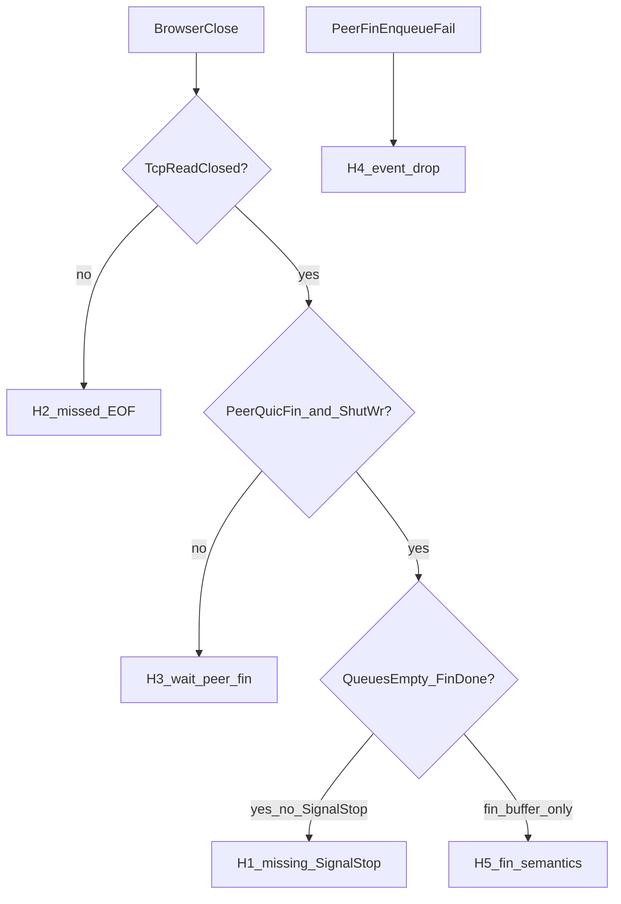

# Darwin HTTP CONNECT：浏览器关闭后 tunnel/relay 不收敛

**日期：** 2026-07-11  
**平台：** macOS / Darwin kqueue relay（client）  
**入口：** HTTP CONNECT ingress（本例 `amazon-sgp` → `0.0.0.0:18080`）  
**状态：** 修复已实现（语义 B + sticky）。设计见 [`docs/superpowers/specs/2026-07-11-darwin-fully-closed-convergence-design.md`](superpowers/specs/2026-07-11-darwin-fully-closed-convergence-design.md)；实现见 [`docs/superpowers/plans/2026-07-11-darwin-fully-closed-convergence.md`](superpowers/plans/2026-07-11-darwin-fully-closed-convergence.md)。

相关代码：

- `src/tunnel/darwin_relay_worker.cpp`（`DrainTcpReadable` / `ProcessPeerSendShutdown` / `FlushTcpWrites` / `ProcessSendShutdownComplete`）
- `src/tunnel/linux_relay_worker.cpp`（`MaybeStopFullyClosedRelay` / `SetRelayStop`）
- 对照文档：`docs/relay_macos.md`、`docs/superpowers/plans/2026-07-10-darwin-relay-stream-wrapper-terminal-lifetime.md`

---

## 1. 问题现象

Client 通过 HTTP CONNECT 为浏览器提供代理。浏览器关闭（或标签页/进程退出）后：

1. Admin `GET /api/v1/tunnels` 与 `GET /api/v1/metrics` 仍显示大量 **active** tunnel / `active_streams`。
2. `GET /api/v1/relay/metrics` / `GET /api/v1/relay/workers` 中 `active_relays` 与 tunnel 数一致，长期不降。
3. 进程仍持有大量监听口上的 TCP FD；`lsof` 显示多数已是 **`CLOSED`**，少数仍为 `ESTABLISHED`。
4. 偶有 tunnel 在数百秒后以 `reason=reaper` 关闭；多数可挂十几分钟以上仍不消失。

### 1.1 现场快照（2026-07-11，本机 client）

| 观测项 | 值（约） |
|--------|----------|
| peer | `amazon-sgp`（HTTP CONNECT `0.0.0.0:18080`） |
| `active_streams` / `active_relays` | ~29–30 |
| `:18080` FD：`CLOSED` | ~25–26 |
| `:18080` FD：`ESTABLISHED` | ~3–4 |
| `closing_relays` | 0 |
| `tcp_read_armed_relays` | ~5（多数 read 已 disarm） |
| `outstanding_quic_sends` / `pending_bytes` | 0 |
| tunnel `duration_ms` | 多为 800s+ |
| 偶发关闭 | `event=relay_stopping` … `reason=reaper`，age 约 700–800s |

典型残留 target：`gpt.raysync.cloud:443`、`*.stripe.com`、`cursor.com`、`hcaptcha.com` 等 HTTPS CONNECT 隧道。

`CLOSED` FD 数 ≈ 卡住的 relay 数，`ESTABLISHED` ≈ 仍存活的连接：浏览器侧 TCP 已死，进程未 `close()` FD，relay 未从 worker map 移除。

---

## 2. 预期半关闭路径

浏览器关闭 CONNECT 套接字后，client 侧应大致经历：

```text
浏览器 TCP FIN/RST
  → Darwin DrainTcpReadable: read()==0
  → TcpReadClosed=true，向 QUIC 提交 FIN（SubmitTcpBatchToQuic(..., fin=true)）
  → 对端（server relay / 目标）处理后再发 QUIC FIN
  → ProcessPeerSendShutdown → TcpWriteShutdownQueued
  → FlushTcpWrites: shutdown(fd, SHUT_WR)，TcpWriteClosed=true
  → 本地 TCP 进入 CLOSED（FD 仍打开，直到 RetireRelay）
  → 收敛：SignalStop / reaper 或 SHUTDOWN_COMPLETE → CloseRelay → close(fd)
```

Linux 在「双向 TCP 已关 + 本地 QUIC FIN 已提交且完成 + 队列排空」时调用 `MaybeStopFullyClosedRelay` → `SetRelayStop`（`SignalStop`），由 tunnel reaper 收敛，不单纯依赖 MsQuic `SHUTDOWN_COMPLETE` 何时到达。

---

## 3. 根因分析

### 3.1 结论与证据强度

**已确认的代码事实：Darwin 缺少 Linux 的 `MaybeStopFullyClosedRelay` 等价收敛。**

半关闭数据面步骤（EOF → QUIC FIN、peer FIN → `SHUT_WR`）在 Darwin 上基本存在，但在 **双向 TCP 已关且本地 QUIC FIN 完成后不会 `SignalStop`**。之后只能等待 MsQuic `SHUTDOWN_COMPLETE`；对 keep-alive / 对端迟迟不拆流的 HTTPS 目标，该事件经常长期不来，于是：

- relay 仍留在 worker `Relays` map → `active_relays` 不降；
- tunnel 仍为 `active`；
- TCP 状态机已到 `CLOSED`，但 FD 未 `close()` → `lsof` 僵尸 FD。

该缺口与现场现象高度吻合，是当前首要根因假设，但现有现场证据尚未逐 relay 证明以下条件曾同时成立：

- `TcpReadClosed && TcpWriteClosed`
- `QuicSendFinSubmitted && QuicSendFinCompleted`
- 所有 in-flight/pending send、receive、TCP write 队列为空

尤其 `lsof` 显示 `CLOSED` 只能证明内核 TCP 状态与用户态 FD 生命周期脱节，不能证明应用一定已观察到 `read()==0`。RST、read filter 因背压被禁用、EOF 事件丢失时，内核连接也可能进入 `CLOSED`，而 `TcpReadClosed` 仍为 false。因此，在获得 per-relay 状态快照或确定性复现前，不应把现场事故表述为“根因已完全证实”。

### 3.2 与 Linux 的代码对照

| 步骤 | Linux | Darwin |
|------|--------|--------|
| TCP EOF | `FinishTcpToQuic` 提交 FIN；失败则 `SetRelayStop` | `SubmitTcpBatchToQuic(..., true)`；**不** `SignalStop` |
| Peer QUIC FIN | 排队 TCP write shutdown | `ProcessPeerSendShutdown` 设 `TcpWriteShutdownQueued` |
| `SHUT_WR` 完成 | `TcpWriteClosed=true` 后 **`MaybeStopFullyClosedRelay("tcp_write_shutdown_complete")`** | `FlushTcpWrites` 仅 `TcpWriteClosed=true`，**无 stop** |
| 本地 QUIC FIN 完成 | `MaybeStopFullyClosedRelay("quic_send_fin_completed")` 等 | `CompleteQuicSend` / `ProcessSendShutdownComplete` 只更新标志，**无 stop** |
| 双向都关且队列空 | `SetRelayStop` → reaper | 无对应逻辑；依赖 `QuicShutdownComplete` → `CloseRelay(TerminalLogicalDetach)` |

Linux 收敛条件（`MaybeStopFullyClosedRelay`）摘要：

- `TcpReadClosed && TcpWriteClosed`
- `QuicSendFinSubmitted && QuicSendFinCompleted`
- 无 outstanding QUIC send / pending TCP write / pending QUIC receive
- 然后 `SetRelayStop` → `StopControl->SignalStop(generation)`

Darwin 在 `FlushTcpWrites` 完成 `SHUT_WR` 后没有调用任何等价函数。

### 3.3 为何会看到 `CLOSED` FD 仍被占用

1. 已读到浏览器 EOF → 本地处于可 `SHUT_WR` 的半关闭态；
2. 随后 peer QUIC FIN 触发 `SHUT_WR` → 内核 TCP 进入 `CLOSED`；
3. `RetireRelay` / `CloseRelayTcpFdOnce` 未跑 → 用户态仍持有 FD；
4. Admin 仍计为 active relay/tunnel。

这与「浏览器已关但 tunnels/relays 不关」的用户观感一致。

### 3.4 次要假设（未单独证实，可并存）

若 TCP read 因 QUIC send backpressure 被 `EV_DISABLE`，而 peer 在 disarm 期间 RST/关闭，可能更晚或无法通过 `EVFILT_READ` 观察到 EOF。现场多数 FD 已是 `CLOSED` 且与 active 数对齐，主路径仍更符合「半关闭做完、缺 SignalStop」。修复 `MaybeStopFullyClosedRelay` 后若仍有残留，再查 read interest / `EV_EOF` 漏读。

---

## 4. 次要现象

1. **Tunnel 字节计数为 0**  
   `GET /api/v1/tunnels` 中多条 `tcp_read_bytes` / `tcp_write_bytes` 恒为 0，但 relay 聚合 `tcp_read_bytes` / `tcp_write_bytes` 有真实流量。属 Darwin → tunnel 指标未正确回填，**易误判为“从未传过数据”**，与泄漏正交。

2. **`linux_relay_*` 指标名**  
   Darwin 快照仍大量以 `linux_relay_*` legacy key 输出；`tcp_read_closed_relays` 等在 Darwin `SnapshotLocal` 中未必按同名字段填充，**不能单靠该字段判断是否已 EOF**。

3. **`quic_send_ops=0` 与 `tcp_read_batches>0` 并存**  
   stats 中 Darwin 路径可能未递增与 Linux 同名的 `quic_send_ops` 计数；不要据此推断“从未 StreamSend”。以 `InFlightQuicSends` / 实际 FD 与 stop 事件为准。

4. **偶发超长延迟后 reaper 成功**  
   说明 stop/reaper 链路本身可用；缺的是半关闭完成后的 **及时 SignalStop**，而不是 reaper 完全失效。

---

## 5. 修复建议

### 5.1 主修复

在 Darwin 增加与 Linux 语义对齐的 `MaybeStopFullyClosedRelay`（或私有同名 helper）：

**触发点（至少）：**

1. `FlushTcpWrites` 在 `shutdown(SHUT_WR)` 且 `TcpWriteClosed=true` 之后；
2. `CompleteQuicSend`（或等价路径）在 `QuicSendFinCompleted=true` 之后；
3. 若还有其它将 `TcpReadClosed` / `TcpWriteClosed` 置位的路径，同样调用。

**条件（对齐 Linux）：**

- `!Closing`
- `TcpReadClosed && TcpWriteClosed`
- `QuicSendFinSubmitted && QuicSendFinCompleted`
- `InFlightQuicSends == 0`，无 `PendingQuicSends` / `PendingTcpWrites` / pending QUIC receive 压力
- `StopControl != nullptr` → `SignalStop(ControlGeneration)`

**不要**用盲目 timeout 强关已 started wrapper 来掩盖未收到 terminal 的问题（与 stream-lifetime 计划约束一致）。同时不能把 Linux 现有谓词未经语义确认直接复制到 Darwin；详见 §8 的 FIN 语义、线程模型和事件可靠性交付评审。

### 5.2 测试

先写会失败的 Darwin 确定性测试（建议落在 `darwin_relay_worker_io_test.cpp`）：

1. 模拟 TCP EOF → 本地 QUIC FIN 完成；
2. 再模拟 peer send shutdown → `SHUT_WR` / `TcpWriteClosed`；
3. 断言在无注入 `SHUTDOWN_COMPLETE` 的情况下，`StopControl` 已被 signal（或 public handle / active map 可观察收敛）；
4. 再实现 helper，使测试通过。

可选：系统/手工回归 — HTTP CONNECT 打开若干 HTTPS，关浏览器，确认 `active_relays` 与 `:18080` FD 在短时间内归零。

### 5.3 顺带（非阻断）

- 修复 Darwin tunnel 快照的 `tcp_read_bytes` / `tcp_write_bytes` 回填，避免 admin 误导。
- 在 Darwin snapshot 中显式统计 `tcp_read_closed` / `tcp_write_closed` / `quic_send_fin_*`，便于下次排障。

### 5.4 非目标

- 不在本修复中改协议 framing 或强制 abort 所有 half-close。
- 不把 Windows/Linux worker 一并大改；仅保证 Darwin 与 Linux 的「双向关完即 SignalStop」语义对齐。

---

## 6. 排障命令备忘

```bash
# Admin（Bearer token 来自 --admin-token-file）
curl -sS -H "Authorization: Bearer $TOKEN" http://127.0.0.1:2345/api/v1/metrics
curl -sS -H "Authorization: Bearer $TOKEN" http://127.0.0.1:2345/api/v1/tunnels
curl -sS -H "Authorization: Bearer $TOKEN" http://127.0.0.1:2345/api/v1/relay/metrics
curl -sS -H "Authorization: Bearer $TOKEN" http://127.0.0.1:2345/api/v1/relay/workers

# 进程 FD 与 TCP 状态
PID=$(pgrep -f 'raypx2 client' | head -1)
lsof -nP -p "$PID" | awk '/TCP/ && /18080/ {print $NF}' | sort | uniq -c

# 日志
rg 'event=(stats_active_tunnel|relay_stopping|stream_closed)' build/bin/Release/log/client.log
```

---

## 7. 记录

| 项 | 内容 |
|----|------|
| 发现方式 | 用户报告 + 运行中 client admin / `lsof` / `client.log` |
| Gortex memory | `mem02b3ed1c4252c55c`（gotcha）、session note `nt25833deff6279173`（decision） |
| 修复状态 | 代码缺口已确认；现场根因待状态证据闭环；修复设计需完成 §8 评审项后实施 |

---

## 8. 根因与修复方案评审（2026-07-11）

### 8.1 评审结论

结论为 **有条件通过，需重大补充**：

1. Darwin 缺少 fully-closed convergence 是确定的代码缺口，也是现场问题的首要根因假设。
2. 当前现场证据不足以证明所有 stuck relay 都已满足完整收敛谓词，根因表述需要保留证据边界。
3. 修复不能只做“增加 helper，并在 `FlushTcpWrites` / `CompleteQuicSend` 调用”；必须同时处理 worker 线程归属、MsQuic FIN 完成语义、callback fallback 和 event queue 满时的可靠交付。
4. 在上述问题解决前，不建议直接按 §5.1 的简化版本实施。

### 8.2 高风险：`SEND_COMPLETE` 不等于 FIN 已被对端确认

MsQuic 的 `QUIC_STREAM_EVENT_SEND_COMPLETE` 只表示 MsQuic 不再需要应用提供的 send buffer，不表示数据已经到达对端。对于带 `QUIC_SEND_FLAG_FIN` 的优雅关闭，`QUIC_STREAM_EVENT_SEND_SHUTDOWN_COMPLETE` 才表示 send direction 已完成关闭；优雅关闭时，该事件在 FIN 被对端确认后产生。参见 MsQuic 官方文档：[Using Streams](https://microsoft.github.io/msquic/msquicdocs/docs/Streams.html)、[`QUIC_STREAM_EVENT`](https://microsoft.github.io/msquic/msquicdocs/docs/api/QUIC_STREAM_EVENT.html)。

当前 Darwin 状态命名混合了这两个阶段：

- FIN 的 `SEND_COMPLETE` 会设置 `QuicSendFinCompleted=true` 和 `QuicSendClosed=true`；
- `ProcessSendShutdownComplete` 收到真正的 `SEND_SHUTDOWN_COMPLETE` 后再次设置 `QuicSendClosed=true`；
- callback 没有把 `SEND_SHUTDOWN_COMPLETE.Graceful` 带给 worker；
- FIN send completion 路径也没有把 `SEND_COMPLETE.Canceled` 纳入终止判断。

而 `SignalStop` 被 tunnel reaper 观察后，Darwin unregister 会请求 `AbortBoth`。若只等待 send buffer completion，可能在 FIN 尚未确认时把原本的优雅关闭变成 abort。

实施前必须明确产品语义：

- **严格优雅关闭：** 收敛谓词应包含真正的 `SEND_SHUTDOWN_COMPLETE`，并记录/检查 `Graceful`；不能把 canceled send 当作成功 FIN。
- **兼容 Linux 当前行为：** 若接受“本地队列排空后即可 abortive retire”，文档和日志必须明确这是兼容性取舍，并用端到端字节一致性测试证明不会造成不可接受的尾部截断；不能再称其为“FIN 已完成优雅传输”。

建议拆分状态命名，避免继续混淆：

- `QuicFinSendSubmitted`
- `QuicFinBufferReleased`
- `QuicSendShutdownComplete`
- `QuicSendShutdownGraceful`

### 8.3 高风险：收敛 helper 必须是 worker-thread-owned

Darwin active relay 的数据面字段和 pending 队列由 worker 线程独占。`CompleteQuicSend` 却不保证运行在 worker 线程：event queue 满时，send callback 会 inline 调用 completion fallback；该路径只对 lifecycle/fallback 字段使用 `relay->Mutex`，而 worker 数据面不会用同一个 mutex 保护所有队列。

因此，不能从任意 `CompleteQuicSend` 路径直接检查：

- `PendingQuicSends`
- `PendingTcpWrites`
- `PendingQuicReceives`
- `InFlightQuicSends`
- TCP/QUIC close 标志的组合

否则会产生数据竞争或不一致快照。建议实现：

```text
callback/fallback 只发布状态或 sticky convergence bit
  → Wake worker
  → worker 更新 relay 状态
  → MaybePublishFullyClosedStopLocal()
  → 条件满足时幂等 SignalStop(ControlGeneration)
```

`MaybePublishFullyClosedStopLocal()` 应显式断言运行在 worker 线程。若 event queue 已满，应使用独立的原子 sticky bit 或可靠 fallback，不能 inline 扫描 worker-owned 队列，也不能丢失最后一次 convergence check。

### 8.4 高风险：peer shutdown 事件可能在 event queue 满时静默丢失

`PEER_SEND_SHUTDOWN` callback 调用 `EnqueueRelayCloseFromCallback()` 后忽略失败结果。event queue 满时，peer FIN 可能永久丢失，导致：

- `TcpWriteShutdownQueued` 不会置位；
- `TcpWriteClosed` 永远不会成立；
- 即使新增 fully-closed helper，也永远无法满足谓词。

以下控制事件都必须具备不可静默丢失的交付语义：

- `QuicPeerSendShutdown`
- `QuicSendShutdownComplete`
- fully-closed convergence check

可为每个 binding/relay 增加 callback-safe sticky state，worker 被唤醒后统一消费，而不必无限扩大主事件队列。

### 8.5 中风险：最终谓词必须覆盖 callback-side pending receive

Darwin event queue 满时，QUIC receive 会暂存在 `StreamBinding::CallbackPendingQuicReceives`，之后由 worker 重新入队。这条 fallback 队列可能与 peer shutdown 控制事件发生重排。

最终收敛谓词除 Linux 同类条件外，至少还应覆盖：

- `PendingQuicReceiveBytes == 0`
- `PendingQuicReceives.empty()`
- `PendingTcpWriteBytes == 0`
- `PendingTcpWrites.empty()`
- `PendingQuicSends.empty()` 和 `InFlightQuicSends == 0`
- binding callback pending receive events/bytes/queue 全部为空
- 不存在该 relay 尚未由 worker 消费的 receive/half-close sticky 状态

否则可能在尚有对端数据未写入 TCP 时提前 stop。

### 8.6 建议的修复结构与触发矩阵

建议把收敛判断集中成 worker-owned 状态机，而不是在少数路径散落条件判断：

```text
所有可能改变终止谓词的事件
  → worker 更新 relay 状态
  → MaybePublishFullyClosedStopLocal(trigger)
  → 满足明确的 graceful/compatibility 谓词
  → StopControl->SignalStop(ControlGeneration)
```

至少应从以下状态转移后触发：

1. TCP EOF 成功提交 FIN 后，特别是 `EnableQuicSends=false` 的同步完成测试分支；
2. worker 线程处理 FIN `SEND_COMPLETE` 后；
3. 真正的 `SEND_SHUTDOWN_COMPLETE` 后；
4. `shutdown(SHUT_WR)` 并设置 `TcpWriteClosed` 后；
5. pending TCP write、QUIC receive、callback pending receive 的最后一个元素排空后；
6. callback fallback completion 可靠移交给 worker 后；
7. read backpressure 解除并重新检查 EOF 后。

`SignalStop` 必须保持 generation 校验和幂等性；active accounting、worker unregister、FD close 仍由现有 reaper/relay lifecycle 负责。

### 8.7 测试覆盖与发布门槛

原 §5.2 的单一事件顺序不足以覆盖真实竞态。确定性测试至少需要以下矩阵：

| 场景 | 关键断言 |
|------|----------|
| EOF → FIN completion → peer FIN | 无 `SHUTDOWN_COMPLETE` 时按选定语义及时 signal stop |
| peer FIN → `SHUT_WR` → EOF → FIN completion | 反向事件顺序同样收敛 |
| FIN `SEND_COMPLETE` 已到，`SEND_SHUTDOWN_COMPLETE` 延迟 | 严格模式不得过早 stop |
| `SEND_COMPLETE.Canceled=true` | 不得当成成功的优雅 FIN |
| FIN 前仍有 in-flight send | 所有 send 完成前不得 stop |
| peer FIN 前仍有 pending write/receive | 数据写完、receive complete 后才能 stop |
| callback pending receive queue 非空 | fallback receive 未消费前不得 stop |
| event queue 满 | peer FIN、send shutdown、convergence check 均不可丢 |
| TCP read 因 QUIC 背压被禁用时收到 FIN/RST | read interest 恢复或 sticky EOF 后能够收敛 |
| 重复/乱序 shutdown callback | stop、unregister、FD close、accounting 均幂等 |
| reaper 完整链路 | stop 后 relay map、tunnel registry、FD、active accounting 全部归零 |

系统回归建议建立量化门槛，而不是只做一次手工观察：

- 建立 100–1000 条并发 HTTP CONNECT，混合 graceful close、RST、浏览器进程退出；
- 用小 event queue 和 QUIC/TCP 背压主动放大竞态；
- 关闭后 1 秒内 `active_relays`/FD 至少下降 99%，5 秒内归零；
- soak 期间 relay、FD、buffer budget、retired relay 不得单调增长；
- 对每条 tunnel 校验 payload hash/byte count，证明没有尾部截断；
- 保存 per-relay 终止状态、stop trigger、event queue fallback、reaper 和 FD close 的日志/metrics 作为发布证据。

### 8.8 可观测性要求

为闭环现场根因并支持发布判定，Darwin snapshot/trace 应至少暴露：

- `tcp_read_closed` / `tcp_write_closed`
- `quic_fin_submitted` / `quic_fin_buffer_released`
- `quic_send_shutdown_complete` / `quic_send_shutdown_graceful`
- in-flight/pending send、receive、TCP write 数量和字节数
- callback pending receive events/bytes
- peer shutdown / send shutdown sticky state
- fully-closed predicate 未满足的具体阻塞项
- stop signal trigger、generation mismatch、unregister、FD close 时间戳

只有当 stuck relay 快照显示完整谓词已满足却未 signal stop，才能把现场根因从“首要假设”升级为“证据闭环”。

---

## 9. 根因取证计划（本阶段：只观测，不修收敛）

### 9.1 约束

- **禁止**在本阶段实现 `MaybeStopFullyClosedRelay` / `SignalStop` 收敛修复。
- 只通过诊断日志、snapshot 半关闭计数与可复现实验区分 H1–H5。
- **仅当** stuck relay 满足 H1 谓词且未 stop，才升级为“根因证实”并另开修复计划（须同时满足 §8）。

### 9.2 假设矩阵

| ID | 假设 | 若成立时关键证据 |
|----|------|----------------|
| H1 | 双向半关闭已完成，缺 `SignalStop`（首要） | `tcp_read_closed=1 tcp_write_closed=1 quic_send_fin_submitted=1 quic_send_fin_completed=1` 且 pending/inflight=0，`fully_closed_predicate_ready` 上升，长期无 `relay_stopping` |
| H2 | 未观察到 TCP EOF（背压 disarm / 漏 EV_EOF） | FD 已 `CLOSED`，但 `tcp_read_closed=0`，`tcp_read_armed=0`，可见 `tcp_read_backpressure_on` 且无后续 `tcp_eof` |
| H3 | 已 EOF+本地 FIN，对端 QUIC FIN 未到 | `tcp_read_closed=1`，`quic_send_fin_*=1`，`tcp_write_closed=0`，`tcp_write_shutdown_queued=0`，无 `peer_send_shutdown`/`tcp_shut_wr` |
| H4 | peer FIN 事件在 queue 满时丢失 | 出现 `peer_shutdown_enqueue_failed`，且长期 `tcp_write_closed=0` |
| H5 | FIN `SEND_COMPLETE` 与 `SEND_SHUTDOWN_COMPLETE` 语义混淆 | 有 `quic_fin_buffer_released`，长期无 `send_shutdown_complete`；若误按 H1 修复会过早 abort |



### 9.3 诊断埋点（trigger 名固定）

| trigger | 含义 |
|---------|------|
| `tcp_eof` | 本地 TCP `read()==0`，已尝试提交 QUIC FIN |
| `quic_fin_buffer_released` | worker 路径 FIN 的 `SEND_COMPLETE`（buffer 可释放） |
| `quic_fin_buffer_released_off_worker` | 非 worker fallback 路径的 FIN completion（§8.3） |
| `peer_send_shutdown` | 收到对端 QUIC send shutdown |
| `tcp_shut_wr` | 本地 `shutdown(SHUT_WR)` 完成 |
| `send_shutdown_complete` | MsQuic `SEND_SHUTDOWN_COMPLETE` |
| `peer_shutdown_enqueue_failed` | peer FIN 入队失败（H4） |
| `tcp_read_backpressure_on` / `tcp_read_backpressure_off` | TCP read interest 因 QUIC 背压变化 |

日志行复用 `TqTraceRelayStopCondition` 形态，并附加 `blockers=`（如 `need_tcp_read_closed,need_peer_fin,pending_recv=N`）。**埋点路径绝不 `SignalStop`。**

Admin / `stats_relay` / `event=stats_darwin_half_close` 聚合字段：

- `tcp_read_closed_relays` / `tcp_write_closed_relays` / `tcp_write_shutdown_queued_relays`
- `quic_send_fin_submitted_relays` / `quic_send_fin_completed_relays`
- `tcp_read_paused_by_quic_backlog_relays`
- `fully_closed_predicate_ready_relays`（满足 Linux 同类谓词但仍 active — H1 聚合证据）
- `closing_relays`

### 9.4 复现步骤

1. 使用带诊断埋点的 Release client，开启既有 trace（`<exe>/log/client.log`）。
2. HTTP CONNECT 代理打开若干 HTTPS 站点，再关闭浏览器。
3. 对照：
   - `lsof`：`:18080` 上 `CLOSED` vs `ESTABLISHED`
   - `GET /api/v1/relay/metrics`：上列半关闭计数
   - `rg 'trigger=(tcp_eof|peer_send_shutdown|tcp_shut_wr|quic_fin|send_shutdown|peer_shutdown_enqueue|backpressure)' log/client.log`
   - `rg 'event=stats_darwin_half_close' log/client.log`

### 9.5 判读规则

- 多数 stuck 满足 H1 谓词（`fully_closed_predicate_ready_relays` ≈ stuck 数）→ **根因证实为缺 SignalStop**，再开修复（含 §8）。
- 多数 `tcp_read_closed=0` 且有 backpressure、无 `tcp_eof` → **H2**。
- 多数卡在无 `peer_send_shutdown`/`tcp_shut_wr` → **H3**；若同时有 `peer_shutdown_enqueue_failed` → **H4**。
- 仅有 `quic_fin_buffer_released`、无 `send_shutdown_complete` → **H5**，修复谓词不能照搬 Linux 字面量。

### 9.6 证据结论（复现后填写）

| 项 | 内容 |
|----|------|
| 复现时间 | 2026-07-11 14:44（诊断埋点构建；curl `-x :18080` 打开 example.com/google 后强制关闭） |
| 主导假设 | **H1 成立（证据闭环）** |
| 关键计数 / 日志摘录 | Admin：`active_relays=8`，`tcp_read_closed_relays=8`，`tcp_write_closed_relays=8`，`quic_send_fin_submitted/completed_relays=8`，`quic_send_shutdown_complete_relays=8`，`fully_closed_predicate_ready_relays=8`，`tcp_read_armed_relays=0`，`relay_control_stop_signaled=0`。日志多条 `trigger=tcp_shut_wr blockers=predicate_ready_no_signal_stop`。隧道仍 `state=active`。 |
| H2–H5 | H2 排除（全部 `tcp_read_closed=1`）；H3/H4 排除（已见 `peer_send_shutdown`→`tcp_shut_wr`，无 enqueue fail）；H5 本场景 `send_shutdown_complete` 已到达，非阻塞项 |
| 是否允许进入收敛修复 | **是** — 在满足 §8（worker 线程归属、事件可靠交付、谓词含 callback pending）前提下，可实施 Darwin `MaybeStopFullyClosedRelay` / `SignalStop` 等价收敛 |

### 9.7 修复验证

修复已落地（`MaybePublishFullyClosedStopLocal` + half-close sticky）。手工回归：

1. 启动 client（HTTP CONNECT）
2. `curl -x 127.0.0.1:18080 https://example.com/` 若干次后关闭
3. `GET /api/v1/relay/metrics`：
   - `fully_closed_predicate_ready_relays` 不长期 == `active_relays`
   - `relay_control_stop_signaled` 上升
   - `active_relays` 数秒内归零
4. `rg 'fully_closed_stop|predicate_ready_no_signal_stop' log/client.log`
   - 应见 `fully_closed_stop`；不应长期 `predicate_ready_no_signal_stop`
