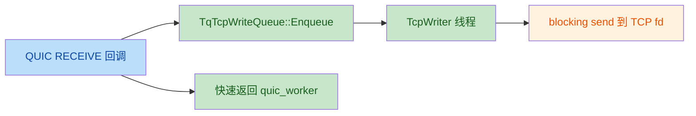
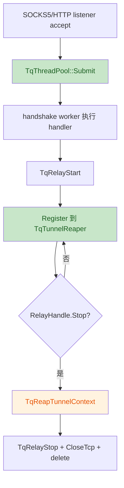

# tcpquic-proxy 线程模型优化实现评审

评审对象：

- 计划文档：`docs/superpowers/plans/2026-06-06-tcpquic-thread-model.md`
- 实际实现：`src/tools/tcpquic-proxy/` 当前代码
- 参考规格：`src/tools/tcpquic-proxy/thread_model_cn.md`

## 评审结论

实现整体方向与计划一致，已经落地了四个核心目标：

- QUIC→TCP 从 MsQuic 回调线程直接 `send()` 改为 `TqTcpWriteQueue` 异步 writer。
- per-tunnel cleanup watcher 改为全局 `TqTunnelReaper`。
- SOCKS5 / HTTP CONNECT 每连接 detached handler 改为固定 `TqThreadPool`。
- QUIC execution profile 支持 `--quic-profile max-throughput|low-latency`，默认仍为 `max-throughput`。

初评发现 **4 个需要修复的问题**（见下表）。截至 **2026-06-06** 已全部修复并通过全量单测 + smoke 回归验证。

## 变更流图





## 作者意图

本次实现意图明确：按照线程模型优化计划降低高并发下 MsQuic `quic_worker` 被慢 TCP 写阻塞的概率，并减少每隧道 detached cleanup 线程，同时保留 WAN 高吞吐默认行为。

## 发现的问题

| No. | 问题标题 | 严重级别 | 状态 | 代码位置 |
|-----|----------|----------|------|----------|
| 1 | `tcpquic_tunnel_test` 未链接新增实现文件，测试目标链接失败 | Major | ✅ 已修复 | `CMakeLists.txt`、`unittest/tcp_tunnel_test.cpp` |
| 2 | `tunnel_reaper_test` 只测 Start/Stop，未验证 Register/Reap 行为 | Medium | ✅ 已修复 | `unittest/tunnel_reaper_test.cpp` |
| 3 | handshake 线程池拒绝任务时 accept fd 不会关闭 | Medium | ✅ 已修复 | `thread_pool.h/cpp`、`socks5_server.cpp`、`http_connect_server.cpp`、`unittest/thread_pool_test.cpp` |
| 4 | `tcpquic_http_connect_test` / `tcpquic_socks5_test` 缺少 include 路径与链接依赖 | Medium | ✅ 已修复 | `CMakeLists.txt` |

### 问题 1 修复详情

- `tcpquic_tunnel_test` 补充链接 `tcp_write_queue.cpp`、`tunnel_reaper.cpp`
- `unittest/tcp_tunnel_test.cpp` 增加 `TqLookupServerConnectionId` 测试桩（避免引入完整 `quic_session.cpp`）

### 问题 2 修复详情

- 重写 `tunnel_reaper_test.cpp`：使用 `TestTunnelContext` + 可追踪的 `TqTunnelRelayStopped` / `TqReapTunnelContext` 桩
- 测试流程：`Register` → `stopped=true` → 2s 内断言 `TqReapTunnelContext` 被调用

### 问题 3 修复详情

- `TqThreadPool::Submit` 改为返回 `bool`（pool 未运行或任务为空时返回 `false`）
- `RunSocks5Server` / `RunHttpConnectServer`：`Submit` 失败时 `close(clientFd)`
- `thread_pool_test.cpp` 补充 `Stop()` 后 `Submit` 返回 `false` 用例

### 问题 4 修复详情

- 新增 CMake 变量 `TCPQUIC_SERVER_TEST_SOURCES`（`thread_pool.cpp`、`tcp_dialer.cpp`、`tuning.cpp`）
- `tcpquic_http_connect_test` / `tcpquic_socks5_test` 补充：
  - include：`${CMAKE_SOURCE_DIR}/src/inc`（解析 `msquic.hpp`）
  - 链接：`control_protocol.cpp` + `TCPQUIC_SERVER_TEST_SOURCES` + `Threads::Threads`
- 根因：`http_connect_server.h` / `socks5_server.h` 经 `tcp_tunnel.h` 间接依赖 `msquic.hpp`；server `.cpp` 实现依赖 `TqTuneTcpForThroughput`（`tcp_dialer`→`tuning`）和 `TqThreadPool::Submit`

## 验证记录

### 初评（修复前）

```bash
cmake --build build-iouring --target tcpquic_tunnel_test tcpquic_http_connect_test tcpquic_socks5_test ... -j2
```

- `tcpquic_tunnel_test`：**链接失败**（缺 `tcp_write_queue` / `tunnel_reaper` / `TqLookupServerConnectionId`）
- `tcpquic_http_connect_test` / `tcpquic_socks5_test`：**编译失败**（缺 `msquic.hpp` include 路径）

### 修复后（2026-06-06）

**构建：**

```bash
cmake --build build-iouring --target \
  tcpquic_tunnel_test tcpquic_http_connect_test tcpquic_socks5_test \
  tcpquic_tunnel_reaper_test tcpquic_thread_pool_test tcpquic_tcp_write_queue_test -j2
```

结果：**全部 Built target 成功**

**单测执行：**

```text
tcpquic_tunnel_test         PASS
tcpquic_http_connect_test   PASS
tcpquic_socks5_test         PASS
tcpquic_tunnel_reaper_test  PASS
tcpquic_thread_pool_test    PASS
tcpquic_tcp_write_queue_test PASS
```

**集成 smoke：**

```bash
./scripts/test-tcpquic-proxy.sh
```

结果：**PASS**（HTTP CONNECT + SOCKS5 + 压缩 + 连接池）

## 计划完成度对照

| 计划任务 | 实现状态 | 评审意见 |
|----------|----------|----------|
| Task 1: QUIC→TCP 异步写队列 | 已实现 | 基本符合计划；已有写失败和 Stop 后 Enqueue 单测 |
| Task 2: relay 接入异步 writer | 已实现 | `OnStreamReceive()` 已改入队，阻塞 `send()` 已迁出回调 |
| Task 3: 全局 Tunnel Reaper | 已实现 | ✅ 单测已覆盖 Register→Reap 路径 |
| Task 4: Accept / Handshake 线程池 | 已实现 | ✅ Submit 返回 bool，listener 提交失败时关闭 fd |
| Task 5: QUIC Execution Profile 可配置 | 已实现 | 默认 max-throughput，low-latency 可配置，符合计划 |
| Task 6: 并发回归与线程数验证 | 已实现 | ✅ 全量单测可构建执行；smoke 回归 PASS |

## 二次校验

**初评阶段**（无独立 sub-agent）通过代码审阅 + 构建复现确认问题 1–4 属实。

**修复阶段**（2026-06-06）完成代码修改后重新执行全量构建与单测，6 个测试 target 全部 PASS，`test-tcpquic-proxy.sh` smoke PASS。问题 4 为初评后追加发现的既有 CMake 缺陷，已随本次一并修复。

## 修复完成总结

| 阶段 | 内容 | 状态 |
|------|------|------|
| 1 | `tcpquic_tunnel_test` 链接修复 | ✅ |
| 2 | `tunnel_reaper_test` Register/Reap 覆盖 | ✅ |
| 3 | `TqThreadPool::Submit` 返回 bool + fd 兜底关闭 | ✅ |
| 4 | `tcpquic_http_connect_test` / `tcpquic_socks5_test` CMake 依赖补齐 | ✅ |
| 5 | 全量单测 + smoke 回归 | ✅ |

**涉及文件：**

- `src/tools/tcpquic-proxy/CMakeLists.txt`
- `src/tools/tcpquic-proxy/thread_pool.h`、`thread_pool.cpp`
- `src/tools/tcpquic-proxy/socks5_server.cpp`、`http_connect_server.cpp`
- `src/tools/tcpquic-proxy/unittest/tcp_tunnel_test.cpp`
- `src/tools/tcpquic-proxy/unittest/tunnel_reaper_test.cpp`
- `src/tools/tcpquic-proxy/unittest/thread_pool_test.cpp`

**评审终态：** 初评 4 项问题均已关闭，线程模型优化实现可视为 **review-clean**，可进入合并/发布流程。
