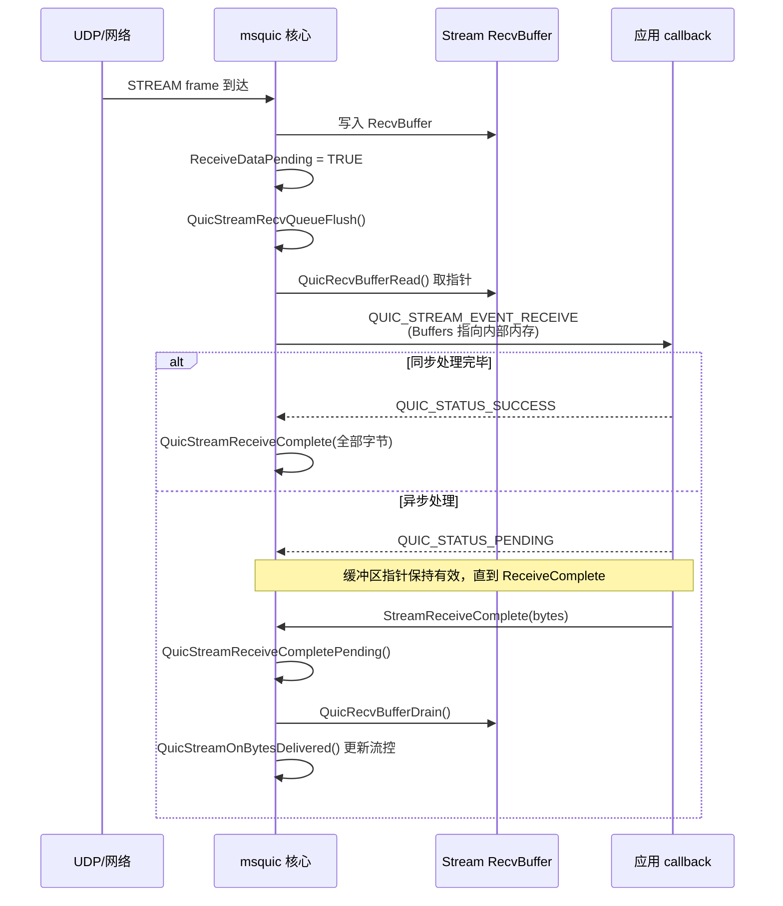
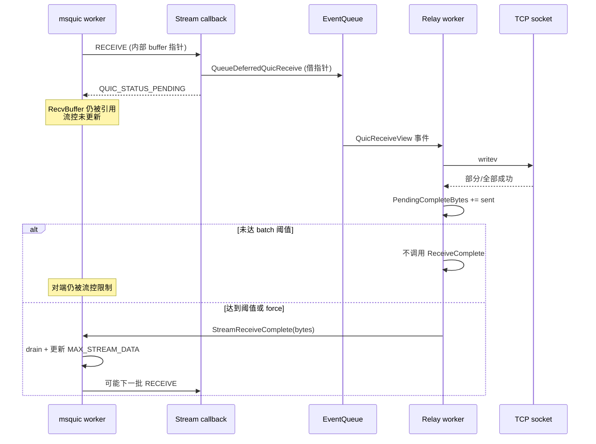

# MsQuic Receive Callback：PENDING 异步处理与吞吐影响

- 时间: 2026-06-12
- 依据: `third_party/msquic` 官方文档与核心实现（`stream_recv.c`、`api.c`、`recv_buffer.c`），以及 tcpquic-proxy `linux_relay_worker` 实现
- 背景: relay 在 `QUIC_STREAM_EVENT_RECEIVE` callback 中无法同步完成数据处理，将 buffer 指针借用到 worker 线程，返回 `QUIC_STATUS_PENDING`，处理完成后再调用 `StreamReceiveComplete`。本文档梳理该流程，并解释为何 PENDING 会影响 QUIC 传输吞吐。
- 相关文档: [msquic-stream-send-receive-semantics.md](./msquic-stream-send-receive-semantics.md)

---

## 核心结论

| 问题 | 答案 |
|------|------|
| `PENDING` 本身是否有问题？ | **否**。这是 msquic 设计的标准异步接收路径。 |
| 吞吐下降的根本原因？ | **不是**「返回 PENDING」这个动作，而是 PENDING 期间 msquic 认为数据仍「欠账」——流控窗口不前进、RecvBuffer 不释放、默认模式下无法并行下一批 RECEIVE。 |
| tcpquic-proxy 额外放大的因素？ | `DeferredReceiveCompleteBatchBytes` 批处理延迟 complete；`ReceiveSetEnabled(false)` 背压与 complete 职责混淆。 |

**正确的不变量：**

- 每个异步 `QUIC_STREAM_EVENT_RECEIVE`（返回 `PENDING`）必须 **恰好一次** `StreamReceiveComplete`。
- `ReceiveComplete` 之前，`QUIC_BUFFER` 指向的 msquic 内部内存保持有效（可借指针，不必 copy）。
- `ReceiveComplete` 之后才会 `QuicRecvBufferDrain` + 更新 `MAX_STREAM_DATA` / `MAX_DATA` 流控。

---

## 1. 标准 msquic 异步接收流程

### 1.1 数据从网络到 callback



**调用链：**

1. STREAM frame 写入 `RecvBuffer`（`stream_recv.c` → `QuicStreamReceiveFrame`）
2. `ReceiveDataPending = TRUE`，`QuicStreamRecvQueueFlush()` 触发 flush
3. `QuicStreamRecvFlush()` → `QuicRecvBufferRead()` 取出内部指针，组装 `QUIC_STREAM_EVENT_RECEIVE`
4. `QuicStreamIndicateEvent()` 调用应用 callback
5. 根据返回值决定是否立即 `QuicStreamReceiveComplete()`

### 1.2 callback 返回值语义

核心逻辑在 `QuicStreamRecvFlush`（`third_party/msquic/src/core/stream_recv.c`）：

```c
QUIC_STATUS Status = QuicStreamIndicateEvent(Stream, &Event);

// 清除 active receive 标志
RecvCompletionLength =
    InterlockedExchange64((int64_t*)&Stream->RecvCompletionLength, 0)
    & ~QUIC_STREAM_RECV_COMPLETION_LENGTH_RECEIVE_CALL_ACTIVE_FLAG;

if (Status == QUIC_STATUS_CONTINUE) {
    // 同步模式：部分消费，继续 callback
    RecvCompletionLength += Event.RECEIVE.TotalBufferLength;
    FlushRecv = TRUE;
    Stream->Flags.ReceiveEnabled = TRUE;

} else if (Status == QUIC_STATUS_PENDING) {
    // 异步：仅当 callback 返回前已 inline 调用 ReceiveComplete 时才 flush
    FlushRecv = (RecvCompletionLength != 0);

} else {
    // SUCCESS 等：视为全部消费
    RecvCompletionLength += Event.RECEIVE.TotalBufferLength;
    FlushRecv = TRUE;
}

if (FlushRecv) {
    FlushRecv = QuicStreamReceiveComplete(Stream, RecvCompletionLength);
}
```

| 返回值 | 行为 |
|--------|------|
| `QUIC_STATUS_SUCCESS` | 视为本次数据全部消费，立刻 `ReceiveComplete` |
| `QUIC_STATUS_PENDING` | **不**立刻 complete；只有 callback 返回前已调用过 `StreamReceiveComplete` 才会 inline flush |
| `QUIC_STATUS_CONTINUE` | 同步模式下部分消费，继续下一次 callback |

**官方文档**（`third_party/msquic/docs/Streams.md`）：

> 异步处理必须返回 `QUIC_STATUS_PENDING`；处理完后必须调用 `StreamReceiveComplete`。
>
> `QUIC_BUFFER` 本身的生命周期只在 callback 内——异步场景下若要把数据交给别的线程，要么 copy，要么靠 `PENDING` 借用到 `ReceiveComplete` 为止。

---

## 2. `StreamReceiveComplete` 做了什么

### 2.1 API 入口

`MsQuicStreamReceiveComplete`（`third_party/msquic/src/core/api.c`）可从任意线程调用（最高 `DISPATCH_LEVEL`）：

```c
// 原子累加已完成字节数
uint64_t RecvCompletionLength =
    InterlockedExchangeAdd64(
        (int64_t*)&Stream->RecvCompletionLength,
        (int64_t)BufferLength);

// callback 仍在执行 → 等它返回后再处理
if ((RecvCompletionLength & QUIC_STREAM_RECV_COMPLETION_LENGTH_RECEIVE_CALL_ACTIVE_FLAG) != 0) {
    goto Exit;
}

// 投递到 connection worker 异步执行
Oper = InterlockedFetchAndClearPointer((void**)&Stream->ReceiveCompleteOperation);
if (Oper) {
    QuicStreamAddRef(Stream, QUIC_STREAM_REF_OPERATION);
    QuicConnQueueOper(Connection, Oper);
}
```

### 2.2 worker 侧处理

`QuicStreamReceiveCompletePending`（`stream_recv.c`）：

```c
uint64_t BufferLength = Stream->RecvCompletionLength;
InterlockedExchangeAdd64((int64_t*)&Stream->RecvCompletionLength, -(int64_t)BufferLength);

if (QuicStreamReceiveComplete(Stream, BufferLength)) {
    QuicStreamRecvFlush(Stream);  // 可能触发下一批 RECEIVE
}
QuicStreamRelease(Stream, QUIC_STREAM_REF_OPERATION);
```

### 2.3 `QuicStreamReceiveComplete` 的三步关键操作

1. **`QuicRecvBufferDrain`** — 释放 recv buffer 空间，允许继续收包
2. **`QuicStreamOnBytesDelivered`** — 更新 **MAX_STREAM_DATA / MAX_DATA** 流控窗口
3. 若还有数据且 receive 仍 enabled — 再次 `QuicStreamRecvFlush`

流控更新（`QuicStreamOnBytesDelivered`，`stream_recv.c`）：

```c
Stream->RecvWindowBytesDelivered += BytesDelivered;
Stream->Connection->Send.MaxData += BytesDelivered;
// ...
Stream->MaxAllowedRecvOffset =
    Stream->RecvBuffer.BaseOffset + Stream->RecvBuffer.VirtualBufferLength;
QuicSendSetStreamSendFlag(..., QUIC_STREAM_SEND_FLAG_MAX_DATA, ...);
```

**关键点：`ReceiveComplete` 之前，对端认为你还没「消化」这批字节，窗口不会前进。**

### 2.4 RecvBuffer 指针借用约束

`recv_buffer.h` 注释：

> Since this returns an internal pointer, the caller must retain exclusive access to the buffer until it calls QuicRecvBufferDrain.

PENDING 期间 chunk 保持 `ExternalReference`，内存不会被 msquic 回收或修改。

---

## 3. tcpquic-proxy 当前实现

实现位于 `src/tunnel/linux_relay_worker.cpp`。

### 3.1 callback 路径

```cpp
if (event->Type == QUIC_STREAM_EVENT_RECEIVE) {
    if (!needsDecompress &&
        QueueDeferredQuicReceive(relay, stream,
            event->RECEIVE.Buffers, event->RECEIVE.BufferCount, fin)) {
        return QUIC_STATUS_PENDING;   // ① 借指针，不 copy
    }
    // ...
}
```

`QueueDeferredQuicReceive` 将 msquic 内部 buffer 指针切片存入 `TqPendingQuicReceive`，投递到 worker 事件队列：

```cpp
view->Slices.push_back(TqQuicReceiveSlice{data, length});  // 直接借指针
event.Type = TqLinuxRelayEventType::QuicReceiveView;
return Enqueue(std::move(event));
```

### 3.2 分批 `ReceiveComplete`

worker 写 TCP 成功后，**按阈值** 才 notify msquic（`FlushDeferredReceiveCompletion`）：

```cpp
const uint64_t threshold = Config.DeferredReceiveCompleteBatchBytes;
if (!force && threshold != 0 && view.PendingCompleteBytes < threshold) {
    return;   // ② 未达 batch 阈值，不调用 ReceiveComplete
}
CompleteDeferredQuicReceive(view.Stream, view.PendingCompleteBytes);
```

配置项：`tuning.LinuxRelayQuicReceiveCompleteBatchBytes`（`src/config/tuning.h`）。

### 3.3 背压：`ReceiveSetEnabled(false)`

```cpp
void MaybePauseQuicReceive(RelayState* relay) {
    if (relay->PendingQuicReceiveBytes >= MaxPendingQuicReceiveBytesPerRelay()) {
        relay->QuicReceivePaused = true;
        SetQuicReceiveEnabled(relay, false);  // ③ 暂停 RECEIVE callback
    }
}
```

---

## 4. tcpquic-proxy 架构时序



---

## 5. 为什么 PENDING 会影响吞吐

PENDING 本身不是问题——**问题是 PENDING 期间 msquic 认为数据仍「欠账」，而应用又延迟了 `ReceiveComplete`。** 影响来自多层叠加：

### 5.1 流控窗口不前进（最主要）

- `ReceiveComplete` 之前 **`QuicStreamOnBytesDelivered` 不会执行**
- 对端 `MAX_STREAM_DATA` / `MAX_DATA` 不更新 → 对端发满窗口后 **停发**
- 本端 recv buffer 也占满 → 即使 UDP 还能收，也无法再写入 stream buffer

**tcpquic-proxy 额外因素：** `DeferredReceiveCompleteBatchBytes` 批处理——TCP 已经写出，但 msquic 还不知道 → **人为拉长流控 RTT**。

近似关系：`吞吐 ≈ window / (RTT + 延迟complete时间)`

### 5.2 默认模式：同一 stream 只能有一个 outstanding RECEIVE

非 Multi-receive 模式下（默认）：

- 返回 `PENDING` 且尚未 `ReceiveComplete` → **不会再给新的 `QUIC_STREAM_EVENT_RECEIVE`**
- 新到的 STREAM frame 堆在 RecvBuffer，等第一次 complete 后才 flush

文档（`third_party/msquic/docs/api/StreamReceiveComplete.md`）：每个异步 RECEIVE 必须 **恰好一次** complete。

Multi-receive（`StreamMultiReceiveEnabled`）可并行多个 PENDING，但应用需自行记账总字节，实现复杂度更高。

### 5.3 RecvBuffer 占用 + 内存压力

PENDING 期间内部 chunk 带 `ExternalReference`，不能回收。RecvBuffer 满 → 即使流控还有一点余量，也可能无法继续收。

### 5.4 callback 线程占用（次要）

官方文档警告：同步在 callback 里慢会拖 ACK 等协议处理。返回 `PENDING` 较快（只 enqueue）是正确的；但若 enqueue 路径很重，仍会占 msquic worker 时间。

### 5.5 `ReceiveSetEnabled(false)` 背压

`PendingQuicReceiveBytes` 超阈值时暂停 receive：

- 停止 **新的 RECEIVE 事件**
- **不能替代** `ReceiveComplete` — RecvBuffer 里已借用的数据仍占着流控
- 若只 pause 不 complete，对端照样会被流控卡住

### 5.6 部分 complete 的陷阱

若 `ReceiveComplete(bytes)` 中 `bytes < TotalBufferLength`（默认模式）：

- msquic **停止** 后续 RECEIVE，直到 `StreamReceiveSetEnabled(true)`
- 文档（`StreamReceiveComplete.md`）明确写了这一点

tcpquic-proxy 按 TCP 实际写出字节做 partial complete 是合理的，但要保证 eventually 全部 complete，否则 stream 会卡住。

---

## 6. 吞吐下降原因对照表

| 现象 | 可能原因 |
|------|----------|
| 高 BDP 下吞吐明显低于直连 | `ReceiveComplete` 延迟 → 流控窗口周转慢 |
| 设置了 `LinuxRelayQuicReceiveCompleteBatchBytes` | batch 越大，流控更新越稀疏 |
| pending 队列深但 QUIC 仍慢 | 只 pause receive，complete 不够快 |
| 单 stream 高吞吐上不去 | 未开 multi-receive，一次只能 PENDING 一批 |
| TCP EAGAIN 时 QUIC 也慢 | 数据已 PENDING 借出但 complete 滞后，RecvBuffer + FC 双占满 |

---

## 7. 优化方向（按收益排序）

### 7.1 尽快、尽量细粒度地 `ReceiveComplete`

- 将 `LinuxRelayQuicReceiveCompleteBatchBytes` 设为 `0` 或很小，先验证吞吐是否恢复
- 原则：**TCP 写出去多少，就 complete 多少**（已在 `PendingCompleteBytes` 中实现，别被 batch 挡住）

### 7.2 区分「应用处理完成」和「流控释放」

- 若 worker 只是 relay 到 TCP：可以在 enqueue 成功后尽快 complete（甚至 copy 后 SUCCESS），不必等 TCP 真正 send
- 若必须等 TCP 确认：那就是用 **背压换语义**，吞吐下降是预期代价

### 7.3 评估 Multi-receive

- 高吞吐单 stream 场景可开 `StreamMultiReceiveEnabled`
- 允许 pipeline 多个 PENDING batch（实现复杂度更高）

### 7.4 背压策略

- `ReceiveSetEnabled(false)` 适合「应用层处理不过来」
- 不能代替 `ReceiveComplete`；pause 的同时仍应 complete 已写出部分

### 7.5 监控指标

tcpquic-proxy 已有部分指标（`relay_metrics.h` / admin JSON）：

| 指标 | 含义 |
|------|------|
| `DeferredReceiveCompleteBytes` | 累计 complete 字节 |
| `DeferredReceiveCompletes` | 累计 complete 次数 |
| `PendingQuicReceiveBytes` | 各 relay 待处理 QUIC 字节 |
| `MaxPendingQuicReceiveBytesObserved` | 观测到的 pending 峰值 |
| `QuicReceivePausedCount` / `QuicReceiveResumedCount` | 背压 pause/resume 次数 |

对比：`ReceiveComplete` 速率 vs QUIC 接收字节速率 vs TCP 写出速率，可定位瓶颈在 complete 还是 TCP。

---

## 8. 验证建议

1. **A/B 测试：** `LinuxRelayQuicReceiveCompleteBatchBytes = 0` vs 当前值，对比吞吐与 `DeferredReceiveCompletes` 频率
2. **单元测试：** 参考 `src/unittest/linux_relay_worker_io_test.cpp` 中 deferred receive complete 相关用例
3. **msquic 侧 trace：** 关注 `StreamAppReceiveComplete` / `UpdateFlowControl` 日志（`stream_recv.c` clog）

---

## 9. 参考

| 资源 | 路径 |
|------|------|
| Stream 接收语义（官方） | `third_party/msquic/docs/Streams.md` |
| StreamReceiveComplete API | `third_party/msquic/docs/api/StreamReceiveComplete.md` |
| 接收 flush 实现 | `third_party/msquic/src/core/stream_recv.c` |
| ReceiveComplete API | `third_party/msquic/src/core/api.c` |
| RecvBuffer | `third_party/msquic/src/core/recv_buffer.c` |
| Relay worker 实现 | `src/tunnel/linux_relay_worker.cpp` |
| 配置项 | `src/config/tuning.h` → `LinuxRelayQuicReceiveCompleteBatchBytes` |

---

## 10. 当前实现对照（2026-06-12）

### 已在当前 always-pending 分支实现

| 文档建议 / 观察点 | 当前实现 |
|---|---|
| 非压缩 receive callback 返回 `PENDING` 并借用 MsQuic buffer | 已实现：`QueueDeferredQuicReceive()` 生成 `QuicReceiveView`，worker 写完后 `StreamReceiveComplete` |
| TCP 写出多少就 complete 多少 | 已实现：`FlushDeferredQuicReceives()` 按 `sendmsg` 成功字节累加 `PendingCompleteBytes` |
| complete batch 可配置 | 已实现：`LinuxRelayQuicReceiveCompleteBatchBytes`，默认可设为 `0` 表示不延迟 batch |
| pending QUIC receive 背压 | 已实现：`MaxPendingQuicReceiveBytesPerRelay()` + `ReceiveSetEnabled(false/true)` |
| pending bytes / queue 高水位指标 | 已实现：`linux_relay_max_pending_quic_receive_bytes`、`linux_relay_max_pending_quic_receive_queue` |
| TCP write `sendmsg` 指标 | 已实现：calls、max bytes、partial、EAGAIN |
| deferred complete 指标 | 已实现：complete bytes、complete calls、completion flushes |
| client/server admin `/metrics` | 已实现：client 和 server 都输出同一组 `linux_relay_*` 指标 |
| 错误来源分解 | 已新增：队列满、buffer 获取失败、压缩/解压失败、QUIC send 失败、TCP hard write error 等子计数 |

### 仍未实现或需继续验证

| 优化项 | 状态 | 说明 |
|---|---|---|
| enqueue 成功后提前 `StreamReceiveComplete` | 不做 | 已确认不符合当前主线：receive callback 统一 pending，worker 按实际 TCP 写出进度完成 receive，保留端到端背压语义 |
| copy 后返回 `QUIC_STATUS_SUCCESS` | 不做 | 已确认不符合当前主线：不回退到 callback copy + sync complete 路径，避免重新引入 callback 重活和额外拷贝 |
| Multi-receive 效果分解指标 | 部分实现 | Phase 4 已启用/验证过 multi-receive，但 metrics 还没有 outstanding RECEIVE 数、callback batch bytes 分布 |
| complete 延迟时间指标 | 未实现 | 还缺 receive event 入队时间、first sendmsg 时间、complete 时间的延迟分布 |
| complete batch A/B 自动报告 | 未实现 | bench 可手工调 `LinuxRelayQuicReceiveCompleteBatchBytes=0` 对比，但脚本尚未自动汇总 complete 平均字节和频率 |
| MsQuic flow-control trace 关联 | 未实现 | 需要开启/采集 `StreamAppReceiveComplete`、`UpdateFlowControl` 相关 trace 后与 admin metrics 对齐 |

### 新增错误分解指标

这些指标用于解释 `linux_relay_errors` 的来源，尤其是 DGX server 侧曾出现总错误数快速增长但无法定位来源的问题：

| 指标 | 含义 |
|---|---|
| `linux_relay_event_queue_full_errors` | worker event queue `TryPush` 失败 |
| `linux_relay_tcp_read_buffer_acquire_failures` | TCP read path 获取 worker buffer 失败 |
| `linux_relay_tcp_to_quic_compress_failures` | TCP->QUIC 压缩或 flush 失败 |
| `linux_relay_tcp_to_quic_buffer_acquire_failures` | 压缩输出切片时获取 worker buffer 失败 |
| `linux_relay_quic_send_failures` | QUIC send 参数/分配/`Stream::Send` 失败 |
| `linux_relay_quic_receive_ingress_buffer_acquire_failures` | 压缩 receive callback 拷贝 ingress buffer 失败 |
| `linux_relay_quic_receive_view_failures` | deferred receive view 分配或构造失败 |
| `linux_relay_quic_receive_decompress_failures` | QUIC->TCP 解压失败 |
| `linux_relay_quic_receive_tcp_buffer_acquire_failures` | 解压后写入 TCP pending queue 时获取 worker buffer 失败 |
| `linux_relay_tcp_write_hard_errors` | QUIC->TCP `sendmsg` 非 `EINTR/EAGAIN` 硬错误 |
