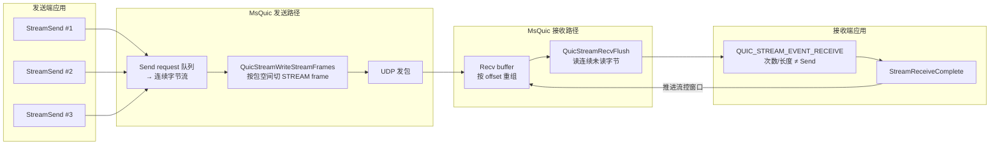

# MsQuic Stream Send / RECEIVE 语义说明

- 时间: 2026-06-12
- 依据: `third_party/msquic` 官方文档与核心实现（`stream_send.c`、`stream_recv.c`、`recv_buffer.c`）
- 背景: tcpquic-proxy relay 层在处理 `StreamSend` 与 `QUIC_STREAM_EVENT_RECEIVE` 时，容易误假设二者为 1:1 消息边界关系；本文档澄清 MsQuic 实际语义，供 relay 设计与性能调优参考。

---

## 核心结论

| 关系 | 是否 1:1 | 说明 |
|------|----------|------|
| `StreamSend()` ↔ 对端 `QUIC_STREAM_EVENT_RECEIVE` | **否** | 发送侧按字节流排队，接收侧按连续可读字节交付 |
| 每次 `Send()` 的字节数 ↔ 每次 `RECEIVE` 的字节数 | **不保证相等** | 中间经历 STREAM frame 切分/合并、recv buffer 缓冲、流控等 |
| `StreamSend()` ↔ `QUIC_STREAM_EVENT_SEND_COMPLETE` | **是（1:1）** | 每次 API 调用对应一个 send request 与一个完成事件 |

**需要区分的事件：**

- `QUIC_STREAM_EVENT_SEND_COMPLETE`：MsQuic 不再持有应用发送缓冲区（可复用/释放）。**不代表对端应用已收到数据。**
- `QUIC_STREAM_EVENT_RECEIVE`：对端（或本端接收方向）从字节流中读到的一段连续数据。

**正确的不变量（连接正常、无 abort 时）：**

- 按 stream offset **有序、不丢不重**；
- 发送总字节数 = 接收总字节数；
- **不能**假设 `N` 次 `Send` → `N` 次 `RECEIVE`，也不能假设每次长度相等。

---

## 1. QUIC Stream 是字节流，没有消息边界

QUIC stream 在协议层是**有序字节流**，不像 UDP datagram 或 HTTP/2 DATA frame 那样保留应用层「一条消息」的边界。

### 发送侧

应用每次调用 `StreamSend()` 会入队一个 `QUIC_SEND_REQUEST`，多个 request 按顺序链接，最终合并为从 `NextSendOffset` 到 `QueuedSendOffset` 的连续字节序列。写包时 `QuicStreamWriteStreamFrames()` 按**当前 UDP 包剩余空间**、SACK 区间、流控额度等切分 STREAM frame，**与「调了几次 Send」无关**。

相关实现：`third_party/msquic/src/core/stream_send.c`（`QuicStreamWriteStreamFrames`）。

### 接收侧

每个 STREAM frame 按 `Frame->Offset` 写入 recv buffer 并重组，**与对端调了几次 `StreamSend` 无关**。

相关实现：`third_party/msquic/src/core/stream_recv.c`（`QuicStreamRecv` → `QuicRecvBufferWrite`）。

### 官方文档

`third_party/msquic/docs/Streams.md`：

> Data is received and delivered to apps via the `QUIC_STREAM_EVENT_RECEIVE` event. The event indicates zero, one or more contiguous buffers up to the application.

---

## 2. 多次 Send 可合并为更少的 RECEIVE

典型场景：发送端连续多次小 `StreamSend()`，接收端应用处理较慢或默认 receive 模式下上一次 `RECEIVE` 尚未 `StreamReceiveComplete`。

数据路径：

1. 多次 `StreamSend` → 合并为同一字节偏移序列；
2. 网络侧可能将多段数据打在少量 UDP 包中到达；
3. recv buffer 累积多段连续未读数据；
4. 下次触发 `QuicStreamRecvFlush` 时，`QuicRecvBufferRead` 一次性读出**所有**连续未读字节；
5. 应用在一次 `QUIC_STREAM_EVENT_RECEIVE` 中看到 `TotalBufferLength` = 多段之和。

`QuicRecvBufferRead` 读取的是 `ContiguousLength - ReadPendingLength` 范围内的全部连续数据（`third_party/msquic/src/core/recv_buffer.c`）。

### 默认 receive 模式的背压

若上次 `RECEIVE` 尚未完成（`ReadPendingLength != 0`），新到达的数据会写入 buffer，但**不会**立即再发 `RECEIVE` 回调，直到应用通过同步返回或 `StreamReceiveComplete` 消费数据：

```c
// stream_recv.c
if (ReadyToDeliver &&
    (Stream->RecvBuffer.RecvMode == QUIC_RECV_BUF_MODE_MULTIPLE ||
     Stream->RecvBuffer.ReadPendingLength == 0)) {
    Stream->Flags.ReceiveDataPending = TRUE;
    QuicStreamRecvQueueFlush(...);
}
```

因此：**慢消费 → 更多合并 → 更少次、但每次更大的 RECEIVE**。

---

## 3. 一次 Send 可拆成多次 RECEIVE

典型场景：单次 `StreamSend` 提交大量数据，对端应用同步快速消费。

数据路径：

1. `QuicStreamWriteStreamFrames` 受 `AvailableBufferLength`（包内剩余空间）限制，大 send 被切成多个 STREAM frame、多个 UDP 包；
2. 每个 frame 到达后，若 `ReadPendingLength == 0`（或 multi-receive 模式），可分别触发 `RECEIVE`；
3. 对端可能看到多次较小 `RECEIVE`，总和等于已发送字节。

写帧循环受限于包空间与 `QUIC_MAX_FRAMES_PER_PACKET`（`stream_send.c` 中 `QuicStreamSendWrite` → `QuicStreamWriteStreamFrames`）。

---

## 4. 影响 Send/Receive 切分与时序的因素

| 因素 | 作用 |
|------|------|
| **拥塞控制 / 丢包重传** | 改变发包时机与在途数据量；不改变字节流语义，但改变 frame 到达节奏，从而影响 `RECEIVE` 次数与每次大小 |
| **Stream / Connection 流控** | 发送在 `MaxAllowedSendOffset`、`PeerMaxData` 处被截断；接收端 `StreamReceiveComplete` 推进慢会拖住对端发送窗口 |
| **UDP 分包 / MTU** | 直接限制每个 STREAM frame 的最大 payload |
| **ACK 时机** | 主要影响发送侧重传与拥塞窗口；间接影响到达时序 |
| **`StreamReceiveComplete` 推进速度** | 决定 recv buffer 何时 drain、`QuicStreamOnBytesDelivered` 何时更新 MAX_STREAM_DATA / MAX_DATA，释放对端 credit |

`QuicStreamOnBytesDelivered`（`stream_recv.c`）在应用确认消费字节后更新流控窗口；注释说明只有 drain 达到阈值或已有 ACK 待发送时才推进 MAX_STREAM_DATA。

---

## 5. Multi-Receive 模式

连接级选项 `StreamMultiReceiveEnabled`（见 `QUIC_SETTINGS`）开启后：

- MsQuic 可在上一次 `RECEIVE` 仍 pending 时继续下发新的 `RECEIVE`；
- `StreamReceiveComplete` 调用次数**不必**与 `RECEIVE` 次数相等（可更多或更少）；
- 应用须自行累计所有 `RECEIVE` 的 `TotalBufferLength`，并保证 `StreamReceiveComplete` 的 `BufferLength` 之和最终覆盖全部已收字节。

官方说明：`third_party/msquic/docs/api/StreamReceiveComplete.md`（Multi-receive Mode 章节）。

---

## 6. 与 tcpquic-proxy 相关的实践建议

### 不要做的假设

- 不要假设「一次 `StreamSend` = 对端一次 `RECEIVE`」；
- 不要假设 `RECEIVE.TotalBufferLength` 等于某次 `Send` 的提交长度；
- 不要用 `SEND_COMPLETE` 推断对端已处理完数据。

### 应该做的

- 将 QUIC stream 视为 **TCP 式字节流**：在 relay 层维护解析状态，按应用协议自行切分消息；
- 处理 `RECEIVE` 时按 `AbsoluteOffset` + `TotalBufferLength` 做有序拼接；
- 异步处理 `RECEIVE`（`QUIC_STATUS_PENDING`）时，必须在完成后调用 `StreamReceiveComplete`，否则默认模式下会阻塞后续接收并拖住流控；
- 若使用 callback 预算 / 分批 `StreamReceiveComplete`（如 phase4 sync-write），需保证**字节计数**正确，而非**回调次数**对齐。

### 事件对照速查

```
发送端应用                    MsQuic 内核                     接收端应用
─────────                    ──────────                     ──────────
StreamSend(buf)    →    入队 send request
                   →    切 STREAM frame / UDP 发包
                   →    SEND_COMPLETE（buffer 归还）

                                              →    STREAM frame 重组进 recv buffer
                                              →    QUIC_STREAM_EVENT_RECEIVE
                                              →    StreamReceiveComplete（若 pending）
```

---

## 7. 代码索引（msquic 子模块）

| 主题 | 路径 |
|------|------|
| 应用 API：`StreamSend` | `third_party/msquic/src/core/api.c`（`MsQuicStreamSend`） |
| 写 STREAM frame | `third_party/msquic/src/core/stream_send.c`（`QuicStreamWriteStreamFrames`） |
| 收 frame、触发 RECEIVE | `third_party/msquic/src/core/stream_recv.c`（`QuicStreamRecv`、`QuicStreamRecvFlush`） |
| recv buffer 读/写 | `third_party/msquic/src/core/recv_buffer.c`（`QuicRecvBufferWrite`、`QuicRecvBufferRead`） |
| 流控推进 | `third_party/msquic/src/core/stream_recv.c`（`QuicStreamOnBytesDelivered`） |
| 官方 Streams 文档 | `third_party/msquic/docs/Streams.md` |
| RECEIVE 事件说明 | `third_party/msquic/docs/api/QUIC_STREAM_EVENT.md` |
| StreamReceiveComplete | `third_party/msquic/docs/api/StreamReceiveComplete.md` |
| StreamSend | `third_party/msquic/docs/api/StreamSend.md` |

---

## 8. 数据路径示意



---

## 参考

- [MsQuic Streams.md](https://github.com/microsoft/msquic/blob/main/docs/Streams.md)（本地：`third_party/msquic/docs/Streams.md`）
- [StreamReceiveComplete.md](https://github.com/microsoft/msquic/blob/main/docs/api/StreamReceiveComplete.md)
- RFC 9000 QUIC Transport：Stream 为有序字节流抽象，不保留应用消息边界
