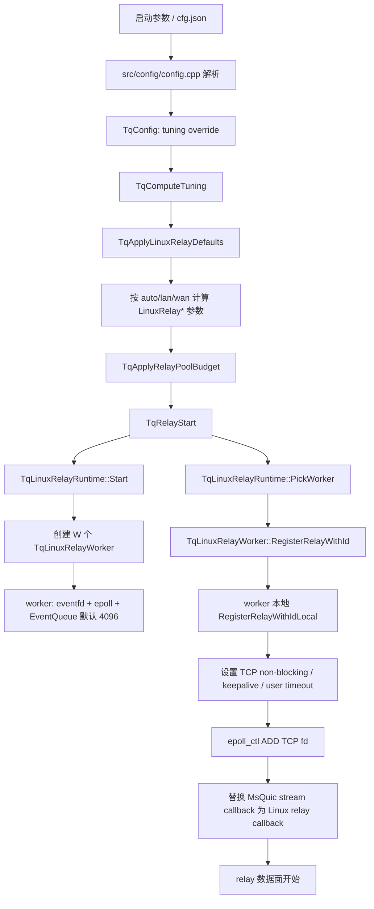
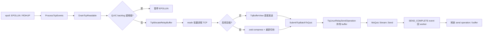

# Linux relay 转发实现梳理

本文基于当前源码记录 Linux 数据转发路径、配置生效流程、线程同步热点和已发现的问题。范围主要覆盖：

- `src/tunnel/relay.cpp`
- `src/tunnel/linux_relay_worker.h`
- `src/tunnel/linux_relay_worker.cpp`
- `src/tunnel/linux_relay_event_queue.h`
- `src/tunnel/relay_buffer.*`
- `src/config/tuning.*`
- `src/config/config.cpp`
- `src/runtime/relay_metrics.*`

Linux 生产路径不是 per-tunnel 线程模型，而是固定数量 `TqLinuxRelayWorker` 分片处理全部 TCP fd。每个 worker 一个 `epoll` + `eventfd` 循环；relay 状态、fd interest、pending queue 和绝大多数数据面状态只在 owner worker 线程内读写。MsQuic callback、控制面 register/unregister/snapshot 通过 `TqLinuxRelayEventQueue` 投递到 owner worker。

## 1. Linux 转发逻辑和实现

### 1.1 配置生效流程

配置入口来自 CLI 和 JSON：

- CLI：`--relay-io-size`、`--linux-relay-read-chunk-size`、`--linux-relay-tcp-write-max-bytes`、`--linux-relay-tcp-write-burst-bytes`、`--max-memory-mb`、`--tuning`。
- JSON：`relay.io_size`、`relay.linux.read_chunk_size`、`relay.linux.tcp_write_max_bytes`、`relay.linux.tcp_write_burst_bytes`。
- `relay.linux.worker_slots` 仍可解析，但当前只 warning，已废弃并被忽略。
- `EventQueueCapacity` 在 `TqLinuxRelayWorkerConfig` 中存在，默认 4096；当前 `TqTuningConfig`、CLI、JSON 没有对外暴露该配置，`TqLinuxRelayRuntime::Start()` 也没有从 tuning 设置它。



关键 tuning 字段：

| 字段 | 默认/来源 | 作用 |
| --- | --- | --- |
| `LinuxRelayWorkerCount` | `TqDetectLinuxRelayWorkers()` | Linux relay worker 数。 |
| `LinuxRelayReadChunkSize` | LAN/WAN 默认 128 KiB，可 override | 单个 TCP read buffer 大小。 |
| `LinuxRelayReadBatchBytes` | LAN 256 KiB，WAN 1 MiB | 单轮 TCP read 批量预算。 |
| `LinuxRelayWorkerEventBudget` | LAN 1024，WAN 4096 | 每次 eventfd wake 后最多处理的 event 数。 |
| `LinuxRelayWorkerByteBudgetPerTick` | LAN 16 MiB，WAN 64 MiB | worker 单 tick 字节预算上限。 |
| `LinuxRelayTcpWriteMaxBytes` | 默认 0，可 override | 单次 TCP `writev` 尝试字节上限，0 表示不额外限制。 |
| `LinuxRelayTcpWriteBurstBytes` | 默认 0，可 override | 单轮 TCP write flush 字节上限。 |
| `LinuxRelayPerTunnelPendingBytes` | 由内存预算和 profile 计算 | 单 relay QUIC receive pending 上限。 |
| `MaxPendingBufferBytesPerRelay` | 由全局 relay memory 和 worker 数计算 | relay buffer budget 上限。 |
| `InitialQuicReadAheadBytes` | 默认 1 MiB | 初始 ideal send/backlog 阈值，后续可由网络统计更新。 |

### 1.2 建链和 worker 接管

client 和 server 的控制面都只负责建立 tunnel。OPEN 成功后统一调用 `TqRelayStart()`：

```text
TqRelayStart()
  -> TqRelayRegisterActive()
  -> TqApplyRelayPoolBudget()
  -> TqLinuxRelayRuntime::Start()
  -> TqLinuxRelayRuntime::PickWorker()
  -> TqLinuxRelayWorker::RegisterRelayWithId()
  -> worker event: RegisterRelay
  -> RegisterRelayWithIdLocal()
  -> epoll ADD tcp fd
  -> stream callback = TqLinuxRelayWorker::StreamCallback
  -> TqRelayHandle 记录 LinuxWorker + LinuxRelayId
```

`RegisterRelayWithIdLocal()` 在 worker 线程中完成 TCP fd 和 stream binding 初始化：

- TCP fd 设置 non-blocking。
- 配置 keepalive 和 `TCP_USER_TIMEOUT`。
- 注册 `EPOLLIN | EPOLLRDHUP | EPOLLERR`。
- `epoll_event.data.u64` 放 relay id，worker 通过 `RelaysById` O(1) 找回 relay。
- 为 MsQuic stream 建立 `StreamRelayBinding`，callback 侧通过 binding 原子字段拿到 relay。

### 1.3 TCP -> QUIC

TCP 可读事件只在 owner worker 线程处理。



实现要点：

- `DrainTcpReadable()` 按 `min(ReadBatchBytes, ByteBudgetPerTick)` 控制单轮读取。
- 每轮构造多个 `iovec`，调用 `readv()` 批量读取。
- 非压缩路径直接把 `TqRelayBuffer` 包装成 `TqBufferView`。
- zstd 路径先写入 `CompressionOutput`，再重新申请 relay buffer 切成 QUIC send views。
- `SubmitTcpBatchToQuic()` 创建 `TqLinuxRelaySendOperation`，其中持有 `TqBufferView` 和 `QUIC_BUFFER`。
- `TrySubmitQuicSendOperation()` 成功后增加 `OutstandingQuicSends` / `OutstandingQuicSendBytes`；`SEND_COMPLETE` 回到 worker 后减少 outstanding 并释放 operation。
- TCP EOF 会设置 `TcpReadClosed`，关闭 EPOLLIN，并用 QUIC FIN 结束对端读方向；压缩模式会先 flush compressor。

TCP 读侧背压：

- `ShouldPauseTcpReadForQuicBacklog()` 使用 `OutstandingQuicSendBytes >= CurrentRelayIdealSendBytes()` 判断是否暂停。
- ideal send 初始来自 `InitialQuicReadAheadBytes`；收到 `QUIC_STREAM_EVENT_IDEAL_SEND_BUFFER_SIZE` 后只增长到更大的 `ByteCount`。
- MsQuic send 返回 `QUIC_STATUS_OUT_OF_MEMORY` 或 `QUIC_STATUS_BUFFER_TOO_SMALL` 时，operation 进入 `PendingQuicSendRetries`，同时暂停 TCP read。

### 1.4 QUIC -> TCP

MsQuic receive callback 不直接写 TCP。Linux relay callback 只保存 MsQuic buffer view、投递 event，然后返回 `QUIC_STATUS_PENDING`。真正写 TCP 和 `ReceiveComplete()` 都由 owner worker 完成。

```mermaid
flowchart LR
    A[MsQuic RECEIVE callback] --> B[StreamRelayBinding 原子校验]
    B --> C[QueueDeferredQuicReceive]
    C --> D{EventQueue push 成功?}
    D -- 是 --> E[QuicReceiveView event]
    D -- 否 --> F[CallbackPendingQuicReceives 降级队列]
    F --> G[ReceiveSetEnabled(false)]
    E --> H[worker DrainEvents]
    G --> H
    H --> I[ProcessQuicReceiveViewEvent]
    I --> J[PendingQuicReceives]
    J --> K{启用解压?}
    K -- 否 --> L[writev TCP]
    K -- 是 --> M[zstd DecompressInto + PendingTcpWrites]
    M --> L
    L --> N{写完 view?}
    N -- 否/EAGAIN --> O[保留 offset + 打开 EPOLLOUT]
    N -- 是 --> P[ReceiveComplete]
    P --> Q{FIN?}
    Q -- 是 --> R[shutdown TCP SHUT_WR]
```

实现要点：

- `TqPendingQuicReceive` 保存 MsQuic buffer slice、当前 slice offset、已完成长度、待批量 `ReceiveComplete` 字节数和 FIN 标记。
- `ProcessQuicReceiveViewEvent()` 把 view 放入 `PendingQuicReceives`，增加 `PendingQuicReceiveBytes`，必要时 `ReceiveSetEnabled(false)`。
- 非压缩路径直接基于 MsQuic buffer slice 构造 `iovec` 调 `writev()`。
- 压缩路径通过 `DrainCompressedQuicReceiveView()` 增量解压到 relay buffer，再写入 `PendingTcpWrites`。
- `FlushDeferredReceiveCompletion()` 可按 `LinuxRelayQuicReceiveCompleteBatchBytes` 批量归还 MsQuic receive buffer；默认阈值 0 时更及时归还。
- `EAGAIN/EWOULDBLOCK` 时保留 view offset，打开 EPOLLOUT，后续 writable 继续。

QUIC receive 背压：

- high watermark 是 `MaxPendingQuicReceiveBytesPerRelay()`，配置优先用 `LinuxRelayPerTunnelPendingBytes`，否则回退到 `MaxPendingBufferBytes`。
- low watermark 当前等于 high watermark，即 pending bytes 只要低于上限就恢复 receive。
- event queue 满时走 `CallbackPendingQuicReceives` 降级路径，并暂停 receive；worker 后续 `DrainCallbackPendingQuicReceives()` 转入正常 pending 队列。

### 1.5 client/server 差异

client ingress 路径：

```text
listen fd
  -> TqClientIngressReactor accept
  -> SOCKS5 / HTTP CONNECT / port-forward 握手
  -> TqStartClientTunnelAsync()
  -> QUIC OPEN request
  -> server OPEN response
  -> ingress 写 SOCKS5 reply / HTTP 200
  -> TqAcceptClientTunnelOpen()
  -> TqRelayStart()
```

server 路径：

```text
MsQuic incoming stream
  -> TqServerIncomingStreamDispatcher
  -> TqTunnelContext::TryHandleServerOpen()
  -> TqServerDialReactor::Submit()
  -> ACL / c-ares DNS / non-blocking TCP connect
  -> OPEN response send complete
  -> StartPendingServerRelay()
  -> TqRelayStart()
```

server 侧 OPEN 和首批 relay 数据可能粘在同一个 QUIC receive 中。`TryHandleServerOpen()` 会把控制头之后的 bytes 保存到 `PendingRelayRx`，relay 启动后再构造 synthetic receive 交给 Linux relay callback，避免 early data 丢失。

### 1.6 关闭和生命周期

relay 正常关闭需要满足：

- TCP read closed。
- TCP write closed。
- QUIC FIN 已提交并完成。
- `OutstandingQuicSends == 0`。
- `PendingQuicSendRetries`、`PendingQuicReceives`、`PendingTcpWrites` 均为空。
- `PendingQuicReceiveBytes == 0`。

fatal 路径会调用 `AbortRelayAndRelease()` 或 `FailRelayFatal()`：

- 设置 `TqRelayHandle::Stop`。
- 从 epoll 删除 TCP fd。
- reset/close TCP fd。
- detach stream binding。
- 清空 pending queue，并对未完成 receive 调 `ReceiveComplete()` 归还 MsQuic buffer。

## 2. Linux 线程锁和同步热点排序

下面按对转发热路径影响从高到低排序。这里把原子 CAS、eventfd wake、mutex 都列入“线程同步热点”，因为 Linux relay 的主要成本已经从传统大锁转为跨线程事件和原子同步。

| 排名 | 同步点 | 位置 | 触发频率/热度 | 当前作用 | 建议 |
| --- | --- | --- | --- | --- | --- |
| 1 | `TqLinuxRelayEventQueue` 的 `EnqueuePos` / `DequeuePos` / per-cell `Sequence` 原子 CAS | `src/tunnel/linux_relay_event_queue.h` | 最高；每个 QUIC receive、send complete、ideal send、abort/shutdown 和控制事件都会经过 | 固定容量 MPMC 风格 ring buffer，把 MsQuic callback 和控制面事件转交给 owner worker | 持续关注 `linux_relay_pending_events`、`linux_relay_event_queue_full_errors`、`linux_relay_quic_receive_view_backpressure_queued`。若多 producer 竞争明显，可做 per-worker 多 shard MPSC 队列或按 stream 分片队列。 |
| 2 | `WakeArmed` 原子 + `eventfd` | `TqLinuxRelayWorker::Wake()` / `DrainEvents()` | 高；每次跨线程 enqueue 后尝试唤醒 worker | `WakeArmed.exchange(true)` 合并 wake，减少 eventfd write storm | 当前设计合理。若 wake 仍过多，可改成队列空->非空才写 eventfd，但需要更精确的空队列同步。 |
| 3 | `StreamRelayBinding::{Relay,Handle,CallbackRefs,Closing}` 原子 | `StreamCallback()` / `OnStreamEventWithBinding()` / detach | 高；每个 QUIC callback 进入 relay 时都会访问 | 避免 callback 线程持容器锁，同时防止 unregister/detach 后 use-after-free | 方向正确。若小包 callback 极多，可评估 generation id 或 callback 批处理，但不能直接删除生命周期校验。 |
| 4 | relay buffer budget 原子：`PendingBufferBytes` CAS、`AllocateCount` | `src/tunnel/relay_buffer.cpp` | 高；TCP read buffer、压缩输出、解压输出都会分配/释放 | 控制单 relay pending buffer 内存，失败时形成读侧背压 | 可引入 per-worker/per-relay buffer pool 和本地 credit cache，减少高吞吐下的 malloc/free 与 CAS。 |
| 5 | 高频 metrics 原子 `fetch_add/load` | `TqLinuxRelayWorker` 多个计数字段 | 中高；按 read/write batch、receive view、send complete、错误事件计数 | 给 admin metrics 和排障使用 | 纯统计计数优先改 `memory_order_relaxed`；worker 独占更新的计数可用普通字段，snapshot 在 worker 线程读。 |
| 6 | `RelayState::CallbackPendingQuicReceiveLock` | `QueueDeferredQuicReceiveFromOffset()` / `DrainCallbackPendingQuicReceives()` / unregister | 中；正常路径不走，event queue 满时才走 | event queue push 失败时临时保存 MsQuic receive view，并暂停 receive | 这是降级保护，不应成为常态。若指标显示频繁触发，优先扩大/暴露 event queue capacity 或队列分片；再考虑 per-relay lock-free overflow queue。 |
| 7 | `TqLinuxRelayWorker::ControlLock` | `Start()`、`Stop()`、`RegisterRelayWithId()`、`UnregisterRelay()`、`Snapshot()`、test helper | 中低；建链、拆链、snapshot 触发，不在每包读写路径 | 串行化控制命令提交、worker running/thread id 检查和栈上 command 生命周期 | 缩小锁范围：避免持 `ControlLock` 等待 worker command 完成；用 atomic running/thread id 和明确 command lifetime 管理替代长持锁。 |
| 8 | `TqLinuxRelayRuntime::Lock` | `Start()`、`Stop()`、`PickWorker()`、`Snapshot()`、`SnapshotWorkers()` | 中低；每条 relay 建链会 `Start()` + `PickWorker()`，admin snapshot 也会持有 | 保护 worker vector 和 round-robin `NextWorker` | `Start()` 可启动期一次完成，`NextWorker` 可 atomic；snapshot 应复制 worker 指针后释放 runtime lock，再逐 worker snapshot。 |
| 9 | `TqLinuxRelayWorker::RetiredBindingLock` | `DetachRelayStreamBinding()` | 低；关闭/detach 路径 | 延迟持有 `StreamRelayBinding`，避免 callback 未退出时释放 | 当前可接受。关闭风暴下可迁移到 worker 私有 retired 队列或 epoch 回收。 |
| 10 | 同步 command 的 `Mutex/Cv` | `RegisterRelayCommand`、`UnregisterRelayCommand`、`SnapshotCommand` 等 | 低；控制面同步 API 使用 | 让调用方等待 worker 完成本地操作 | 建议给 register/unregister/snapshot 增加超时和错误日志，避免 worker 卡住时调用方无限等待。 |
| 11 | runtime tuning `g_Runtime.Lock` | `src/config/tuning.cpp` | 低；吞吐/RTT/压缩观察更新和日志 | 保护运行时观测状态 | 不在 Linux relay 每包转发主路径。若观测采样频率升高，可改为分片计数再周期聚合。 |

结论：当前 Linux 转发路径已经避免了 per-relay 大 mutex。真正的热点优先级是 event queue 原子竞争、eventfd wake、stream binding 原子、buffer budget CAS 和 metrics 原子写压力；传统 mutex 主要集中在控制面、降级路径和生命周期回收。

## 3. 当前问题和解决方案建议

### 3.1 Linux active relay 明细缺失

现象：`TqSnapshotActiveRelays()` 当前只在 Windows 分支填充 `ActiveRelayStates`，Linux 下 `/api/v1/relay/active-relays` 返回空列表。Linux 聚合 metrics 已有 hot relay 字段，但无法列出所有 active relay 的细节。

影响：

- 排查单连接卡顿时只能看聚合 `linux_relay_hot_relay_*`，无法通过 API 枚举所有 relay。
- `docs/relay_linux.md` 中建议关注 per-relay pending/backpressure，但实际 API 不完整。

建议：

- 增加 Linux active relay snapshot 结构，至少包含 relay id、worker index、pending receive bytes/queue、outstanding QUIC send bytes、pending retry 数、TCP read/write bytes、read/write armed、last errno、local/peer address。
- 在 worker `SnapshotLocal()` 或单独 active-relay event 中构建明细；如果担心 snapshot 成本，支持分页或只返回 top N hot relays。
- 让 `/api/v1/relay/active-relays/{id}` 同时支持 Linux。

### 3.2 Event queue capacity 未暴露配置

现象：`TqLinuxRelayWorkerConfig::EventQueueCapacity` 默认 4096，单测可直接设置，但生产 `TqTuningConfig` 没有对应字段；CLI/JSON 也没有配置项。

影响：

- 代码已经有 `EventQueueFullErrors` 和 `QuicReceiveViewBackpressureQueued` 指标，但用户无法通过配置扩大 queue，只能改源码。
- 高并发小包或多 MsQuic callback producer 下，event queue 满会进入 `CallbackPendingQuicReceives` 锁路径，并暂停 receive。

建议：

- 在 `TqTuningConfig` 增加 `LinuxRelayEventQueueCapacity`。
- JSON 增加 `relay.linux.event_queue_capacity`，CLI 增加 `--linux-relay-event-queue-capacity`。
- 文档中明确 power-of-two normalize 行为、建议范围和过大容量的内存成本。

### 3.3 QUIC receive 背压没有 hysteresis

现象：`LowPendingQuicReceiveBytesPerRelay()` 当前直接返回 high watermark。也就是说 pending bytes 一旦低于上限就恢复 receive。

影响：

- 在 TCP 写端轻微抖动时，`ReceiveSetEnabled(false/true)` 可能围绕阈值频繁切换。
- metrics 中 `linux_relay_quic_receive_paused_count` / `resumed_count` 上升时，不容易判断是稳定背压还是阈值抖动。

建议：

- 设置 low watermark，例如 high 的 50% 或 75%。
- metrics 增加当前 high/low watermark，便于现场判断。
- 对不同 tuning profile 设置不同 hysteresis：LAN 更低延迟，WAN 更强调吞吐和减少 callback 抖动。

### 3.4 runtime snapshot 持锁范围偏大

现象：`TqLinuxRelayRuntime::Snapshot()` 和 `SnapshotWorkers()` 持有 `Runtime::Lock` 时逐个调用 `worker->Snapshot()`。worker snapshot 会投递同步 event 并等待 worker 完成。

影响：

- admin snapshot 慢或 worker 忙时，`PickWorker()` 会被 runtime lock 阻塞，短连接建链可能被 metrics 请求影响。
- 如果未来 snapshot 更重，控制面抖动会更明显。

建议：

- runtime lock 内只复制 worker 指针/引用，随后释放 lock，再调用各 worker snapshot。
- worker lifetime 可通过 `shared_ptr` 或停止阶段 join 前 drain snapshot 请求保证。
- 聚合 snapshot 可以允许返回部分 worker 超时结果，并暴露超时计数。

### 3.5 `ControlLock` 持锁等待 worker command

现象：`RegisterRelayWithId()`、`UnregisterRelay()`、`Snapshot()` 在持有 `ControlLock` 后 enqueue command，并等待 command `Cv`。event queue 满时部分路径会释放锁重试，但 register 和 snapshot 的首次 enqueue 失败直接返回。

影响：

- worker 忙或 event queue 满时，控制面调用可能长时间占用 `ControlLock`，阻塞同 worker 的 stop/snapshot/register。
- register enqueue 失败直接返回失败，短时 queue full 可能造成建链失败，而 unregister/test helper 有 retry。

建议：

- 缩小 `ControlLock` 到 running/thread id 检查，不要持锁等待 command 完成。
- register/snapshot enqueue 失败可采用 bounded retry + 明确错误日志，而不是静默返回空结果。
- command wait 增加超时，超时后标记 relay/backend 状态，避免调用方无限阻塞。

### 3.6 收到 MsQuic fake FIN 时直接 abort 进程

现象：`OnStreamEventWithBinding()` 遇到 `TqIsMsQuicFakeFinReceive()` 时执行 `assert(false)` 和 `std::abort()`。

影响：

- 即使这是“不应发生”的 MsQuic 事件形态，生产进程直接退出会扩大单 stream 异常的影响面。
- 该路径在 relay callback 中，崩溃时可能影响所有 active tunnels。

建议：

- 改为记录 fatal relay error，调用 `AbortRelayFromCallback()` 或投递 fatal event 给 worker，关闭当前 relay/stream。
- 保留 debug build assert，但 release build 不应 `std::abort()`。
- 增加单测覆盖 fake FIN receive，验证只重置当前 relay。

### 3.7 metrics 原子内存序偏保守

现象：很多计数器 `fetch_add()` / `load()` 未显式内存序，默认 `seq_cst`。这些计数器多数只用于观测，不参与业务状态同步。

影响：

- 小包、高事件率压测下，统计写入可能形成额外 cache line 和内存序成本。
- 真正业务状态多在 worker 线程独占，部分原子属于历史保守实现。

建议：

- 对纯统计字段统一使用 `memory_order_relaxed`。
- worker 线程独占更新、snapshot 也在 worker event 中读取的字段可改普通整数。
- 高频指标可以按 worker 本地聚合，admin snapshot 时再汇总。

### 3.8 运行时缺少锁/队列等待时间指标

现象：Windows relay metrics 暴露了 `windows_relay_worker_lock_wait_nanos`、`find_relay_by_id_count`、callback dispatch nanos 等；Linux 没有类似 event queue CAS retry、ControlLock wait、Runtime lock wait、command wait 的指标。

影响：

- 只能通过 queue depth/full 和 pending bytes 间接判断瓶颈。
- “锁热点排序”目前主要依赖代码结构和路径频率，缺少生产现场的直接等待时间证据。

建议：

- 增加 Linux `event_queue_push_failures/retries`、`event_queue_cas_retry_count`、`control_lock_wait_nanos`、`runtime_lock_wait_nanos`、`snapshot_command_wait_nanos`。
- 把 `MultipleEventProducerThreadsObserved` 暴露到 JSON metrics，辅助判断是否需要 queue shard。
- 对 queue full 降级路径增加每 relay callback pending depth/top N。

### 3.9 relay id lookup 已优化，但 fd/stream fallback 仍有线性扫描

现象：主路径 epoll 通过 relay id 走 `RelaysById`；但 `FindRelayByFd()` 和 `FindRelayIdByStream()` 仍扫描 `Relays`。其中 fd 查找主要用于测试，stream 查找已有 `StreamLookupScanCount` 指标。

影响：

- 当前不属于主热路径；如果 `StreamLookupScanCount` 在生产中上升，说明存在 fallback 或旧路径仍在使用。

建议：

- 继续以 relay id map 为主路径。
- 如需生产使用 fd/stream 查找，增加 `RelaysByFd` / `RelaysByStream` map 或 slot/generation id。
- 在 metrics 中暴露 `StreamLookupScanCount`，若非零则排查调用来源。

## 4. 排障优先级

生产排查 Linux relay 性能时建议按下面顺序看指标：

1. 队列压力：`linux_relay_pending_events`、`linux_relay_event_queue_full_errors`、`linux_relay_quic_receive_view_backpressure_queued`。
2. QUIC->TCP 背压：`linux_relay_current_pending_quic_receive_bytes`、`linux_relay_max_relay_pending_quic_receive_bytes`、`linux_relay_tcp_write_eagain_count`、`linux_relay_hot_relay_*`。
3. TCP->QUIC 背压：`linux_relay_outstanding_quic_send_bytes`、`linux_relay_quic_send_backpressure_events`、`linux_relay_read_disabled_count`。
4. buffer budget：`linux_relay_buffer_bytes_in_use`、`linux_relay_tcp_read_buffer_acquire_pending_budget_failures`、`linux_relay_quic_receive_tcp_buffer_acquire_pending_budget_failures`。
5. 错误路径：`linux_relay_tcp_write_hard_errors`、`linux_relay_tcp_read_hard_errors`、`linux_relay_quic_send_fatal_errors`、`linux_relay_fatal_relay_resets`、last errno/status。

当前最值得优先补齐的是 Linux active relay 明细和 event queue capacity 配置；前者提升定位能力，后者让 queue full 降级路径有可操作的调优手段。
