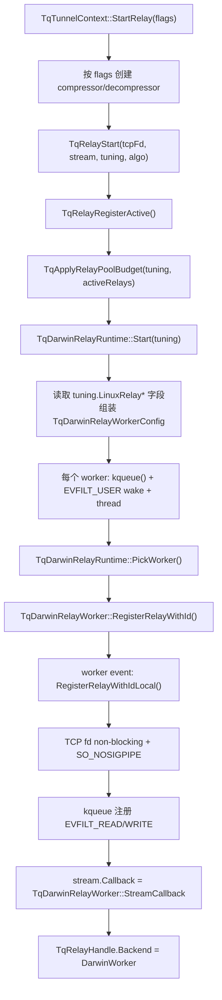

# macOS relay 转发代码检视

本文基于当前源码梳理 macOS/Darwin relay 的转发实现、线程锁热点和代码问题。2026-07 send completion 锁出清后，active worker TCP->QUIC send 路径已改用 `ActiveSendOperations` + operation 原子状态，fallback 边界保留 `KnownSendOperations` / `FallbackSendOperations`。主要代码入口：

- `src/tunnel/relay.cpp`
- `src/tunnel/tcp_tunnel.cpp`
- `src/tunnel/darwin_relay_worker.h`
- `src/tunnel/darwin_relay_worker.cpp`
- `src/tunnel/darwin_relay_event_queue.h`
- `src/unittest/darwin_relay_worker_io_test.cpp`
- `src/unittest/darwin_relay_worker_queue_test.cpp`

## 1. macOS 转发逻辑和实现

macOS relay 后端由 `TqDarwinRelayRuntime` 管理。runtime 按配置启动多个 `TqDarwinRelayWorker`，每个 worker 拥有一个线程、一个 `kqueue` fd 和一个跨线程事件队列 `TqDarwinRelayEventQueue`。控制面完成 OPEN 后，`TqTunnelContext::StartRelay()` 调用 `TqRelayStart()`，macOS 分支启动 runtime、轮询选择 worker，并通过 `RegisterRelayWithId()` 把 TCP fd 与 MsQuic stream 绑定到 worker。

### 配置和启动流程图



当前 Darwin 配置复用 `TqTuningConfig` 内的 `LinuxRelay*` 字段：worker 数、事件预算、read chunk/batch、IOV、TCP write burst、per-tunnel pending bytes 和 QUIC receive complete batch 等都从 Linux 命名字段读取。功能上可用，但配置语义不清晰。

### 线程边界

- client ingress reactor：负责本地 listen/accept、SOCKS5/HTTP CONNECT/port-forward 握手、发起 client OPEN、写代理成功响应。
- server dial reactor：server OPEN 后执行 ACL、DNS、TCP connect，并在 OPEN response 完成后启动 relay。
- MsQuic worker：触发 stream callback，包括 RECEIVE、SEND_COMPLETE、peer abort、shutdown complete。
- Darwin relay worker：kqueue 循环，处理 TCP fd read/write readiness 和 relay 事件队列。
- tunnel reaper：relay 移交后回收 tunnel context。

控制面 reactor 不执行 relay 数据转发。`TqRelayStart()` 成功后，TCP fd 和 stream callback 都交给 `TqDarwinRelayWorker`。

### 数据转发流程图

```mermaid
flowchart LR
    subgraph TCP_TO_QUIC["TCP -> QUIC"]
        A1["kqueue EVFILT_READ"] --> A2["ProcessTcpEvents()"]
        A2 --> A3["DrainTcpReadable()"]
        A3 --> A4["readv 批量读取"]
        A4 --> A5{"压缩启用?"}
        A5 -- "否" --> A6["TqBufferView[]"]
        A5 -- "是" --> A7["compress + flush 输出"]
        A7 --> A6
        A6 --> A8["SubmitTcpBatchToQuic()"]
        A8 --> A9["SubmitTcpBatchToQuic() / TrySubmitQuicSendOperation()"]
        A9 --> A10["RegisterKnownSendOperationLocal() -> ActiveSendOperations"]
        A10 --> A11["MsQuic Stream::Send()"]
        A11 --> A12["SEND_COMPLETE callback"]
        A12 --> A13["TryClaimKnownSendCompletionEvent() 原子 claim"]
        A13 --> A14{"claim 成功?"}
        A14 -- "是" --> A15["QuicSendComplete event 或 inline CompleteQuicSend()"]
        A14 -- "否 / detached" --> A16["CompleteDetachedQuicSend() -> FallbackSendOperations"]
        A15 --> A17["CompleteQuicSend() -> UnregisterKnownSendOperationLocal()"]
        A16 --> A17
        A17 --> A18["释放 operation / 计数 / 恢复 TCP read"]
    end

    subgraph QUIC_TO_TCP["QUIC -> TCP"]
        B1["QUIC_STREAM_EVENT_RECEIVE"] --> B2["StreamCallback()"]
        B2 --> B3["QueueDeferredQuicReceive()"]
        B3 --> B4["ReserveCallbackReceiveBudget()"]
        B4 --> B5["TqDarwinRelayEventQueue::TryPush(QuicReceiveView)"]
        B5 --> B6["worker wake"]
        B6 --> B7["ProcessQuicReceiveViewEvent()"]
        B7 --> B8["PendingQuicReceives / PendingTcpWrites"]
        B8 --> B9["MaybePauseQuicReceive()"]
        B9 --> B10["FlushTcpWrites()"]
        B10 --> B11["sendmsg()"]
        B11 --> B12{"全部写完?"}
        B12 -- "否/EAGAIN" --> B13["启用 EVFILT_WRITE"]
        B13 --> B10
        B12 -- "是" --> B14["ReceiveComplete(bytes)"]
        B14 --> B15["MaybeResumeQuicReceive()"]
    end
```



### client TCP -> QUIC

client 侧 OPEN 完成后，`FinishClientOpenAndStartRelay()` 设置 pending client relay，等待 OPEN send complete 后进入 `StartRelay()`。Darwin worker 注册 relay 后，TCP read filter 初始启用；本地 TCP 可读时：

1. `ProcessKqueueEvent()` 从 `event.udata` 取 relay id。
2. `ProcessTcpEvents()` 在 worker 线程内通过 `FindRelayLocal()` 查找 relay，避免进入 worker 全局 map 锁。
3. `DrainTcpReadable()` 在 `ReadBatchBytes`、`ByteBudgetPerTick`、`ReadChunkSize`、`MaxIov` 限制内分配 relay buffer 并 `readv()`。
4. 如果未启用压缩，读取到的 `TqBufferView` 直接进入 `SubmitTcpBatchToQuic()`；如果启用 zstd，则先压缩到 `CompressionOutput`，再切成 buffer view。
5. `TrySubmitQuicSendOperation()` 在 worker 线程上登记 active send operation（`ActiveSendOperations`），写入不可变 completion metadata，并将 operation 状态推进到 `Registered`；非 worker 路径仍走 `KnownSendOperations` + `FallbackSendOperations` fallback。随后增加 in-flight send 计数并调用 MsQuic `Stream::Send()`。
6. `SEND_COMPLETE` callback 通过 `TryClaimKnownSendCompletionEvent()` 对 operation 做原子 claim（不查 `CompletionState::Mutex`）；成功则优先投递 `QuicSendComplete` 事件，队列满时在 worker 线程 inline 调用 `CompleteQuicSend()`。worker 线程 `CompleteQuicSend()` 从 `ActiveSendOperations` unregister 并释放 operation。若 MsQuic 在 `StreamSend()` 返回前同步触发 callback，submit 路径会检测 `CompletionEventClaimed` 并 `DrainEvents(1)`，避免 double-complete。
7. worker stop 时 `DetachActiveSendOperationsForStop()` 将尚未完成的 active operation 标记 detached 并迁入 `FallbackSendOperations`，供迟到 callback 走 `CompleteDetachedQuicSend()`。
8. TCP EOF 会关闭 kqueue read interest，并提交带 FIN 的 QUIC send；压缩模式会先 flush compressor。

TCP 读侧背压来自三类条件：`MaxInFlightQuicSends` 达到上限、`MaxBufferedQuicSendBytes` 达到上限、`TqRelayBufferBudget` pending bytes 达到上限。触发后 `SetTcpReadBackpressure(true)` 禁用 kqueue read filter。

### client QUIC -> TCP

QUIC receive callback 不直接做 TCP I/O。`StreamCallback()` 收到 `QUIC_STREAM_EVENT_RECEIVE` 后：

1. 通过 `StreamBinding` 取得 relay id 和 callback 预算状态，不查 worker relay map。
2. `QueueDeferredQuicReceive()` 保存 MsQuic buffer view 指针、长度和 FIN 标志。
3. `ReserveCallbackReceiveBudget()` 先在 callback 侧原子计数中预留 pending receive bytes/events。
4. 将 `QuicReceiveView` 事件投递到 `TqDarwinRelayEventQueue` 并返回 `QUIC_STATUS_PENDING`。

worker 处理事件时：

1. `ProcessQuicReceiveViewEvent()` 把 view 放入 `PendingQuicReceives`，增加 `PendingQuicReceiveBytes`，释放 callback 预留预算。
2. `MaybePauseQuicReceive()` 按 `PendingQuicReceiveBytes + PendingTcpWriteBytes` 计算压力，超过高水位时调用 `ReceiveSetEnabled(false)`。
3. `EnqueueQuicReceiveForTcp()` 将 QUIC slice 转成 `PendingTcpWrites`；压缩模式下先解压。
4. `FlushTcpWrites()` 用 `sendmsg()` 写 TCP，支持 partial write；写不完时启用 kqueue write filter。
5. 某个 receive 对应的所有 TCP write 完成后，`CompleteDeferredQuicReceive()` 调用 MsQuic `ReceiveComplete(bytes)` 归还 buffer。
6. pending 压力降到低水位后，`MaybeResumeQuicReceive()` 调用 `ReceiveSetEnabled(true)`。

收到 QUIC FIN 时，worker 等相关数据写入 TCP 后执行 `shutdown(tcpFd, SHUT_WR)`。

### server 两个方向

server 侧 incoming stream 先进入 `TqTunnelContext::TryHandleServerOpen()`。OPEN request 解码成功后进入 server dial reactor 执行 ACL、DNS 和目标 TCP connect。目标 TCP 连接成功后发送 OPEN response；response 的 SEND_COMPLETE 到达后 `StartPendingServerRelay()` 启动 relay。

如果 OPEN request/response 同一个 QUIC receive 中带了 relay early data，`tcp_tunnel.cpp` 会把多余字节放到 `PendingRelayRx`。`StartRelay()` 成功后，`DispatchPendingRelayRx()` 构造 synthetic `QUIC_STREAM_EVENT_RECEIVE` 调用当前 stream callback，保证 early data 按原顺序进入 Darwin relay 的 QUIC->TCP 路径。

server 的 TCP->QUIC 与 client 一致，只是 TCP fd 是 server dial reactor 连接到目标服务的 fd。

### 事件队列和生命周期

`TqDarwinRelayEventQueue` 是固定容量 power-of-two ring buffer，默认容量来自 `EventQueueCapacity`，最大 `1 << 20`。push/pop 使用 `EnqueuePos`、`DequeuePos` 和 per-cell `Sequence` 原子操作。事件类型覆盖 receive view、send complete、peer abort、shutdown complete、ideal send buffer、register/unregister/snapshot/shutdown。

relay 生命周期由三层对象托住：

- `RelayState`：单条 relay 的 TCP fd、stream、pending 队列、in-flight send、背压和压缩状态。
- `StreamBinding`：stream callback 上下文，持有 worker 指针、active 标志、callback refs、callback receive 预算和 `CompletionState`。
- Send operation registry 分两层：`ActiveSendOperations`（worker-local，`ActiveSendMutex`）负责 active worker 主路径 register/submit/complete，配合 operation 原子状态处理正常 SEND_COMPLETE claim；`KnownSendOperations` + `CompletionState::FallbackSendOperations` 保留为非 worker fallback、stop drain、迟到 completion 和 detached callback 边界。

#### QUIC send operation 状态机

每个 `TqDarwinRelaySendOperation` 携带原子状态 `TqDarwinSendOperationState` 和 submit 时写入的不可变 completion metadata（`CompletionRelayId`、`CompletionTotalBytes`、`CompletionFin`、`CompletionBindingOwner`）。正常路径状态流转：

```text
Created -> Registered -> Submitted -> CompletionClaimed -> Completed
```

- **Created → Registered**：`TrySubmitQuicSendOperation()` 填充 metadata 后调用 `TryMarkRegistered()`。
- **Registered → Submitted**：`StreamSend()` 返回且 operation 未被同步 completion 删除时调用 `TryMarkSubmitted()`。
- **Submitted → CompletionClaimed**：`TryClaimKnownSendCompletionEvent()` 在 SEND_COMPLETE callback 中 CAS claim；已 claim 的重复 callback 直接返回 SUCCESS。
- **CompletionClaimed → Completed**：worker 线程 `CompleteQuicSend()` 调用 `TryMarkCompleted()` 后 unregister 并 `delete` operation。
- **→ Detached**：`DetachActiveSendOperationsForStop()` 在 worker 退出循环时调用 `MarkDetached()`；`CompletionClaimed` 视为终态，不会被 detach 覆盖，避免 stop 窗口与 in-flight callback 竞争。

fallback 路径（非 worker submit、worker stop 后迟到 callback、unregister 后 completion）不经过 active map，改查 `FallbackSendOperations` 并在 `CompletionState::Mutex` 下 unregister。

## 2. macOS 线程锁热点排序

> 跟进计划：`docs/superpowers/specs/2026-07-04-darwin-relay-state-lock-design.md` 和 `docs/superpowers/plans/2026-07-04-darwin-relay-state-lock.md` 已覆盖排名 1、2 的锁热点热路径出清。排名 3–5 的 send completion 锁已在 `docs/superpowers/plans/2026-07-04-darwin-send-completion-lock.md` 中完成 active worker 主路径出清（实现 commit 范围 `800e8c5`–`7b6e798`）。receive callback 失败语义与 event queue 背压已在 `docs/superpowers/plans/2026-07-04-darwin-receive-callback-hardening.md` 中完成（实现 commit 范围 `ce05f0c`–`32340fe`）。

下面按对转发热路径影响从高到低排序。这里的“热度”按代码路径频率、是否跨连接共享、是否进入 callback 或 worker 数据面综合判断。

| 排名 | 锁/同步点 | 粒度 | 主要路径 | 热点原因 | 建议 |
|---:|---|---|---|---|---|
| 1 | `RelayState::Mutex` | 单 relay | `DrainTcpReadable()`、`SubmitTcpBatchToQuic()`、`TrySubmitQuicSendOperation()`、`CompleteQuicSend()` fallback/retired 分支、`ProcessQuicReceiveViewEvent()`、`EnqueueQuicReceiveForTcp()`、`FlushTcpWrites()`、pause/resume receive | 每个 TCP read batch、QUIC receive view、TCP write flush 都会多次进入；active worker send completion 已改为 worker-local accounting，不再等同 fallback/retired cleanup。虽然是单连接锁，但数据面频率最高，并且会和 MsQuic callback、stop/snapshot 交叉。 | 已规划分阶段实现：active relay 数据面字段归 worker thread 独占，callback 只投递事件，snapshot 继续事件化构造；`RelayState::Mutex` 保留为生命周期和非 worker fallback 边界。 |
| 2 | `TqDarwinRelayWorker::RelayMutex` | 单 worker 全局 | `FindRelay()`、`FindRetiredRelay()`、register/unregister、retire/purge、snapshot、callback close/receive 查找 | 所有分配到同一 worker 的 relay 共享；TCP kqueue event、QUIC receive callback、send complete 和关闭路径都会查 map。高并发短连接或小包 receive 会放大竞争。 | 已纳入同一阶段热路径出清：worker kqueue/event 路径使用 `FindRelayLocal()`；callback 通过 `StreamBinding` 持有稳定 relay 信息，不再为 RECEIVE/abort/shutdown 查 worker map；`RelayMutex` 保留 register/unregister/retire/purge 等生命周期 map 边界。 |
| 3 | `ActiveSendMutex` | 单 worker 全局 | worker 线程 `RegisterKnownSendOperationLocal()`、`MarkKnownSendOperationSubmittedLocal()`、`UnregisterKnownSendOperationLocal()`；callback `TryClaimKnownSendCompletionEvent()` membership 检查 | active send map 需被 MsQuic callback 线程与 worker 线程并发访问；临界区仅 map 查找/更新，比原先 `KnownSendMutex` + `CompletionState::Mutex` 双锁热路径更窄。 | 已完成 active worker 主路径出清；保留为 worker-local active registry 边界，不再与 per-binding completion map 叠加。 |
| 4 | `KnownSendMutex` | 单 worker 全局 | 非 worker `RegisterKnownSendOperation()`、`MarkKnownSendOperationSubmitted()`、`UnregisterKnownSendOperation()` fallback、test helper、`WaitForKnownOperationsToDrain()` | active worker 主路径已迁出；仅保护 fallback registry 和 stop drain。 | 已完成 active worker 主路径出清；保留为非 worker fallback、stop drain 和 detached completion 边界。 |
| 5 | `CompletionState::Mutex` | 单 stream binding | fallback `RegisterKnownSendOperation()`、`UnregisterCompletionStateOperation()`、`CompleteDetachedQuicSend()`、`DetachActiveSendOperationsForStop()`、retired cleanup | 正常 SEND_COMPLETE claim 已通过 operation 原子状态完成，不再查 per-binding unordered_map；`CompletionState::Mutex` 仅服务 fallback/detached/late completion。 | 已完成正常 SEND_COMPLETE claim 热路径出清；保留为 fallback registry、detached/late completion 和 retired binding cleanup 边界。 |
| 6 | `TqDarwinRelayEventQueue` 原子 CAS + kqueue wake | 单 worker 队列 | QUIC receive view、send complete event、control event | 不是 mutex，但每个 QUIC receive view 都会 push + wake，多个 MsQuic callback producer 会竞争 `EnqueuePos`；wake 系统调用成本明显。 | 已完成 queue-full backpressure：`CallbackPendingQuicReceives` 暂存 + worker drain 重试；snapshot 暴露 `EventQueueFullErrors`、`WakeFailures`、`QuicReceiveViewBackpressureQueued` 等细分计数。仍可优化 wake coalesce。 |
| 7 | `StreamBinding::CallbackRefs`、`CallbackPendingReceiveBytes/Events` 原子 | 单 stream binding | 每次 MsQuic callback、receive budget 预留/释放 | 避免了 callback 入口 mutex，但高 receive 频率下同一 cache line 反复写。 | 拆分 cache line；把 bytes/events 分开对齐；事件进入 worker 后统一扣减，减少 CAS 循环次数。 |
| 8 | `TqRelayBufferBudget::PendingBufferBytes` 原子 | 单 relay budget | TCP read buffer、压缩输出、QUIC->TCP pending write buffer 分配/释放 | 成本随 buffer 数线性增长；`ReadChunkSize` 越小越频繁。 | 调大 batch/chunk 或按 batch 一次性预留预算；对 QUIC->TCP 解压输出使用更少大块 buffer。 |
| 9 | `TqDarwinRelayWorker::LifecycleMutex` | 单 worker | start/stop/register control event | 注册、注销、停止时使用，不进入稳定长连接数据面。 | 保持即可；注意不要在持锁时等待 worker 线程可能反向依赖的操作。 |
| 10 | `TqDarwinRelayRuntime::Mutex` | 全 runtime | `Start()`、`Stop()`、`Snapshot()`、`PickWorker()` | 每条 relay 注册时会 `PickWorker()` 一次；长连接转发不触发。短连接风暴下可能串行化 worker 选择。 | `NextWorker` 可改 atomic round-robin，`Workers` 启动后只读；snapshot 可复制 worker 指针后释放锁。 |
| 11 | 控制命令 mutex/CV：`RegisterRelayCommand::Mutex`、`SnapshotCommand::Mutex` 等 | 单次命令 | 非 worker 线程同步 register/snapshot | 只在控制命令等待完成时使用。 | 保持；需要记录超时/重试次数，避免 wake 失败时无观测。 |
| 12 | `TqTunnelContext::Lock`、`StreamOpLock` | 单 tunnel 控制面 | OPEN、relay 启动、early data 移交、pre-relay send/shutdown | 接管 relay 后不在每包数据面使用。 | 保持；重点是避免在持锁状态调用外部 callback。 |
| 13 | `WorkerThreadIdMutex` | 单 worker | `IsWorkerThread()`、start/stop/test | `TrySubmitQuicSendOperation()`、completion 路径会调用 `IsWorkerThread()`，因此比纯控制锁更热，但临界区很小。 | 用 `std::atomic<std::thread::id>` 不可移植；可改为 `std::atomic<uint64_t>` 存平台 thread id，或在 worker 路径显式传入 `workerThread=true` 减少查询。 |

> 跟进计划：send completion active worker 主路径已完成 rank 3–5 锁出清（`ActiveSendMutex` 替代原先 active path 上的 `KnownSendMutex` + `CompletionState::Mutex` 双锁）；剩余 fallback 锁只服务 worker stop、late callback、retired cleanup。receive callback 入队失败语义与 event queue 背压已在 `docs/superpowers/plans/2026-07-04-darwin-receive-callback-hardening.md` 完成（`ce05f0c`–`32340fe`）。fake FIN abort 为设计行为，不在该 plan 范围内。

## 3. 目前代码问题和建议

### P0：Darwin 配置复用 Linux 字段，语义和用户接口不清晰

现象：`TqDarwinRelayRuntime::Start()` 使用 `tuning.LinuxRelayWorkerCount`、`LinuxRelayWorkerEventBudget`、`LinuxRelayReadChunkSize`、`LinuxRelayTcpWriteMaxBytes`、`LinuxRelayPerTunnelPendingBytes` 等字段组装 Darwin worker config。`darwin_relay_worker.h` 内部有 `TqDarwinRelayWorkerConfig`，但外部配置仍叫 Linux。

影响：macOS 用户调优 relay 时需要配置 `relay.linux.*`；admin/metrics 里也有 `linux_relay_*` 命名承载 Darwin 数据，容易造成误配和误判。

建议：

1. 在 `TqTuningConfig` 中增加平台中性字段，如 `RelayWorkerCount`、`RelayReadChunkSize`、`RelayTcpWriteMaxBytes`。
2. 兼容保留旧 `LinuxRelay*` 字段，作为 Linux/Darwin 默认来源，文档标注 deprecated。
3. metrics JSON 增加平台中性 key，同时保留旧 key 一段时间。

### P0：`TqRelayStartQuicReceiveSink()` 只有 Linux 分支

现象：`TqRelayStartQuicReceiveSink()` 在非 Linux 平台直接返回 false。Darwin relay 后端没有 receive sink 注册路径。

影响：如果 macOS 上启用 speed test 或仅接收 QUIC sink 的场景，`TqTunnelContext::StartRelay()` 在 `ReceiveSink` 为 true 时会失败。

建议：

1. 明确产品层面是否支持 macOS receive sink。
2. 若需要支持，给 `TqDarwinRelayRegistration` 增加 `SinkQuicReceives` 和 `SinkQuicReceiveBytes`，复用 `QueueDeferredQuicReceive()` 的 ownership/backpressure，但 worker 处理时只统计 bytes 并 `ReceiveComplete()`。
3. 若暂不支持，在配置和启动日志中给出明确错误，不要只表现为 relay start failed。

### P1：QUIC receive callback 在队列满或预算拒绝时返回 SUCCESS，可能影响上游背压语义 — **已完成**

> 实现：`docs/superpowers/plans/2026-07-04-darwin-receive-callback-hardening.md`（commit 范围 `ce05f0c`–`32340fe`）；设计：`docs/superpowers/specs/2026-07-04-darwin-receive-callback-hardening-design.md`。

原问题：`StreamCallback()` RECEIVE 路径中，`QueueDeferredQuicReceive()` 失败时仅递增 `Errors` 并返回 `QUIC_STATUS_SUCCESS`，MsQuic buffer ownership 边界不清。

已完成：

1. `QueueDeferredQuicReceive()` 返回 `TqDarwinQuicReceiveEnqueueResult`（`Ok`、`InvalidArgs`、`AllocationFailed`、`EmptyNonFin`、`NullBuffer`、`CallbackBudgetRejected`、`EventQueueFull`），并按原因递增 `QuicReceiveEnqueueFailures` 及细分计数。
2. `StreamCallback()` 按结果分支处理 `ReceiveComplete()` 边界：
   - `Ok` / `EventQueueFull`（backpressure 暂存后 worker 接管）：返回 `QUIC_STATUS_PENDING`。
   - `InvalidArgs` / `EmptyNonFin` / `NullBuffer`：无 buffer 可持有，返回 `QUIC_STATUS_SUCCESS`。
   - `AllocationFailed`：标记 relay closing 并投递 close event；若有 payload 则 `ReceiveComplete(totalLength)` 后返回 `SUCCESS`。
   - `CallbackBudgetRejected`：pause receive + `ReceiveComplete(totalLength)` + `SUCCESS`。
3. queue 满时 pause receive，将 view 暂存到 `StreamBinding::CallbackPendingQuicReceives`，worker drain 后 `FlushCallbackPendingQuicReceives()` 重试入队（详见 P2）。
4. `TqDarwinRelayWorkerSnapshot` / runtime aggregate 暴露 `EventQueueFullErrors`、`WakeFailures`、`CallbackReceiveBudgetRejects`、`QuicReceiveEnqueueFailures`、`QuicReceiveViewBackpressureQueued`。

### fake FIN：`StreamCallback()` 遇到 fake FIN 会 `abort()` 是设计行为

设计说明：

- `TqIsMsQuicFakeFinReceive()` 命中后，Darwin receive callback 记录 `receive_fake_fin` trace，然后 `assert(false)` 并 `std::abort()`。
- 这是有意保留的 fail-fast 行为，用于暴露违反当前 Darwin relay receive 假设的 MsQuic 事件形态（FIN-only receive 且无已知 final size）。
- fake FIN 不作为单 relay 可恢复错误处理；若该条件在生产环境触发，应优先调查 MsQuic receive 语义或上游状态机，而不是在 relay 内静默降级。

当前状态：

- 无需作为待修复问题处理。Linux relay 已单独实现 graceful shutdown 路径（`FakeFinReceiveShutdown`）；Darwin 与 Windows 仍保持 abort 契约。
- trace 保留 absolute offset、total buffer length、buffer count、flags，便于定位触发条件。

### P1：worker 级 `RelayMutex` 仍在部分 callback 和控制路径上

现象：`FindRelay()` 通过 `RelayMutex` 查 worker map。active worker 数据面已改用 `FindRelayLocal()`；send completion 已拆成 `ActiveSendOperations` + operation 原子 claim（active path）和 `KnownSendOperations` + `FallbackSendOperations`（fallback path），正常 TCP->QUIC send 不再触发 `KnownSendMutex` 或 `CompletionState::Mutex`。但 fallback/retired completion、lifecycle cleanup 和部分测试/控制路径仍会调用 `FindRelay()`/`FindRetiredRelay()`。

影响：单 worker 多连接小包场景下，callback 线程和 worker 线程仍可能在 `RelayMutex` 上竞争。send completion 双锁热点已消除，但 relay map 查找仍是共享瓶颈。

建议：

1. 将 RelayState 生命周期托管从 worker map lookup 改成 binding 持有 `weak_ptr/shared_ptr<RelayState>`，callback 获取后只做最小检查和事件投递。
2. worker 线程内的 kqueue event 继续使用 `FindRelayLocal()`，由 worker map 所有权保证无锁访问。
3. ~~known send map 拆成 worker-only 正常路径和 detached completion fallback 两套结构~~ **已完成**（见 `docs/superpowers/plans/2026-07-04-darwin-send-completion-lock.md`）。

### P1：`UnregisterRelay()` 非 worker 线程直接执行 local unregister

现象：注释说明 eventized unregister 可能因 worker 正在 `FlushTcpWrites()` 而无法 drain control event，所以非 worker 线程直接调用 `UnregisterRelayLocal()`。

影响：这是为避免 deadlock 的保守处理，但也意味着 stop/unregister 会跨线程直接移除 kqueue filter、修改 `Relays`、retire relay，并与 worker 正在执行的数据面函数并发。当前依靠 `RelayMutex`、`RelayState::Mutex` 和 pending object shared ownership 维持安全，复杂度较高。

建议：

1. 保留当前行为前，给 unregister 并发场景增加 TSAN/macOS stress 测试。
2. 中期方案：worker 的长时间 `FlushTcpWrites()` 应按 burst 让出并 drain control event，让 unregister 可重新事件化。
3. 若继续 direct unregister，文档化锁顺序：`RelayMutex` -> `RelayState::Mutex`，禁止反向持锁。

### P2：QUIC->TCP 写路径查找 pending receive 的复杂度偏高

现象：`FlushTcpWrites()` 每次推进 pending write 后，会遍历 `PendingTcpWrites` 判断同一个 receive 是否还有未完成 write。

影响：当一个 receive 被拆成很多 TCP write buffer，或者 TCP partial write 很碎时，该逻辑可能退化为较多链表遍历。

建议：

1. 给 `TqDarwinPendingQuicReceive` 增加 `PendingTcpWriteRefs` 或 `PendingTcpWriteBytes` 计数。
2. 创建 write 时递增，write 完成/丢弃时递减；归零后直接 `ReceiveComplete()`。
3. 这样也能降低 `RelayState::Mutex` 下的遍历时间。

### P2：`DeferredReceiveCompleteBatchBytes` 配置未在 Darwin 路径体现

现象：Darwin worker config 保存 `DeferredReceiveCompleteBatchBytes`，但当前 `CompleteDeferredQuicReceive()` 直接按 receive 完成调用 `ReceiveComplete(bytes)`，没有按该字段做批量归还。

影响：配置项对 Darwin 无实际效果；高频小 receive 下 completion 调用次数仍按 receive 数增长。

建议：

1. 若 Darwin 不打算批量归还，删除或忽略时明确记录。
2. 若要对齐 Windows/Linux，给 relay 增加 per-stream deferred completion accumulator，在 FIN、暂停、关闭或达到 batch bytes 时 flush。

### P2：event queue 满后的 backpressure 和可观测性不足 — **已完成**

> 实现 commit 范围 `ce05f0c`–`32340fe`（与 P1 同一 plan）。

原问题：`TqDarwinRelayEventQueue::TryPush()` 满时直接失败；snapshot 无队列满、wake 失败、receive view enqueue failure 等分类指标。

已完成：

1. queue 满时 pause 该 stream receive，将 `TqDarwinPendingQuicReceive` 暂存到 `StreamBinding::CallbackPendingQuicReceives`；worker 事件循环 drain 后 `FlushCallbackPendingQuicReceives()` 重试入队，暂存清空后 `MaybeResumeQuicReceive()`。
2. callback 在 backpressure 暂存后返回 `QUIC_STATUS_PENDING`（buffer 生命周期由 worker 侧结构接管）。
3. snapshot 细分计数：`EventQueueFullErrors`、`WakeFailures`、`QuicReceiveEnqueueFailures`、`CallbackReceiveBudgetRejects`、`QuicReceiveViewBackpressureQueued`（`SnapshotLocal()` + `TqDarwinRelayRuntime::Snapshot()` 聚合）。

### P2：Darwin metrics 命名仍带 Linux

现象：`darwin_relay_metrics_test.cpp` 断言 JSON 中存在 `"linux_relay_backend":"kqueue"` 等字段。

影响：上层 UI 或自动化读取指标时会把 macOS 后端归到 Linux 命名空间，长期维护不直观。

建议：新增 `"relay_backend"`、`"relay_pending_bytes"`、`"relay_workers"` 等平台中性字段；旧字段保持兼容。

### P3：macOS 验证覆盖需要补齐真实平台组合

现状：已有 Darwin 单测覆盖 kqueue worker、队列、多 producer、TCP read/write、QUIC receive defer、partial write、pause/resume、late SEND_COMPLETE、stop/unregister 等关键场景。send completion 锁出清后新增/强化了以下回归测试（均在 `darwin_relay_worker_io_test.cpp`）：

- `ActiveWorkerSendCompleteDoesNotUseKnownSendLocks`：active worker completion 不增加 `KnownSendMutex` / `CompletionState::Mutex` 计数。
- `AsyncSendCompleteCallbackDoesNotLockCompletionState`：async callback claim 不触碰 completion map 锁。
- `SynchronousSendCompleteDoesNotDoubleComplete` 及同步 failure/success 变体：MsQuic 在 `StreamSend()` 返回前同步 completion 时不 double-complete / 不泄漏。
- `SendCompleteAfterRunningFalseWaitsForWorkerExit`、`StopThenLateCompletionDoesNotUseDanglingWorker`：stop 后迟到 completion 走 fallback 路径。
- `SendOperationStateTransitionsAreSingleClaim`：operation 状态机单 claim 语义（含 `CompletionClaimed` 不被 `MarkDetached` 覆盖）。

但这些测试都在 `#if defined(__APPLE__)` 下，当前 Linux 环境无法执行。

建议：

1. CI 增加 macOS runner，至少执行 `darwin_reactor_test`、`darwin_relay_worker_queue_test`、`darwin_relay_worker_io_test`、`darwin_relay_metrics_test`。
2. 增加 MsQuic 集成测试：真实 stream receive pending ownership、SEND_COMPLETE 同步/异步/迟到 completion、peer abort 后不再提交 TCP->QUIC。
3. 增加 TSAN 任务，重点覆盖 unregister 与 `FlushTcpWrites()` 并发、worker stop 与 late callback、event queue 满压测。
