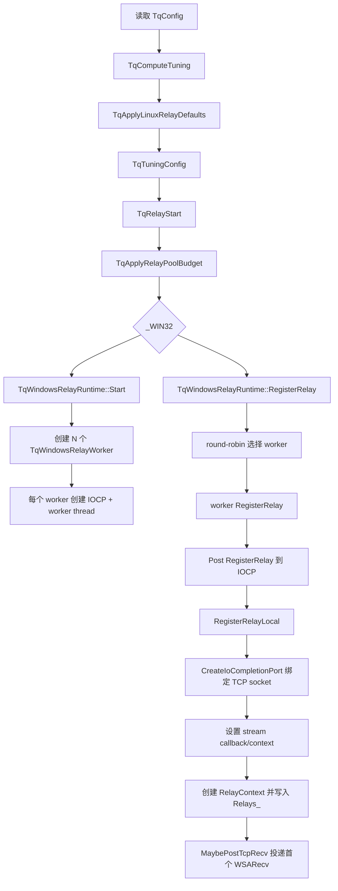
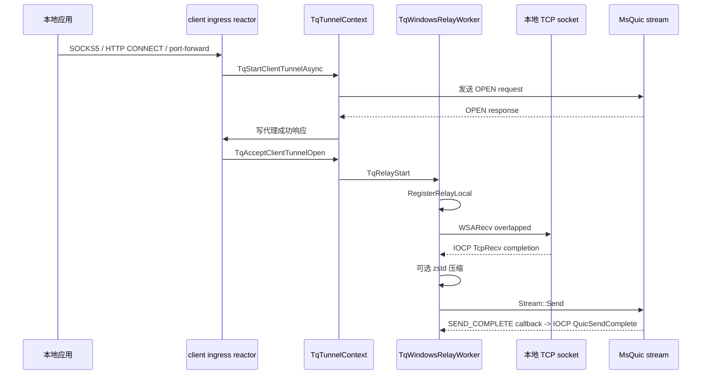
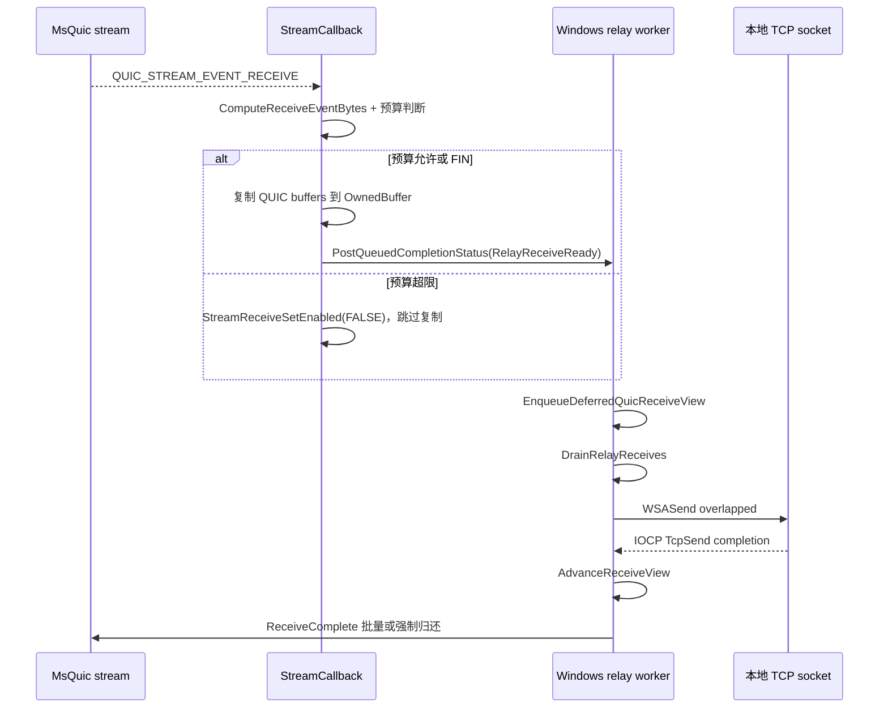
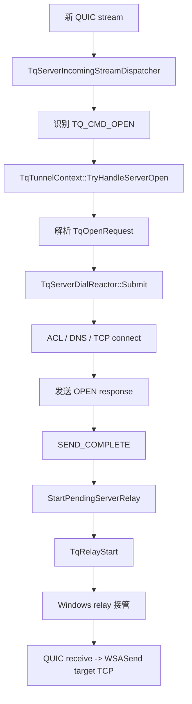

# Windows 转发代码检视

本文基于当前代码仓库梳理 Windows 平台的数据转发实现，重点记录三类信息：

1. Windows 转发逻辑、配置入口和数据流程图。
2. Windows 线程相关锁，按热点从高到低排序。
3. 当前代码中可见的问题和建议方案。

主要代码入口：

- `src/tunnel/relay.cpp`
- `src/tunnel/windows_relay_worker.h`
- `src/tunnel/windows_relay_worker.cpp`
- `src/runtime/windows_reactor.cpp`
- `src/config/tuning.h`
- `src/config/tuning.cpp`
- `src/tunnel/tcp_tunnel.cpp`
- `src/tunnel/server_dial_reactor.cpp`
- `src/ingress/client_ingress_reactor.cpp`

## 1. Windows 转发逻辑和实现

### 1.1 配置和启动流程图

Windows relay 的入口是 `TqRelayStart()`。调用前，client/server 控制面已经完成代理握手、OPEN 请求、目标 TCP connect 或 OPEN 响应。进入 relay 后，TCP socket 被绑定到 Windows IOCP，MsQuic stream callback 被替换为 `TqWindowsRelayWorker::StreamCallback()`。



注意：Windows worker 数量由 `TqTuningConfig::WindowsRelayWorkerCount` 控制，默认通过 `TqDetectRelayWorkers()` 自动检测（1..8）。CLI 使用 `--windows-relay-worker-count`，JSON 使用 `relay.windows.worker_count`。

### 1.2 线程模型

Windows relay 主要有以下线程边界：

- ingress reactor 线程：本地监听、accept、SOCKS5/HTTP CONNECT/port-forward 握手、发起 client OPEN。
- server dial reactor 线程：server 侧 OPEN 后执行 ACL、DNS、非阻塞 TCP connect，并发送 OPEN response。
- MsQuic worker 线程：触发 stream callback，包括 `RECEIVE`、`SEND_COMPLETE`、ideal send buffer、abort、shutdown complete。
- Windows relay worker 线程：每个 `TqWindowsRelayWorker` 一个线程，阻塞在 `GetQueuedCompletionStatus()`，串行处理 TCP completion 和 callback 投递过来的 operation。
- tunnel reaper/thread pool 等辅助线程：负责 tunnel 生命周期回收和通用任务，不参与已接管 relay 的包级转发。

Windows 数据面不使用 `epoll`/`kqueue`，主要通过 IOCP 串行化每个 worker 的状态推进。TCP I/O completion 由 Winsock 投递到 IOCP；MsQuic callback 不直接推进大部分 relay 状态，而是通过 `PostQueuedCompletionStatus()` 投递 worker operation。

### 1.3 client TCP -> QUIC



实现要点：

- `TqRelayStart()` 在 Windows 下启动 `TqWindowsRelayRuntime`，并调用 `RegisterRelay()`。
- `RegisterRelayLocal()` 调用 `CreateIoCompletionPort()`，将 TCP socket 关联到 worker IOCP。
- `MaybePostTcpRecv()` 使用 `TcpRecvPosted` 保证每条 relay 同时最多一个 posted TCP receive。
- `HandleTcpRecv()` 处理 TCP receive completion：`bytes == 0` 映射为 TCP EOF，并发送 QUIC FIN；有数据时构造 `TqWindowsQuicSendOperation`，非压缩路径直接持有 relay buffer，zstd 路径先压缩到 `OwnedBytes`。
- `TrySubmitQuicSendOperation()` 调用 `MsQuicStream::Send()`，成功后增加 `InFlightQuicSends` 和 `OutstandingQuicSendBytes`；`SEND_COMPLETE` 再经 IOCP 回到 worker 做 accounting。

### 1.4 client QUIC -> TCP



实现要点：

- `StreamCallback(RECEIVE)` 先调用 `ComputeReceiveEventBytes()` 和 `ShouldRejectReceiveInCallback()`：通过 `CallbackBinding::RelayHint` 读取 relay generation、pending bytes 和 `WindowsRelayMaxPendingQuicReceiveBytesPerRelay`；明显超限且不含 FIN 的 receive 会暂停后续 QUIC receive 并跳过复制，返回 `QUIC_STATUS_SUCCESS`。
- 预算允许或带 `QUIC_RECEIVE_FLAG_FIN` 的 receive 才会调用 `BuildDeferredQuicReceiveView()` 复制 MsQuic buffers 到 `TqWindowsPendingQuicReceive::OwnedBuffer`，成功投递 IOCP 后返回 `QUIC_STATUS_PENDING`。
- callback 投递的是带 relay id/generation 的 `RelayReceiveReady` operation；真正入 `PendingReceives` 发生在 worker 线程的 `EnqueueDeferredQuicReceiveView()`，其中仍保留预算检查作为并发竞态兜底。
- `DrainRelayReceives()` 只处理队首 view，保持 QUIC -> TCP 写入顺序。
- 非压缩路径由 `PostTcpSendFromReceiveView()` 对当前 slice 投递 `WSASend()`。
- zstd 路径由 `PostTcpSendFromCompressedReceiveView()` 解压到 relay buffer 后投递 `WSASend()`。
- `HandleTcpSend()` 推进 view offset，并根据 `WindowsRelayQuicReceiveCompleteBatchBytes` 批量调用 `ReceiveComplete()`。
- view 完成后 `FinishReceiveView()` 从 `PendingReceives` 删除，递减 pending bytes/depth，并在 FIN 时执行 TCP send half-close。

### 1.5 server QUIC -> TCP



如果 server OPEN 的同一个 MsQuic receive 中已经带有应用数据，`TqTunnelContext` 会先保存为 pending relay receive。relay 启动后，这些 early data 以 synthetic receive 的形式重新进入 relay callback，因此最终仍走 Windows quic -> tcp 队列。

### 1.6 server TCP -> QUIC

server 侧 TCP fd 来自 `TqServerDialReactor` 成功连接目标服务。relay 注册后立即投递 `WSARecv()`，后续路径与 client TCP -> QUIC 相同：

```text
target TCP WSARecv completion
  -> IOCP TcpRecv
  -> HandleTcpRecv()
  -> optional zstd compress
  -> TqWindowsQuicSendOperation
  -> MsQuic Stream::Send()
  -> SEND_COMPLETE callback
  -> IOCP QuicSendComplete
```

### 1.7 背压和关闭

TCP read 背压：

- `ShouldPauseTcpReadForQuicBacklog()` 使用 `OutstandingQuicSendBytes >= CurrentRelayIdealSendBytes()` 暂停 TCP read。
- `ShouldResumeTcpReadForQuicBacklog()` 使用半水位恢复：`OutstandingQuicSendBytes < ideal / 2`。
- MsQuic send 返回 `QUIC_STATUS_OUT_OF_MEMORY` 或 `QUIC_STATUS_BUFFER_TOO_SMALL` 时，operation 进入 `PendingQuicSendRetries`，同时暂停 TCP read。

QUIC receive 背压：

- **callback 线程（复制前）**：`ShouldRejectReceiveInCallback()` 比较 `PendingQuicReceiveBytes + receiveBytes` 与 `WindowsRelayMaxPendingQuicReceiveBytesPerRelay`；超限时调用 `StreamReceiveSetEnabled(FALSE)` 并跳过复制。FIN receive、零字节 receive、hint 为空、generation 不匹配、relay 已 closing 或 limit 为 0 时不做预算拒绝，交给 worker 侧 stale/drop 逻辑处理。
- **worker 线程（入队时）**：`EnqueueDeferredQuicReceiveView()` 累加 `PendingQuicReceiveBytes` 和 `PendingQuicReceiveQueueDepth`；达到上限后调用 `StreamReceiveSetEnabled(FALSE)`。
- pending bytes 低于一半时 `MaybeResumeQuicReceive()` 恢复 receive。

关闭：

- TCP read EOF 发送 QUIC FIN。
- QUIC FIN 在 view 完成后设置 `CloseAfterDrained`，再 `TqShutdownSend()` 半关闭 TCP 写方向。
- abort/shutdown/IOCP teardown 错误根据是否还有 pending work 决定 graceful drain 或 abort reset。
- `TryRetireRelay()` 等 `ActiveHandlers`、queued worker ops、in-flight TCP/QUIC 全部归零后从 `Relays_` 删除，并把 callback binding 放入 `RetiredCallbacks_`，防止迟到 callback 访问悬空上下文。

## 2. Windows 线程相关锁热点排序

排序依据是当前代码中的生产调用频率、锁粒度、是否跨 relay 共享，以及已有观测指标。需要特别说明：当前 `PendingReceives`、`PendingQuicSendRetries`、`TcpRecvOpsFree` 的生产路径基本由 worker 线程串行访问，虽然结构体里有一些 per-relay mutex 声明或测试辅助锁，但它们不是当前生产数据面主锁。

| 热点级别 | 锁 | 位置 | 保护对象 | 主要路径 | 热点判断 |
|---|---|---|---|---|---|
| P0 | `TqWindowsRelayWorker::Lock_` | `windows_relay_worker.cpp` | `Relays_`、`RetiredCallbacks_` | register、snapshot、callback operation 在 worker 内按 id/generation 解析 relay、retire、trace context 查找 | 单 worker 内所有 relay 共享，是最核心的生产锁。当前有 `WorkerLockAcquireCount`、`WorkerLockWaitNanos`、`FindRelayByIdCount` 可观测。callback 已改为先按 id 投递，降低了 MsQuic callback 线程直接抢锁的概率，但 worker 仍要在多个路径查 `Relays_`。 |
| P1 | `TqWindowsRelayRuntime::Lock_` | `windows_relay_worker.cpp` | worker vector、runtime start/stop、round-robin 注册 | runtime start/stop、`RegisterRelay()`、`Snapshot()` | 不在包级转发路径，但会串行化 Windows relay 注册和 snapshot 取 worker 列表。高连接建立速率或高频 metrics snapshot 下可能影响控制面延迟。 |
| P1 | `RuntimeWorkerLifetimeLock()` | `windows_relay_worker.cpp` | runtime stop 与 snapshot 生命周期 | `TqWindowsRelayRuntime::Stop()`、`Snapshot()` | 主要防止 snapshot 遍历 worker 时 runtime 被销毁。只影响观测/停止，不影响稳定转发吞吐。 |
| P2 | `TqWindowsRelayWorker::ControlCommandLock_` | `windows_relay_worker.cpp` | 同步 command 投递和等待 | `RegisterRelay()`、`Snapshot()` | 控制面锁。外部线程通过 IOCP 同步命令让 worker 执行注册或 snapshot，期间用 command mutex/cv 等待完成。连接建立和 admin snapshot 频繁时会体现为排队。 |
| P2 | `RegisterRelayCommand::Mutex` / `SnapshotCommand::Mutex` | `windows_relay_worker.cpp` | command 完成标志 | `WaitWindowsRelayCommand()` / `CompleteWindowsRelayCommand()` | 每次同步注册或 snapshot 使用一次，热度取决于连接建立和观测频率。不是数据包级锁。 |
| P3 | `TqTunnelContext::Lock` | `tcp_tunnel.cpp` | tunnel 生命周期、TCP fd、stream、relay started、pending relay receive | OPEN、StartRelay、Stop、early data 保存/释放 | relay 接管前后的控制面锁。对持续转发影响低，但影响 OPEN 完成、server dial 和异常关闭路径。 |
| P3 | `TqTunnelContext::StreamOpLock` | `tcp_tunnel.cpp` | pre-relay stream send/shutdown 顺序 | OPEN response、失败响应、shutdown | relay 接管后数据面 `Stream::Send()` 不走这把锁。 |
| P3 | `TqServerDialReactor::Lock` | `server_dial_reactor.cpp` | server dial 任务队列和状态 | server OPEN 后 DNS/connect | 影响 server 建链速率，不影响已接管 relay 的 TCP/QUIC forwarding。 |
| P4 | `TqClientTunnelOpenHandle::Lock`、ingress `Mutex`/`LifecycleMutex` | `client_ingress_reactor.cpp`、`tcp_tunnel.cpp` | client OPEN handle、ingress lifecycle | client 代理握手、OPEN 完成/取消 | 控制面锁，不在 relay 包级转发路径。 |
| P4 | `TqTunnelReaper::Mutex`、`TqThreadPool::Mutex` | `tunnel_reaper.cpp`、`thread_pool.cpp` | 回收队列、通用任务队列 | tunnel 回收、异步任务 | 辅助线程锁，不是 Windows relay 数据面瓶颈。 |
| 测试/残留 | `LastPostedCallbackLock_` | `windows_relay_worker.cpp` | 单测中的最近 callback post 记录 | `TQ_UNIT_TESTING` | 只在单测编译路径存在。 |

Per-relay 队列（`PendingReceives`、`PendingQuicSendRetries`、`TcpRecvOpsFree`）由 worker IOCP 线程串行访问，不再声明误导性的 per-relay mutex。Windows 不使用 Linux 的 `CallbackPendingQuicReceives` 降级队列；`CallbackPendingQuicReceiveDepth` 指标恒为 0。

### 热点结论

当前最高优先级关注 `TqWindowsRelayWorker::Lock_`，但它的风险边界与旧实现不同：MsQuic receive callback 在复制前做轻量预算判断，预算允许时才复制 receive view 并用 id/generation 投递 IOCP；`SEND_COMPLETE` 也通过 `PostCallbackOperationById()` 投递，因此 callback 线程直接持 worker map 锁的机会下降。真正要观察的是 worker 内部查 map、snapshot、trace context 和 relay retire 与注册/观测之间的竞争。

建议线上或压力测试时重点看这些指标：

- `WindowsRelayWorkerLockAcquireCount`
- `WindowsRelayWorkerLockWaitNanos`
- `WindowsRelayFindRelayByIdCount`
- `WindowsRelayCallbackDispatchNanos`
- `WindowsRelayCallbackReceiveBudgetRejectedCount` / `WindowsRelayCallbackReceiveBudgetPausedCount`
- `WindowsRelayCallbackReceiveCopyBytes` / `WindowsRelayCallbackReceiveCopyNanos`
- `WindowsRelayMaintenanceDrainCount` / `WindowsRelayMaintenanceDrainNanos` / `WindowsRelayMaintenanceRelaysProcessed`
- `WindowsRelayReceiveViewFinishLinearSearchCount` / `WindowsRelayReceiveViewFinishLinearSearchNanos` / `WindowsRelayReceiveViewFinishNotFrontCount`
- `WindowsRelaySnapshotBuildNanos`
- `WindowsRelaySnapshotActiveRelaysScanned`
- `WindowsCallbackIocpPostCount`
- `WindowsPostedCallbackStaleDropCount`
- 每个 active relay 的 `queued_worker_ops`、`inflight_tcp_*`、`inflight_quic_sends`

## 3. 当前问题和解决方案建议

### 3.1 Windows worker 数量配置

历史问题：

- `TqWindowsRelayRuntime::Start()` 曾使用 `tuning.LinuxRelayWorkerCount` 决定 Windows worker 数。
- `TqTuningConfig` 没有独立的 Windows 命名字段，配置语义和 tuning 输出容易误导。

当前状态：

- `TqTuningConfig::WindowsRelayWorkerCount` 控制 Windows IOCP worker 数；默认与 Linux 一样通过 `TqDetectRelayWorkers()` 自动检测（1..8）。
- CLI：`--windows-relay-worker-count <n>`；JSON：`relay.windows.worker_count`。
- Linux 侧可使用 `--linux-relay-worker-count` / `relay.linux.worker_count` 单独覆盖，不影响 Windows 字段。
- `TqPrintTuning()` / `TqPrintRelayBackend()` 在 Windows 上输出 `WindowsRelayWorkerCount`。

后续可选：

- 更彻底的平台中性命名（如通用 `RelayWorkerCount`）和 Darwin 侧独立字段，可在后续批次处理。

### 3.2 `DrainPerRelayMaintenance()` 每次事件前后全量扫描 relay

现象：

- `Run()` 在等待 IOCP 前调用 `DrainPerRelayMaintenance()`，处理完一次 event 后又调用一次。
- `DrainPerRelayMaintenance()` 会持 `Lock_` 复制当前 worker 所有 relays，然后逐个执行 `RetryPendingQuicSends()`、`MaybePostTcpRecv()`、`CloseRelayIfDrained()`、`TryRetireRelay()`。

影响：

- 单 worker 上 active relay 很多时，每个 IOCP event 可能带来 O(N) 维护成本。
- 高频小包或高连接数场景下，维护扫描可能压过真正 I/O 处理。
- snapshot 也要扫描 active relays，会和这条维护路径叠加。

当前状态：

- 常规维护已改为 worker-owned maintenance queue，只有状态变化后需要 retry、resume、close 或 retire 的 relay 会入队。
- 每轮 maintenance drain 有预算，避免单个 IOCP event 后处理完整 worker relay map。
- 仍保留低频 full-scan fallback，只把需要维护的 relay 入队，用于兜底异常状态。

### 3.3 `PendingReceives` 删除是线性查找

现象：

- `FinishReceiveView()` 用 `std::find(relay->PendingReceives.begin(), relay->PendingReceives.end(), view)` 查找并删除 view。
- 正常 drain 按队首处理，但实现没有利用“当前 view 应该是队首”的事实。

影响：

- 慢 TCP 写或大 receive backlog 下，队列较深时完成 view 会产生 O(N) 查找。
- 如果未来加入并行 drain 或乱序完成，这里既不高效，也不显式表达顺序约束。

当前状态：

- 正常完成路径要求 `PendingReceives.front() == view`，然后 O(1) `pop_front()`。
- 非队首完成或 missing view 保留线性查找/诊断路径，并通过 `ReceiveViewFinishLinearSearchCount`、`ReceiveViewFinishNotFrontCount`、`ReceiveViewFinishLinearSearchNanos` 观测。
- Windows QUIC -> TCP 仍保持每条 relay 单队首 drain，不支持乱序 TCP 写。

### 3.4 receive callback 复制前预算判断

历史问题：

- 旧实现里 `StreamCallback(RECEIVE)` 先调用 `BuildDeferredQuicReceiveView()` 复制 MsQuic buffers，pending bytes 上限仅在 worker 的 `EnqueueDeferredQuicReceiveView()` 中检查。
- 大 receive 或 callback burst 会先消耗内存和 CPU，然后才暂停 QUIC receive；`WindowsRelayMaxPendingQuicReceiveBytesPerRelay` 不能阻止单次超大 view 的复制。

当前状态：

- callback 线程在复制前通过 `CallbackBinding::RelayHint` 读取 relay generation、pending bytes 和上限，先做轻量预算判断（`ComputeReceiveEventBytes()` → `ShouldRejectReceiveInCallback()`）。
- 对不含 FIN 且会超过 `WindowsRelayMaxPendingQuicReceiveBytesPerRelay` 的 receive，callback 线程会调用 `PauseQuicReceiveFromCallback()` 暂停后续 QUIC receive 并跳过复制，返回 `QUIC_STATUS_SUCCESS`（不持有 MsQuic buffer ownership）。
- FIN receive 始终绕过预算拒绝，保证 stream 关闭语义；hint 为空、generation 不匹配、relay 已 closing 或 limit 为 0 时也不做预算拒绝，由 worker 侧 IOCP/stale/drop 逻辑兜底。
- worker 侧 `EnqueueDeferredQuicReceiveView()` 仍保留预算检查，作为并发竞态兜底。
- copy 字节和耗时通过 `windows_relay_callback_receive_copy_bytes` / `windows_relay_callback_receive_copy_nanos` 观测；预算拒绝和暂停通过 `windows_relay_callback_receive_budget_rejected_count` / `windows_relay_callback_receive_budget_paused_count` 观测；trace 摘要字段为 `win_cb_recv_*`。

验证覆盖：

- `tcpquic_windows_relay_worker_test` 覆盖初始指标状态、copy 计量、预算拒绝（复制前暂停且不复制）、FIN 绕过、stale generation / closing relay 跳过预算拒绝等路径。

### 3.5 `StreamCallback()` 遇到 fake FIN 会 `abort()` 是设计行为

设计说明：

- `TqIsMsQuicFakeFinReceive()` 命中后，当前代码 trace 后 `assert(false)` 并 `std::abort()`。
- 这是有意保留的 fail-fast 行为，用于暴露违反当前 Windows relay receive 假设的 MsQuic 事件形态。
- fake FIN 不作为单 relay 可恢复错误处理；如果该条件在生产环境触发，应优先调查 MsQuic receive 语义或上游状态机，而不是在 relay 内静默降级。

当前状态：

- 无需作为待修复问题处理。
- trace 保留 absolute offset、total buffer length、buffer count、flags，便于定位触发条件。

### 3.6 trace context 外部线程直写问题已修复

修复前问题：

- `TqWindowsRelayWorker::SetRelayTraceContext()` 通过 `FindRelayById()` 拿到 relay 后，直接写 `TraceTunnelId` 和 `TraceTarget`。
- worker 线程中的 `BuildRelayTraceState()` 会读取同一组字段并生成 trace state。

修复前影响：

- `TraceTarget` 是 `std::string`，外部写与 worker 读之间没有同一把锁或 IOCP 串行化，存在数据竞争风险。
- 这个问题通常只在 relay 启动后短窗口出现，但 C++ 数据竞争本身属于未定义行为。

当前状态：

- `TqWindowsRelayWorker::SetRelayTraceContext()` 不直接写 `RelayContext`，而是复制 `target` 并投递 `SetTraceContext` IOCP operation。
- worker 线程解析 relay id/generation 后更新 `TraceTunnelId` 和 `TraceTarget`，与 `BuildRelayTraceState()` 的读取保持同一 worker 串行模型。
- 迟到 operation 在 relay 不存在、generation 不匹配或 relay 已进入 `Closing` 时丢弃，不复活 relay；丢弃次数计入 `windows_relay_posted_trace_context_stale_drops`。
- shutdown 后投递失败也不写 relay 字段；`PostQueuedCompletionStatus` 失败时递增 `Errors_`。
- MsQuic callback 线程上的 send-complete post failure 路径不会再构建 trace state：`FailRelayFatalFromCallback()` 调用 `CloseRelay(..., false)`，已 closing/stopping 分支调用 `TryRetireRelay(..., false)`，从而跳过 stop-condition 和 unregister trace 中的 `BuildRelayTraceState()`。
- trace context 的写入和读取现在都由 worker IOCP 串行化，上述外部线程直写风险已消除。

验证覆盖：

- `tcpquic_windows_relay_worker_test` 覆盖 trace context 不会从调用线程立即写入、stale generation / closing relay 被丢弃、`target == nullptr` 时只设置 tunnel id 并保持空 target，以及零 id、relay 不存在、worker 已停止和投递失败等 fire-and-forget 负路径。
- send-complete post failure 用例覆盖 callback 投递失败时的 accounting 和 fatal reset；`FailRelayFatalFromCallback()` 使用 `CloseRelay(..., traceState=false)`，单测通过 trace hook 计数断言不会触发 stop-condition/unregister trace。

### 3.7 per-relay mutex 声明和实际模型不一致已修复

历史现象：

- `RelayContext` 曾声明 `TcpRecvOpsLock`、`PendingReceiveLock`、`PendingQuicSendLock`、`CallbackPendingQuicReceiveLock` 等 mutex。
- 生产路径实际直接访问 `TcpRecvOpsFree`、`PendingReceives`、`PendingQuicSendRetries`，依赖 worker IOCP 串行化。
- `CallbackPendingQuicReceives` 为 Linux 降级路径；Windows 从未写入该 deque，相关锁与队列已移除。

当前状态：

- per-relay 队列字段已标注为 worker-thread-owned（IOCP 串行访问，无 per-relay mutex）。
- snapshot 中 `CallbackPendingQuicReceiveDepth` 恒为 0，与 Linux 语义区分。
- 单测如需窥探队列状态应通过 snapshot 或 IOCP command，不在生产路径保留误导性锁。

### 3.8 Windows relay 热点观测指标

历史问题：

- 早期仅有 worker 级 `Lock_` acquire/wait、`PendingReceives` 深度、pending bytes、callback dispatch nanos 等指标。
- maintenance 扫描耗时、每轮扫描 relay 数、receive view 线性查找成本、callback 复制字节/耗时等缺少直接指标，高并发下难以定位 callback copy、全表 maintenance 或 TCP 写慢等根因。

当前状态：

- maintenance 扫描：`windows_relay_maintenance_drain_count` / `windows_relay_maintenance_drain_nanos` / `windows_relay_maintenance_relays_processed` / `windows_relay_maintenance_full_scan_*`。
- receive view 线性查找：`windows_relay_receive_view_finish_linear_search_count` / `windows_relay_receive_view_finish_linear_search_nanos` / `windows_relay_receive_view_finish_not_front_count`。
- callback 复制与预算：`windows_relay_callback_receive_copy_bytes` / `windows_relay_callback_receive_copy_nanos` / `windows_relay_callback_receive_budget_rejected_count` / `windows_relay_callback_receive_budget_paused_count`。
- 后续如果继续优化 receive callback，可评估 MsQuic buffer ownership 或分片处理，但当前观测缺口已关闭。

## 建议优先级

| 优先级 | 建议 | 理由 |
|---|---|---|
| 已完成 | `SetRelayTraceContext()` 通过 IOCP 串行更新 trace context | 原跨线程写 `TraceTarget` 的 C++ 数据竞争风险已消除。 |
| 设计如此 | fake FIN 命中后 fail-fast abort | 保留为违反 receive 假设的强信号，无需降级为单 relay 错误。 |
| 已完成 | 为 Windows 增加独立 worker count 配置名 | `WindowsRelayWorkerCount`、CLI/JSON/tuning 输出已贯通。 |
| 已完成 | 优化 `DrainPerRelayMaintenance()` 全量扫描 | 常规路径已改为事件驱动 maintenance queue，并保留低频兜底扫描。 |
| 已完成 | `FinishReceiveView()` 队首 pop 优先，异常才线性查找 | 正常路径 O(1)，异常路径有计数和 trace。 |
| 已完成 | receive callback 复制前加入预算判断和指标 | 超限 receive 会在复制前被拒绝并暂停后续 receive，copy 成本已有指标。 |
| 已完成 | 清理或注释 per-relay 残留 mutex | 已删除未用锁并标注 worker-thread-owned 队列。 |
| 已完成 | 补齐 maintenance/copy/linear-search 指标 | maintenance、linear-search 和 callback copy 指标均已补齐。 |
