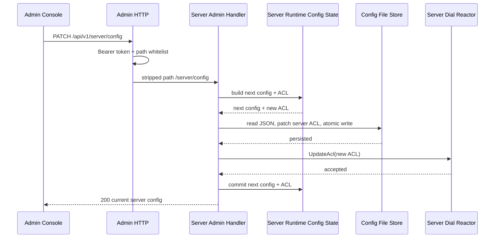
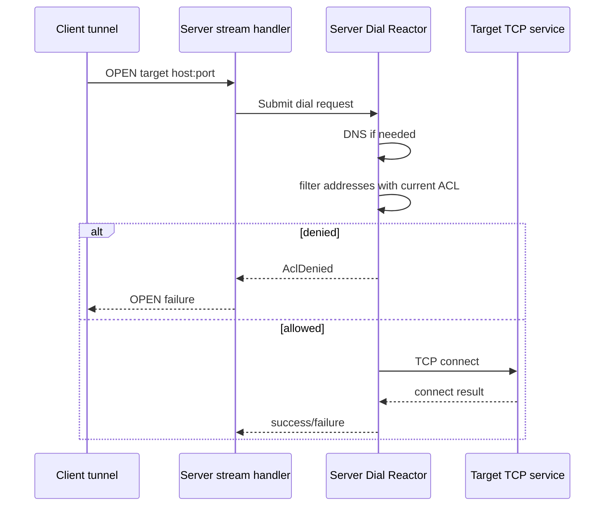

# Server Admin Console 配置能力设计

## 0. 当前实现状态

本设计已落地首版实现：

- 新增 `TqRuntimeConfigFileStore`，使用 `nlohmann::json` 读改写 server JSON 配置文件，并通过临时文件 + rename 写回。
- 新增 `TqServerRuntimeConfigState`，`GET /api/v1/server/config` 读取共享 runtime state。
- 新增 `PATCH /api/v1/server/config`，支持 `allow_targets` / `deny_targets` 数组或逗号分隔字符串。
- `TqServerDialReactor` 增加 `UpdateAcl(TqAcl)`，后续新建普通 tunnel 使用最新 ACL。
- `RunServer()` 已接入 runtime state、配置文件 store 和 ACL 更新回调。
- server admin-console 的 ACL 页面已支持编辑、保存和刷新 `acl_denied`。

实现中的事务顺序为：解析 patch -> 构造 next config/ACL -> 写回配置文件 -> 更新 server dial reactor ACL -> 提交 runtime state。生产路径的 `serverDial.UpdateAcl()` 当前不可失败；测试注入 update 失败时，handler 返回 503 且不提交 runtime state，但已经写入的配置文件不会自动回滚。

### 0.1 server peer 名称展示

server peer 名称优先来自 client 建连后上报的 `client_name`。未收到上报或老版本 client 连接时，console 回退到 `peer-${remote_address}`。`client_name` 是展示字段，不是认证身份。

`/api/v1/server/connections` 和单连接详情会返回 `client_name` 与原有 `remote_address`。server overview、server peers 和 server connections 页面使用 `client_name` 聚合/展示 peer；同一 `client_name` 下出现多个远端地址时，console 会保留去重后的地址集合并在表格中显示首个地址及额外地址数量。

### 0.2 Relay 快照展示

Relay 页每次刷新只请求一次 `/api/v1/relay/workers`，并从同一响应的 `aggregate` 行填充 Backend、Active、Pending 和 Errors 卡片。顶层或 aggregate 的 `snapshot_complete:false` 时，页面明确显示 `snapshot incomplete`，不把 partial 的零值当作健康状态；worker 表仍展示服务端返回的全部行。

## 1. 背景和目标

server admin-console 需要从观测面扩展到配置面。首要目标是让 server 侧 ACL 白名单和黑名单可以在 admin-console 修改后立刻生效，影响后续新建 tunnel 的目标访问决策，不要求重启进程。

当前 server console 已有只读 ACL 页面，展示 `/api/v1/server/config` 中的 `allow_targets`、`deny_targets` 和 `/api/v1/metrics` 中的 `acl_denied`。当前 server runtime handler 接收 `const TqConfig&`，`PATCH /api/v1/runtime/config` 只返回本次 patch 后的响应，server 配置快照本身还不是可更新的共享状态。因此本设计的核心不是单纯增加前端表单，而是补齐 server 运行期配置状态、ACL 热更新 API、配置文件持久化写回、console 提交交互和验证闭环。

## 2. 范围

首版必须支持：

- 在 server admin-console 修改 `allow_targets` 和 `deny_targets`。
- 提交后立即影响新建 target dial，包括 IP literal 和 hostname 解析后的候选地址过滤。
- 配置更新失败时保持旧 ACL 完整生效。
- 配置更新成功时写回 server 启动使用的 JSON 配置文件，重启后继续使用新 ACL。
- console 显示当前生效 ACL、保存结果、校验错误和 `acl_denied` 计数。
- 保留 Admin Bearer Token 鉴权和 loopback-only admin listen 约束。

首版只读展示但不支持热更新：

- `server.proto_listen` 和 `resolved_listens`。
- TLS 证书、私钥、CA 路径。
- QUIC profile、stream count、keepalive、1-RTT encryption、initial window、initial RTT。
- relay/tuning 细项。
- admin listen、token file、threads。

明确非目标：

- 不提供 ACL 命中历史、最近拒绝目标、逐规则计数；当前指标只有聚合 `acl_denied`。
- 不改变 speed-test 使用的受控 loopback 授权绕过语义。
- 不保持用户原配置文件的注释和字段顺序。配置文件是严格 JSON，写回使用第三方 JSON 库重新格式化输出。

## 3. 方案选择

推荐方案：新增 server 专用 `PATCH /api/v1/server/config`，只允许更新 server 运行期安全字段，首版字段为 `allow_targets` 和 `deny_targets`。patch 成功后同时完成三件事：更新共享运行期配置、更新 server dial reactor 的 ACL、用第三方 JSON 库把配置写回 `cfg.ConfigPath`。

取舍：

- 优点：API 语义和 server 页面一致，避免把 server ACL 塞进现有跨角色 `/runtime/config` 的 tuning patch 语义里。
- 优点：后续如果 server 有更多只影响新 tunnel 的字段，可以在同一个 server config patch 下扩展，并沿用同一套配置文件写回流程。
- 缺点：需要新增 route 白名单、handler 分支、测试和文档。
- 缺点：必须处理配置文件不存在、不可写、并发写、写盘失败和热更新失败之间的一致性。

备选方案 A：扩展 `PATCH /api/v1/runtime/config` 支持 `server.allow_targets` / `server.deny_targets`。这个方案复用现有按钮和路径，但 `/runtime/config` 当前跨 client/server，且已把 `listen`、`proto`、`relay` 等启动级字段统一判为不支持。把 server ACL 放进去会让 schema 变得含混。

备选方案 B：只在 console 编辑 JSON，提示重启生效。这个方案实现最小，但不满足“改完后立刻生效”。

备选方案 C：只热更新内存，不写回配置文件。这个方案实现较简单，但不满足 server 需要像 client 一样持久化配置的要求。

## 4. 后端设计

### 4.1 ServerRuntimeConfig 状态

新增一个 server 运行期状态对象，建议命名为 `TqServerRuntimeConfigState` 或类似名称。它负责持有当前生效的 server 配置快照和 ACL 快照：

```cpp
class TqServerRuntimeConfigState {
public:
    explicit TqServerRuntimeConfigState(const TqConfig& initial);

    TqConfig SnapshotConfig() const;
    TqAcl SnapshotAcl() const;
    bool BuildAclPatch(const TqServerConfigPatch& patch,
                       TqConfig& nextConfig,
                       TqAcl& nextAcl,
                       std::string& err) const;
    void Commit(const TqConfig& nextConfig, const TqAcl& nextAcl);

private:
    mutable std::mutex Lock;
    TqConfig Config;
    TqAcl Acl;
};
```

更新策略：

- `BuildAclPatch()` 基于当前快照和 patch body 构造临时 `nextConfig` / `nextAcl`，并校验所有 CIDR。
- `allow_targets` 为空时不自动补 `0.0.0.0/0`。空 allow 表示拒绝所有普通目标；这可以作为紧急封禁能力。启动配置仍保持现有默认补全行为。
- `deny_targets` 为空表示没有 deny 规则。
- 配置文件写回成功、server dial reactor ACL 更新成功后，才调用 `Commit()` 一次性替换 `Config.AllowTargets`、`Config.DenyTargets` 和 `Acl`。
- 响应返回替换后的完整 server config 快照。

### 4.2 配置文件持久化写回

server 必须像 client 一样支持 admin API 修改配置后持久化配置文件。首版规则：

- 只有通过 `--config <path>` 或配置加载得到 `cfg.ConfigPath` 时允许写回。没有 `ConfigPath` 时，`PATCH /api/v1/server/config` 返回 `503 not_supported`，提示当前进程没有可持久化配置文件。
- 写回只修改严格 JSON 文件，不支持 JSONC 注释。
- 读写 JSON 必须使用项目已有第三方 JSON 库 `nlohmann::json`。禁止手工拼接 JSON 字符串、正则替换 JSON 片段或用字符串查找方式更新字段。
- 写回流程读取当前磁盘配置为 `nlohmann::json root`，校验 root 是 object，并确保 `root["server"]` 是 object。
- 将 `root["server"]["allow_targets"]` 和 `root["server"]["deny_targets"]` 更新为 JSON array。未修改的其他字段保持 JSON 结构值不变。
- 输出使用 `root.dump(2)` 或项目约定缩进，并追加换行。
- 使用同目录临时文件写入，再原子 rename 覆盖目标文件。POSIX 下用 `fsync` 临时文件后 rename；Windows 下使用等价的 replace/rename 流程。
- 写回失败时不得更新内存 ACL，也不得更新 dial reactor；响应返回 503，旧 ACL 继续生效。
- 生产路径的 dial reactor `UpdateAcl()` 当前不可失败，因此写回成功后会继续提交运行态状态。测试注入 update 失败时，内存 runtime state 不提交并返回 503；配置文件不会自动回滚，后续需要再次提交或人工检查配置文件与运行中 ACL 是否一致。

建议新增一个独立组件，避免 handler 内堆积文件 IO 细节：

```cpp
class TqRuntimeConfigFileStore {
public:
    explicit TqRuntimeConfigFileStore(std::string path);

    bool PatchServerAcl(const std::vector<std::string>& allow,
                        const std::vector<std::string>& deny,
                        std::string& err);
};
```

该组件只负责 JSON 文件读写和原子替换，不做 ACL 语义判断；CIDR 校验仍由 server config patch 逻辑负责。

### 4.3 ACL 生效路径

当前 server 启动时构造 `TqAcl acl`，再传给 `TqServerDialReactor`。热更新后需要确保后续 dial 使用新 ACL。推荐改造为：

- `TqServerDialReactor` 不再只在构造时复制 ACL，而是接受一个 ACL provider，或增加 `UpdateAcl(TqAcl acl)` 方法。
- 如果选择 `UpdateAcl()`，实现时在 reactor 内部锁下替换 `Impl::Acl`；`OnResolved()` 过滤候选地址时读取同一份锁保护的当前 ACL。
- `RunServer()` 中 admin patch 成功后执行顺序为：构造 next config/ACL、写回配置文件、`serverDial.UpdateAcl(newAcl)`、提交 `TqServerRuntimeConfigState`。任何一步失败都不得提交后续状态。

并发语义：

- 已经完成 ACL 检查并正在 connect 的 pending dial 不回滚。
- DNS 已提交但尚未进入 `OnResolved()` 的请求，应以 `OnResolved()` 执行时的当前 ACL 为准。
- 所有新提交的 tunnel 必须使用最新 ACL。
- 更新操作和 tunnel dial 可以并发；不得出现部分 allow/deny 生效的中间状态。

### 4.4 Admin API

新增或调整接口：

| Method | Path | 用途 |
| --- | --- | --- |
| `GET` | `/api/v1/server/config` | 返回当前生效 server config。 |
| `PATCH` | `/api/v1/server/config` | 热更新 server config 中允许运行期修改的字段；首版只支持 ACL。 |

`PATCH /api/v1/server/config` 请求体：

```json
{
  "allow_targets": ["127.0.0.1/32", "10.0.0.0/8"],
  "deny_targets": ["169.254.0.0/16"]
}
```

字段规则：

- `allow_targets` 和 `deny_targets` 支持数组或逗号分隔字符串，沿用配置文件语义。
- 至少出现一个字段；未出现字段保持原值。
- 所有 CIDR 必须合法；任一非法返回 `400`，旧 ACL 保持不变。
- 未知字段返回 `400`。
- 启动级字段如 `listen`、`resolved_listens`、`tls`、`quic`、`relay`、`admin` 返回 `503 not_supported`。
- 没有可写配置文件、配置文件不是 JSON object、磁盘写回失败时返回 `503 not_supported` 或 `500`。推荐对“当前运行模式不支持持久化”使用 `503 not_supported`，对临时 IO 失败使用 `500`。

成功响应：

```json
{
  "role": "server",
  "config_path": "server.json",
  "listen": "0.0.0.0:4433",
  "resolved_listens": ["10.0.0.1:4433"],
  "allow_targets": ["127.0.0.1/32", "10.0.0.0/8"],
  "deny_targets": ["169.254.0.0/16"],
  "quic": {},
  "tls": {},
  "tuning_mode": "wan"
}
```

错误响应沿用现有 admin 风格：

- `400 {"error":"invalid CIDR: ..."}`
- `400 {"error":"unknown server config field: ..."}`
- `503 {"error":{"code":"not_supported","message":"runtime field ... requires process restart"}}`

### 4.5 与现有 `/runtime/config` 的关系

`PATCH /api/v1/runtime/config` 继续用于跨角色运行期安全字段，当前是 `tuning.max_memory_mb`。server ACL 不放入该接口，避免 UI 和 API 语义混乱。server 端不需要配置压缩；压缩是否启用在设计上由 client 端控制。

需要同时修正 server 侧 runtime config 的状态问题：任何支持热更新的字段，都必须写入共享 runtime state，并能被后续 `GET` 读回。首版 ACL 走 `/server/config`，不依赖 `/runtime/config` 完成。

## 5. Admin Console 设计

### 5.1 Server ACL 页面

把当前只读 ACL 页改为可编辑页面：

- 左侧：`allow_targets` 多行输入框，每行一个 CIDR，也允许粘贴逗号分隔内容并在提交前规范化。
- 中间：`deny_targets` 多行输入框。
- 右侧：当前状态和统计，包括 `acl_denied`、上次刷新时间、保存状态。
- 底部操作：`Save ACL`、`Reload`、`Reset edits`。

交互规则：

- 页面加载时并发请求 `/server/config` 和 `/metrics`。
- 保存前在前端做轻量校验：空行忽略、去掉首尾空白、重复项去重、显示将提交的数组。
- 最终合法性以后端为准；前端不能替代 CIDR parser。
- 保存成功后重新拉取 `/server/config` 和 `/metrics`，确保显示的是当前生效状态。
- 保存失败时保留用户输入，并显示后端错误。
- 保存成功文案必须同时说明“运行中已生效”和“配置文件已写回”。
- `allow_targets` 为空时显示显著提示：“空 allow 将拒绝所有普通目标；speed-test 受控授权不受普通 ACL 影响。”

### 5.2 Config 页面

server 模式的 Config 页不再只显示原始 JSON。建议分为两块：

- “Runtime editable”：跳转或内嵌 ACL 编辑入口，后续可扩展 tuning。server 端不展示压缩配置，因为压缩是否启用由 client 端控制。
- “Restart required”：只读展示 listen、TLS、QUIC、relay、admin 配置。

保存按钮语义要避免误导：

- server 模式不显示 `Save config`。
- server 模式保留 `Patch runtime` 时，应只提交明确支持的 runtime patch；ACL 使用 `Save ACL`。

### 5.3 安全和审计提示

console 页面不显示 TLS key 内容。ACL 保存成功后应在 server 日志写一条结构化日志，至少包含：

- `event=server_acl_updated`
- allow/deny 规则数量
- admin remote address
- config path
- 是否清空 allow

不在日志中记录 bearer token。

## 6. 数据流



新 tunnel 生效路径：



## 7. 验证和测试设计

### 7.1 功能目标和非功能目标

功能目标：

- ACL 可以通过 admin-console 和 Admin API 热更新。
- 更新成功后，新 tunnel 使用新 ACL。
- 更新成功后，server JSON 配置文件持久化保存新 ACL。
- 更新失败时旧 ACL 继续生效。
- GET config 反映当前生效状态。

非功能目标：

- ACL patch p95 延迟在本机测试中应低于 50 ms，不包含人工 UI 操作时间。
- 并发 patch 和 tunnel open 不崩溃、不死锁、不产生部分 ACL 状态。
- admin HTTP 仍只接受合法 token 和允许的 `/api/v1/*` 路径。
- ACL 更新期间现有 relay 不中断。

### 7.2 系统级端到端功能图

| 路径 | 断言 |
| --- | --- |
| UI 登录 -> GET `/server/config` -> 渲染 ACL | 页面显示当前 allow/deny；TLS key 不泄露。 |
| UI 修改 ACL -> PATCH `/server/config` -> GET `/server/config` | 响应和刷新后的列表一致。 |
| PATCH 成功 -> 读取 server 配置文件 | 文件中的 `server.allow_targets` / `server.deny_targets` 与响应一致。 |
| ACL 从允许改为拒绝 -> 新建 tunnel | 新 tunnel 返回 ACL denied，`acl_denied` 增加。 |
| ACL 从拒绝改为允许 -> 新建 tunnel | 新 tunnel 可以连接目标，`acl_denied` 不因该请求增加。 |
| 提交非法 CIDR | PATCH 返回 400，GET 仍返回旧 ACL。 |
| 未认证 PATCH | 返回 401，ACL 不变。 |
| PATCH 启动级字段 | 返回 503 not_supported，ACL 不变。 |
| 配置文件不可写 | PATCH 返回错误，GET config 和实际 ACL 都保持旧值。 |
| 更新期间已有 relay 传输 | 已有 relay 不中断；更新只影响后续 dial。 |

### 7.3 单元和集成测试

已新增或扩展：

- `server_admin_test`：覆盖 `PATCH /server/config` 成功、非法 CIDR、未知字段、启动级字段、部分字段 patch、无 `ConfigPath`。
- `runtime_config_file_store_test` 或同等测试：使用 `nlohmann::json` 读取/写回 server ACL，覆盖保留其他字段、创建缺失 `server` object、拒绝非 object root、原子写临时文件失败、目标文件不可写。
- `server_dial_reactor_test`：覆盖 `UpdateAcl()` 后新 literal 请求使用新 ACL；DNS resolve 后过滤使用最新 ACL和更强并发场景可作为后续补充。
- `admin_http_test`：覆盖 `/api/v1/server/config` PATCH path whitelist、认证失败、console JS 调用目标。
- `acl_filter_test`：复用现有 CIDR 规则，补充空 allow 的拒绝语义。
- console 静态测试：确认 server ACL 页面有两个输入框、保存按钮、错误展示和 `api('/server/config', { method: 'PATCH' ... })`。

### 7.4 k6 性能基线

Admin API 负载模型：

- `acl_patch_baseline`：1 VU，每 2 秒提交一次 ACL patch，持续 1 分钟。
- `acl_patch_peak`：5 VU，每 VU 每秒 1 次 GET `/server/config`，每 5 秒 1 次 PATCH，持续 5 分钟。
- `acl_patch_stress`：20 VU 混合 GET/PATCH，持续 2 分钟，用于发现 admin worker、mutex 和 path dispatch 瓶颈。
- `tunnel_mixed`：在 patch 压力下同时运行 client 新建短连接 tunnel，验证数据面影响。

阈值：

- PATCH `/server/config` p95 < 50 ms，p99 < 200 ms。
- GET `/server/config` p95 < 20 ms。
- HTTP error rate < 0.1%，预期的 400/401/503 负向用例单独统计。
- 数据面短连接成功率符合当前 ACL 状态，不能出现 allow 后仍持续拒绝或 deny 后仍持续允许。
- 进程 CPU、内存、admin worker 队列无持续增长。

测试环境：

- 单 server 进程，admin 绑定 loopback。
- server 必须通过 `--config` 启动，并使用测试专用临时配置文件。
- 单 client 进程或脚本驱动 tunnel open。
- 一个允许目标服务和一个应拒绝目标服务。
- 测试前固定 token 文件，避免 token 轮换影响压测。

### 7.5 异常条件和恢复

| 场景 | 注入故障 | 预期影响 | 检测信号 | 恢复和验收 |
| --- | --- | --- | --- | --- |
| 非法 CIDR | PATCH `allow_targets:["bad"]` | 请求失败，旧 ACL 保持 | HTTP 400，GET config 仍为旧值 | 提交合法 ACL 后成功生效。 |
| 空 allow 误提交 | PATCH `allow_targets:[]` | 普通新 tunnel 全部拒绝 | `acl_denied` 增加，config 显示空 allow | 提交恢复 ACL，新 tunnel 成功。 |
| 并发 patch | 多个 admin 请求同时提交不同 ACL | 最后成功提交的完整 ACL 生效 | GET config 为某个完整版本，无混合规则 | 后续 tunnel 与 GET config 一致。 |
| 配置文件不可写 | chmod 或占用配置文件后提交 PATCH | 请求失败，旧 ACL 保持 | HTTP 500/503，日志含 config path 和写回错误 | 恢复文件权限后重新提交成功。 |
| 配置文件 JSON 损坏 | 将配置文件改为非法 JSON 后提交 PATCH | 请求失败，运行中 ACL 保持 | HTTP 500/503，日志提示 parse 失败 | 修复配置文件后重新提交成功。 |
| admin worker 压力 | GET/PATCH 高并发 | admin 延迟上升但数据面不中断 | admin latency、数据面成功率 | 降低压力后恢复；无死锁。 |
| server dial reactor 更新失败 | 模拟 `UpdateAcl` 返回失败 | PATCH 返回 503，旧 ACL 保持 | HTTP 503，日志记录失败 | 修复故障后重新提交成功。 |
| 写回成功但 reactor 更新失败 | 测试注入 `UpdateAcl` 失败 | 内存 ACL 不提交；配置文件可能已经写入 | HTTP 503 | 人工检查配置文件；再次提交后内存和文件一致。生产 wiring 当前不可失败。 |
| 进程重启 | 热更新后重启 server | ACL 从写回后的配置文件恢复 | GET config 显示热更新后的 ACL | 重启后新 tunnel 行为与持久化 ACL 一致。 |

## 8. 实施顺序和完成状态

1. 已完成：增加 server runtime config state，让 `GET /server/config` 从共享状态读取。
2. 已完成：增加 `TqRuntimeConfigFileStore`，用 `nlohmann::json` 实现 server ACL 读改写和原子持久化。
3. 已完成：给 `TqServerDialReactor` 增加 ACL 热更新入口，并补测试。
4. 已完成：增加 `PATCH /server/config` parser 和 handler，按“写文件 -> 更新 reactor -> 提交 runtime state”顺序应用。
5. 已完成：补齐 Admin HTTP route whitelist 测试，确认 `/api/v1/server/config` PATCH 透传。
6. 已完成：改造 server ACL console 页面，接入保存、错误展示和刷新状态。
7. 已完成：更新 `docs/admin-api/interface.md` 和配置相关文档。
8. 已完成：跑单元测试、admin HTTP smoke 和主程序构建；短连接 E2E ACL 热更新和重启恢复可作为后续系统测试补充。

## 9. 风险和待确认点

- 空 `allow_targets` 的语义：本设计选择“拒绝所有普通目标”，因为它是有用的紧急封禁能力；如果希望保持启动配置默认行为，则 PATCH 空 allow 应返回 400。
- 配置文件写回会重新格式化严格 JSON，并可能改变字段顺序；这是使用 JSON AST 安全更新的取舍。
- 如果 admin API 未来支持多个 server 字段同时修改，需要继续保持“校验 next config -> 写文件 -> 更新 runtime -> 提交状态”的事务顺序。
- tuning 的 server runtime patch 目前语义不完整。建议另起设计修复，不和 ACL 首版混在一起。server 端压缩配置不在修复范围内，因为压缩是否启用由 client 端控制。
- 如果未来要展示最近 ACL 拒绝明细，需要在 server dial path 增加审计 ring buffer，不能只依赖当前 `acl_denied` counter。
