# 系统测试设计：tcpquic-proxy

## 1. 范围与目标

`tcpquic-proxy` 是一个 TCP-over-QUIC 隧道代理。client 进程暴露本地 SOCKS5、HTTP CONNECT，以及可选的固定端口转发监听。每个被接受的本地 TCP 连接会映射为某条 QUIC 连接上的一个双向 Stream。server 进程接收 Stream OPEN，校验 DNS/CIDR ACL 策略，连接目标 TCP 服务，并在两个方向转发数据。系统还包括可选的 zstd 流式压缩、JSON 配置、多 peer 路由、Admin HTTP API、运行时指标、内置 speed test，以及平台相关的 relay worker。

系统测试必须验证完整生产链路，而不是只验证协议解析器或单个类：

```text
application/client
  -> SOCKS5 / HTTP CONNECT / port-forward local ingress
  -> client ingress reactor
  -> QUIC connection pool and OPEN protocol
  -> server stream callback
  -> server dial reactor
  -> DNS + ACL
  -> target TCP service
  -> relay worker data plane
  -> metrics / admin / traces / process lifecycle
```

核心目标：

- 验证 SOCKS5、HTTP CONNECT、port-forward 三类入口的隧道建立、数据转发、错误映射和生命周期清理正确性。
- 验证 single-peer 和 multi-peer 配置下的路由行为，包括运行时 Admin API 变更。
- 验证安全控制：TLS server 校验、ALPN、本地代理鉴权、Admin bearer token、Admin 只能绑定 loopback、server 侧 ACL。
- 验证高延迟、丢包、高并发、大 payload、压缩、重连和进程故障下的非功能行为。
- 建立可重复执行的 k6 性能与回归基线，补充现有 shell benchmark。

本文档不覆盖：

- 替代现有 C++ 单元测试。
- 公网 Admin 暴露、多用户 RBAC 或 mTLS client 鉴权，因为当前产品设计保持 Admin 本地访问，server 鉴权为单向校验。
- 浏览器 UI 测试，因为项目没有前端 UI。

## 2. 功能目标与非功能目标

功能目标：

| 领域 | 目标 |
| --- | --- |
| 本地入口 | SOCKS5 CONNECT、HTTP CONNECT、固定 port-forward 只有在目标 peer 至少有一个已连接 QUIC slot 时才建立隧道。 |
| 隧道映射 | 一个被接受的本地 TCP 连接映射为一个 QUIC 双向 Stream 和一个目标侧 TCP 连接。 |
| OPEN 协议 | OPEN、OPEN_OK、OPEN_FAIL 保留目标 host、port、地址类型、压缩 flags 和错误语义。 |
| Server dial | IP 字面量和 hostname 目标都遵循 ACL；hostname 由 server 侧通过 c-ares 解析，并过滤所有 A/AAAA 候选地址。 |
| ACL | deny 优先于 allow；allow 为空时拒绝所有目标；非法 CIDR 在启动或配置应用时失败。 |
| 错误映射 | ACL、DNS、timeout、refused、internal error 映射到文档化的 SOCKS5 REP 和 HTTP 状态码。 |
| 压缩 | `off`、`zstd`、`auto` 模式保持 payload 字节级完整，并暴露压缩/解压指标。 |
| 连接池 | `--connections` / `proto.connections` 在 QUIC slots 上分配 tunnels，且不超过 stream 限制。 |
| Multi-peer | Router config 支持 peer CRUD、enable/disable、drain、abort 和 listener 生命周期，且 peer 间没有串扰。 |
| Admin | `/api/v1/*` 要求 bearer token；legacy 路径遵循配置的兼容行为；变更操作有稳定状态码。 |
| 可观测性 | health、metrics、relay worker snapshot、tunnel snapshot、日志和可选 trace 反映真实运行状态。 |

非功能目标与临时门禁：

| 维度 | 门禁 |
| --- | --- |
| 功能正确性 | 发布前 unit、integration、negative-path、lifecycle suites 100% 通过。 |
| 本地 loopback 延迟 | 安静开发机上 100 并发 tunnels 时，CONNECT 建立 p95 低于 50 ms，p99 低于 150 ms。 |
| WAN 模拟延迟 | 在 `100ms` RTT 和 `5%` loss 下，同 payload 和配置的 p95 请求延迟相对上一条已接受基线回归不超过 15%。 |
| 吞吐 | compression off 的隧道吞吐至少达到同 host 和网络 profile 的上一条已接受基线 80%；zstd 模式不得损坏数据，并且对可压缩 payload 应优于 off 模式。 |
| 容量 | 除非显式降低配置，否则每条 QUIC 连接可维持 1,024 active streams；验证 1、4、16、128 QUIC connection pools。 |
| 错误率 | 稳态成功路径 k6 `http_req_failed` 低于 0.1%；0 次非预期进程退出；0 次非预期 OPEN internal error。 |
| 恢复 | server 重启后 client 在 `reconnect_interval_ms + 5s` 内重连；所有 slots 断开时 listeners 关闭，重连后重新打开。 |
| 资源稳定性 | 30 分钟 soak 中 RSS、active tunnel count、fd count、pending relay bytes、pending reactor events 不出现单调增长。 |
| 安全 | 未鉴权 `/api/v1/*` 不得成功；Admin 不能绑定非 loopback；POSIX token 文件权限正确。 |

以上数字用于可重复 CI/lab 运行的发布门禁。获得真实生产流量后，应以生产 SLO 替换这些临时目标。

## 3. 系统级全链路功能图谱

```mermaid
flowchart LR
    App[Application: curl/browser/db client/k6] --> Ingress[Client local ingress: SOCKS5 / HTTP CONNECT / port-forward]
    Ingress --> Auth[Optional proxy auth]
    Auth --> CReactor[TqClientIngressReactor]
    CReactor --> CSession[QuicClientSession connection pool]
    CSession --> Open[OPEN frame: target + port + compression flags]
    Open --> MsQuic[MsQuic QUIC/UDP + TLS + ALPN]
    MsQuic --> ServerStream[Server stream callback]
    ServerStream --> DReactor[TqServerDialReactor]
    DReactor --> DNS[c-ares DNS for hostnames]
    DReactor --> ACL[CIDR allow/deny filter]
    ACL --> Dial[Non-blocking TCP connect]
    Dial --> Target[Target TCP service]
    Target --> Relay[Platform relay worker]
    Relay --> Metrics[Admin metrics / relay stats / traces]
```



| 链路 | 可测试断言 |
| --- | --- |
| App -> local ingress | HTTP CONNECT 正确解析合法目标、拒绝非法目标、保留 relay early data；SOCKS5 支持 no-auth 和配置的 username/password；port-forward 不需要代理握手。 |
| Ingress -> client reactor | listen socket 只在 peer connected 时打开；accepted socket 被设置为 non-blocking；handshake timeout/cancel 对 fd 和 pending OPEN 只清理一次。 |
| Client reactor -> QUIC session | OPEN 异步执行；成功时写回 `200` 或 SOCKS5 `0x00`；失败时写回映射状态；已取消 OPEN 不触发过期 callback。 |
| QUIC session -> MsQuic | Client 用 CA 校验 server 证书，使用 ALPN `tcpquic-tunnel/1`，遵循 keepalive、connection stream count 和 connection pool size。 |
| MsQuic -> server stream | Server 拒绝非法 magic/frame、不支持 flags、畸形目标和 stream abort；已接受 streams 注册到 tunnel registry。 |
| Server stream -> dial reactor | Dial tasks 不创建 per-OPEN detached threads；pending DNS/connect 可在 tunnel abort 或进程停止时取消。 |
| DNS -> ACL | IP 字面量绕过 DNS；hostname 的 A/AAAA 候选全部被检查；deny 优先于 allow；无 allow 候选返回 ACL failure。 |
| ACL -> TCP target | Timeout、refused、unreachable、connect success 映射为文档化 OPEN errors。 |
| TCP target -> relay worker | 全双工数据、half-close、peer reset、backpressure、pending bytes、compression 都在无数据丢失下处理。 |
| Relay -> observability | active/total stream counters、relay byte counters、pending bytes、errors、worker snapshots、tunnel snapshots 在 close 后收敛。 |
| Admin -> runtime | 已鉴权 peer/config/connection/tunnel mutation 改变 runtime state；未鉴权或非法请求返回稳定错误且不产生 mutation。 |

## 4. 测试策略与覆盖矩阵

| 测试层级 | 范围 | 必需套件 |
| --- | --- | --- |
| 构建/链接 | vendored msquic/quictls/zstd/c-ares/spdlog/mimalloc 集成和静态运行时假设 | Release build、ASAN build、production linkage guard、可用时的 Linux/macOS/Windows builds |
| 单元测试 | Protocol、ACL、config、proxy auth、compression、tuning、relay buffers、reactors、router runtime、Admin auth/routes | `src/CMakeLists.txt` 中列出的所有 `tcpquic_*_test` targets |
| 本地集成 | loopback 上的 client/server/target 端到端进程 | `scripts/test-tcpquic-proxy.sh`、`scripts/test-tcpquic-concurrent.sh`、Windows PowerShell loopback script |
| 系统功能 | 真实 multi-peer、port-forward、Admin mutations、负路径 | 使用生成证书和临时 JSON configs 的新 scenario runner |
| 性能 | 可重复吞吐、延迟、并发、stream count、compression、netem | 现有 shell benches 加下方 k6 baseline |
| 韧性 | 进程 crash/restart、网络丢包、DNS failure、target failure、QUIC reconnect、drain/abort | signal fault injection、`tc netem`、target kill/restart、Admin controls |
| 安全 | TLS、ALPN、ACL、本地 proxy auth、Admin token file 和 loopback binding | negative auth tests、certificate mismatch tests、ACL bypass attempts |
| 可观测性 | metrics 与 traces 匹配实际活动 | load 前/中/after drain/after recovery 的 Admin snapshots；trace enabled regression run |

发布阻塞功能场景：

| ID | 场景 | 期望结果 |
| --- | --- | --- |
| F-01 | 通过 single peer HTTP CONNECT 到 loopback HTTP target | `200 Connection Established`，payload 与直接访问 target 一致，metrics total_streams 增加。 |
| F-02 | SOCKS5 hostname CONNECT 到 target | SOCKS5 REP `0x00`，DNS 在 server 侧发生，payload 一致。 |
| F-03 | Port-forward `127.0.0.1:local=target:port` | 原始 TCP client 不经代理握手即可到达 target。 |
| F-04 | HTTP CONNECT malformed host/port | 本地 ingress 拒绝，且不启动 server-side tunnel。 |
| F-05 | ACL denied literal IP | HTTP `403`，SOCKS5 `0x02`，server `acl_denied` 增加。 |
| F-06 | DNS failure | HTTP `502`，SOCKS5 `0x04`，不连接 target TCP。 |
| F-07 | TCP refused | HTTP `502`，SOCKS5 `0x05`，tunnel 被清理。 |
| F-08 | TCP timeout/unreachable | HTTP `504`，SOCKS5 `0x05`，无泄漏 pending dial。 |
| F-09 | zstd 可压缩和不可压缩 payload | 字节级完整；compression counters 按预期变化。 |
| F-10 | Connection pool 1/4/16/128 | connected slot count 匹配配置；tunnels 成功；listener 不抖动。 |
| F-11 | 低 stream count limit | 超过配置并发 stream 容量的请求按 msquic 行为失败或排队，且不崩溃。 |
| F-12 | 两个 server 的 multi-peer，使用不同 listeners | 请求路由到目标 peer；peer A mutation 不影响 peer B。 |
| F-13 | Admin peer disable/drain/enable | disable/drain 时 listener 关闭，active tunnels 按命令 drain 或 abort，enable 后 listener 重新打开。 |
| F-14 | Admin connection add/delete/reconnect | connection snapshots 更新；删除非最高序号 slot 返回 `409`；reconnect 不破坏 active peers。 |
| F-15 | Tunnel abort/drain | target socket 和 client socket 关闭；registry 最终为空；状态码符合 endpoint contract。 |
| F-16 | 内置 download/upload speed test | control stream 启动 server-side loopback，bytes close enough，结果报告正确的主计数字节侧。 |
| F-17 | Trace enabled | 生成 trace 文件，并包含 connection/tunnel/relay counters，且不泄漏 token。 |
| F-18 | Windows/macOS parity smoke | SOCKS5、HTTP CONNECT、port-forward、Admin health、zstd 在每个支持平台通过。 |

安全场景：

| ID | 场景 | 期望结果 |
| --- | --- | --- |
| S-01 | Client CA 不信任 server cert | Client 连接失败；本地 listeners 保持关闭。 |
| S-02 | Server cert hostname/SAN 错误 | TLS 校验失败。 |
| S-03 | 错误 ALPN 或非 tcpquic QUIC client | Server 拒绝。 |
| S-04 | 无 token 请求 Admin `/api/v1/health` | `401`，无副作用。 |
| S-05 | Admin bearer token 错误 | `401`，响应结构稳定。 |
| S-06 | Admin 绑定非 loopback | 启动或配置失败。 |
| S-07 | POSIX token path 位于不安全共享目录 | 除非父目录 ownership/permissions 安全，否则启动失败。 |
| S-08 | Legacy Admin unauthenticated disabled | legacy paths 默认要求 token。 |
| S-09 | Legacy Admin unauthenticated enabled | 只有 legacy paths 在 loopback 上跳过 token；`/api/v1/*` 仍要求 token。 |
| S-10 | 配置本地代理鉴权 | HTTP Basic 和 SOCKS5 username/password 对合法用户成功，对缺失/错误凭据失败。 |

兼容性场景：

| 平台 | 要求 |
| --- | --- |
| Linux | 完整 unit、integration、k6、netem、ASAN、soak suites。 |
| Windows | Build、unit subset、PowerShell loopback、SOCKS/HTTP/zstd、Admin health、relay worker smoke。 |
| macOS | Build、unit subset、loopback integration、Darwin reactor/relay worker smoke。 |

## 5. k6 压测基准

k6 原生不能在无扩展的情况下直接压测任意 SOCKS5 或 raw TCP port-forward，但可以通过把 tcpquic-proxy client 作为 HTTP proxy 来产生主要 HTTP CONNECT 工作负载。使用 `HTTP_PROXY=http://127.0.0.1:<client_http_port>`，并向目标服务发起 HTTP 请求；对于 HTTPS target，k6 会通过 tcpquic-proxy 驱动 CONNECT/data path；对于 HTTP target，行为取决于 k6 transport 的 HTTP proxy 语义。若要严格验证 CONNECT，应将 target 作为 HTTPS 服务运行，使用生成的 CA，并设置 k6 TLS 选项信任测试 CA。

基线拓扑：

```text
k6 host
  -> tcpquic-proxy client: HTTP CONNECT 127.0.0.1:18080
  -> QUIC/UDP 127.0.0.1:4453 or remote server
  -> tcpquic-proxy server
  -> target HTTP/HTTPS service
```

推荐 k6 场景：

| 场景 | 目的 | 形态 |
| --- | --- | --- |
| `connect_smoke` | 验证 proxy path 和 status mapping | 1 VU，30s |
| `baseline_steady` | 主发布回归 | 1m ramp 到 100 VUs，保持 5m，1m ramp down |
| `expected_peak` | 标称容量 | 2m ramp 到 500 VUs，保持 10m |
| `stress` | 饱和点探索 | 100 -> 500 -> 1000 -> 2000 VUs 阶梯 ramp，每档 3m |
| `spike` | listener/reactor 突刺处理 | 跳到 1000 VUs 持续 1m，恢复 2m |
| `soak` | 泄漏与稳定性 | 200 VUs 最少 30m，nightly lab 4h |
| `lossy_wan` | 网络损伤下的 QUIC 行为 | `tc netem delay 100ms loss 5%` 下 100 VUs |
| `compressed_payload` | zstd 路径 | 重复下载 1 MiB 可压缩 payload |
| `incompressible_payload` | zstd 开销保护 | 下载随机 1 MiB payload |

示例 k6 脚本：

```javascript
import http from 'k6/http';
import { check, sleep } from 'k6';

export const options = {
  scenarios: {
    baseline_steady: {
      executor: 'ramping-vus',
      stages: [
        { duration: '1m', target: 100 },
        { duration: '5m', target: 100 },
        { duration: '1m', target: 0 },
      ],
      gracefulRampDown: '30s',
    },
  },
  thresholds: {
    http_req_failed: ['rate<0.001'],
    http_req_duration: ['p(95)<500', 'p(99)<1500'],
    checks: ['rate>0.999'],
  },
};

const target = __ENV.TARGET_URL || 'https://127.0.0.1:18443/payload.bin';

export default function () {
  const res = http.get(target, {
    timeout: '30s',
    tags: {
      path: 'tcpquic-http-connect',
      compress: __ENV.COMPRESS || 'off',
      quic_connections: __ENV.QUIC_CONNECTIONS || '1',
    },
  });
  check(res, {
    'status is 200': (r) => r.status === 200,
    'payload non-empty': (r) => r.body && r.body.length > 0,
  });
  sleep(0.1);
}
```

执行矩阵：

| 变量 | 取值 |
| --- | --- |
| `COMPRESS` | `off`、`zstd`、`auto` |
| `QUIC_CONNECTIONS` | `1`、`4`、`16`、`128` |
| `PAYLOAD` | `1 KiB`、`64 KiB`、`1 MiB`、`64 MiB` |
| `NETWORK` | loopback、dual-host LAN、`100ms/0%`、`100ms/5%`、`200ms/5%` |
| `PROFILE` | `low-latency`、`max-throughput` |
| `ENCRYPTION` | 当前默认配置，以及显式开启 1-RTT encryption |

每次运行需要采集的指标：

- k6：`http_reqs`、`http_req_duration`、`http_req_failed`、`checks`、`data_received`、`iteration_duration`、dropped iterations。
- client Admin：peer state、connected connections、active streams、total streams、reconnects、last_error。
- server Admin：accepted connections、active streams、total streams、acl_denied、relay byte counters、relay errors、last_error。
- relay worker snapshots：pending events、pending bytes、TCP read/write bytes、compressed/decompressed bytes。
- OS：进程 RSS、CPU、fd count、thread count、UDP drops、TCP retransmits、NIC throughput、相关 softirq。
- Logs/traces：非预期 `Internal`、tunnel abort reason、reconnect reason、token/auth failures。

通过/失败门禁：

- 所有 checks 通过率 > 99.9%。
- 成功路径场景 `http_req_failed < 0.1%`。
- proxy 进程无退出、crash、ASAN error、deadlock 或永久 listener closure。
- 同拓扑下 p95/p99 相对上一条已接受基线回归不超过 15%。
- loopback 吞吐相对上一条已接受基线回归不超过 10%，netem/dual-host 不超过 15%。
- 测试结束后 10s 内 active streams 和 active tunnels 回到 0；fd count 回到测试前基线 5% 以内。

现有 shell 基线仍然有用：

- `scripts/bench-tcpquic-proxy.sh` 用于 direct TCP 与 tunnel off/zstd 对比。
- `scripts/bench-tcpquic-proxy-dgx.sh` 和 DGX 脚本用于 dual-host 与 netem 吞吐。
- `scripts/test-tcpquic-concurrent.sh` 用于确定性并发 CONNECT 成功数。
- 内置 `--download-test` 和 `--upload-test` 用于 QUIC-controlled loopback 吞吐。

## 6. 容量与可扩展性验证

容量维度：

| 维度 | 测试 |
| --- | --- |
| Active tunnels | 100、1,024、4,096 active HTTP CONNECT tunnels，按 host limits 调整。 |
| QUIC streams | 单连接 `connection_stream_count` 边界值 1、16、1,024、65,535。 |
| Connection pool | 1、4、16、128 条 client QUIC connections 连接同一 server。 |
| Multi-peer | config 中 1、10、100 peers；只启用子集；load 下执行 Admin list/update。 |
| Listener scale | 每 peer 配置 SOCKS + HTTP + 多个 port-forwards；reconnect 下 listener open/close。 |
| DNS scale | 高基数 hostname targets，混合 A/AAAA，DNS timeout 和 NXDOMAIN。 |
| Payload size | tiny requests、64 MiB streaming、双向 upload/download、half-close。 |
| Compression | 重复文本、随机数据、混合 payload、level 1 和更高配置等级。 |
| Relay buffers | 慢 target、慢 client、非对称 send/receive 下的持续 backpressure。 |

资源门禁：

- 10,000 个顺序 tunnels 后无 fd leak。
- thread count 不随 tunnel count 线性增长；control-plane thread count 接近文档化模型。
- pending relay bytes 被配置的 relay/tuning 值约束。
- data-plane load 下 Admin endpoints 仍然响应：loopback 上 `/api/v1/health` 和 `/api/v1/metrics` p95 低于 200 ms。
- idle 和 under load 下 config mutation 必须完成或返回清晰 conflict；不能出现部分应用状态。

## 7. 异常条件与容灾恢复

| 场景 | 触发 | 注入故障 | 预期用户影响 | 检测信号 | 缓解/恢复 | 验收标准 |
| --- | --- | --- | --- | --- | --- | --- |
| Server 进程重启 | 稳态流量中 kill 并重启 server | `SIGKILL` server 进程 | 现有 tunnels 失败；没有 QUIC slots connected 时 client listeners 关闭 | Client peer state disconnected，reconnects 增加，本地 listen ports 关闭 | Supervisor 重启 server；client 按配置 interval 重连 | 新 tunnels 在 `reconnect_interval_ms + 5s` 内成功；10s 后无 stale active tunnels |
| Client 进程重启 | active tunnels 下 kill client | `SIGKILL` client 进程 | 本地应用丢失 proxy connections | server connection/tunnel snapshots 在 QUIC close timeout 后下降 | Supervisor 重启 client | Client 重建 listeners 并连接；server active streams 回到 0 |
| Target service crash | Kill target HTTP/TCP server | TCP reset/refused | 新 opens 返回 refused mapping；现有 tunnels 关闭 | HTTP `502`，SOCKS5 `0x05`，relay errors 可能增加 | 重启 target | 不重启 proxies，新 tunnels 恢复 |
| Target slow 或 blackholed | 丢弃 target packets 或连接 unroutable IP | TCP timeout/backpressure | opens 返回 timeout 或吞吐下降 | HTTP `504`，pending dial count 有界，relay pending bytes 有界 | Dial timeout 和 backpressure | 无 leaked pending dials；active tunnel count 收敛 |
| DNS failure | 覆盖 resolver 或请求不存在域名 | NXDOMAIN/timeout | hostname opens 失败 | DNS error mapping，无 target fd | DNS 恢复后重试 | IP 字面量仍可用；resolver 恢复后 hostname 可用 |
| ACL misconfiguration | 应用空 allow 或 deny target CIDR | Runtime config 阻断流量 | 新 tunnels 被拒绝 | `acl_denied` 增加，Admin config 显示策略 | 通过 Admin 或重启恢复 config | 无 bypass；恢复 config 后允许流量 |
| QUIC network loss | `tc netem loss 5%/10%` | UDP loss 和 delay | 延迟增加，严重丢包下可能 stream 失败 | k6 p95/p99、reconnects、MsQuic stats | QUIC recovery、BBR/profile tuning | 进程不 crash；metrics 显示退化但有界 |
| QUIC port blocked | Drop 到 server 的 UDP | 完全连接丢失 | Client listeners 关闭 | Peer disconnected，connected_connections=0 | 移除 firewall/drop rule | 重连且 listeners 重新打开 |
| Admin token missing/wrong | 删除或破坏调用方 token 文件 | 未授权 Admin caller | Admin 自动化失败 | HTTP `401` | 读取正确 token file 或重启 Admin | Data plane 不受影响；无 unauthenticated mutation |
| Admin thread exhaustion | 大量慢 Admin clients | Worker pool pressure | Admin p95 增加 | Admin latency，thread count 稳定 | 固定 worker pool 和 request timeouts | Data plane 不受影响；无 unbounded threads |
| Relay buffer pressure | 慢 receiver + 大 sender | Backpressure | 吞吐被限速 | pending bytes，read disabled count | Relay backpressure 和 bounded buffers | 内存有界；tunnel 最终完成或干净关闭 |
| zstd decompression error | fault-injection build 或 test hook 中破坏 stream bytes | 非法 compressed frame | Tunnel abort | Relay error，tunnel close | Abort 受影响 tunnel | 进程不 crash；其他 tunnels 不受影响 |
| Rolling binary upgrade | 一侧 stop/start，另一侧保持运行 | Version skew window | 现有 tunnels 失败；新 tunnels 重连 | reconnects，accepted_connections | Supervisor rollout，可用时 drain | 无 stuck listeners；新版本接受支持的协议 |
| Host resource pressure | CPU/memory/fd limit | Saturation | 延迟升高或 accept 被拒绝 | OS metrics，proxy last_error | 提高 limits、降低 load、必要时重启 | 错误清晰；无 silent data corruption |

恢复目标：

- 受 supervisor 管理的部署中，proxy process restart 的 RTO：新 tunnel 可用时间低于 30s。
- RPO：0 持久化业务数据丢失，因为 tcpquic-proxy 对应用 payload 是无状态的；进程或网络故障时 in-flight TCP streams 可能丢失。
- 最大用户影响边界：active TCP sessions 可被 reset；单个 peer/connection/tunnel Admin 操作不应影响无关 peers 和 tunnels。

灾备演练：

1. 每周 lab drill：server restart、target restart、UDP drop/recover、ACL deny/recover。
2. Nightly soak：30m k6 steady，加 target restart 和 Admin metrics polling。
3. Release candidate drill：dual-host netem `100ms/5%`、`200ms/5%`，compression off/zstd，connection pool 1/16。

## 8. 可观测性与测试证据

每次系统运行必须保留的证据：

- Client 和 server 的命令行或 JSON config。
- 生成证书 SAN/CA 详情，或 checked-in 测试证书身份。
- k6 summary JSON 和原始 trend output。
- load 前、load 中、drain 后、recovery 后的 Admin snapshots。
- 进程指标：pid、RSS、fd count、thread count、CPU。
- 网络损伤设置，包括精确 `tc qdisc` 命令和清理证明。
- 已脱敏 token 的 proxy logs。
- 诊断运行中 `trace.enabled=true` 时的 trace output。
- 目标服务日志，显示 request count 和 payload integrity checks。

证据一致性检查：

- k6 successful request count 必须与 proxy total stream count 匹配，或只因预期 retries 而小于它。
- 测试后 server `active_streams` 和 tunnel registry 回到 0。
- Relay TCP read/write byte counters 与 target payload size 和 request count 兼容。
- ACL-denied tests 只增加 ACL counters，不增加 target service request count。
- Admin unauthorized tests 不产生 config、peer、connection、tunnel mutation。

## 9. 入口、退出与发布门禁

入口条件：

- Submodules 已初始化，Release build 成功。
- 测试 host 具备 `openssl`、`curl`、`python3`、`k6`，以及 netem 场景需要的 `tc`。
- 已记录 host fd limits 和 ephemeral port ranges。
- 计划端口上没有无关 proxy 进程。
- 有上一条已接受 release 的 baseline 数字可供比较；如果没有，本次运行必须明确标记为 first baseline。

退出条件：

- 所有发布阻塞 functional、security、resilience scenarios 通过。
- Linux 上 unit tests 和本地 integration scripts 通过；Windows/macOS 在 release scope 中时 platform smoke 通过。
- k6 baseline 满足 thresholds，且无回归超过允许范围。
- Soak test 无单调资源增长，无 stuck active streams/tunnels。
- 所有失败已分类为 fixed、accepted risk，或 non-release-blocking 且有 owner 和 deadline。

发布停止条件：

- 任意 data corruption 或 payload mismatch。
- 任意 unauthenticated `/api/v1/*` mutation。
- 任意 ACL bypass。
- 任意 crash、ASAN error、deadlock，或正常恢复场景中的 unrecovered listener closure。
- 配置容量下任意 unbounded thread/fd/memory growth。

## 10. 风险、假设与开放问题

假设：

- Linux 是主要完整系统测试平台；除非 release scope 要求完整 lab 覆盖，否则 Windows 和 macOS 执行 parity smoke。
- k6 主要通过 HTTP CONNECT/HTTPS target 路径使用；SOCKS5 和 raw port-forward 容量继续使用 Python/shell harness，除非引入 k6 extensions。
- 当前默认 `proto.disable_1rtt_encryption` 可能偏 lab 配置；如果生产启用加密，release security testing 必须包含显式 encrypted 1-RTT mode。
- 数字化 latency/throughput gates 是临时值，直到积累足够稳定的 dual-host baselines。

风险：

- k6 的 proxy 行为可能无法覆盖 SOCKS5 或 raw TCP 语义；这些路径需要专用 harness。
- Loopback benchmark 会掩盖 NIC、RSS、UDP buffer、MTU 问题；吞吐声明仍必须依赖 dual-host tests。
- Admin API 与 data-plane tests 共享进程；过度 Admin polling 可能成为测试伪影，需受控。
- 压缩 stream 损坏的 fault injection 可能需要 test hooks 或更低层 relay/protocol harness。
- DNS 和网络损伤测试如果依赖 host-global resolver 或 `tc` 状态，容易不稳定；harness cleanup 必须严格。

开放问题：

- 应用哪些生产 SLO 来替换临时 p95/p99 和吞吐回归门禁？
- 项目应对外宣称的最大 active tunnel count 是 1,024、4,096，还是 host-dependent？
- Release certification 是否要求完整 Windows/macOS k6 runs，还是只要求 loopback smoke 加 unit tests？
- 项目是否应在 `scripts/` 或 `tests/perf/` 下新增 checked-in k6 harness，让本设计可直接执行？
- Admin API 是否应暴露足够结构化 counters，避免通过解析日志获取 reconnect 和 OPEN error reason？
