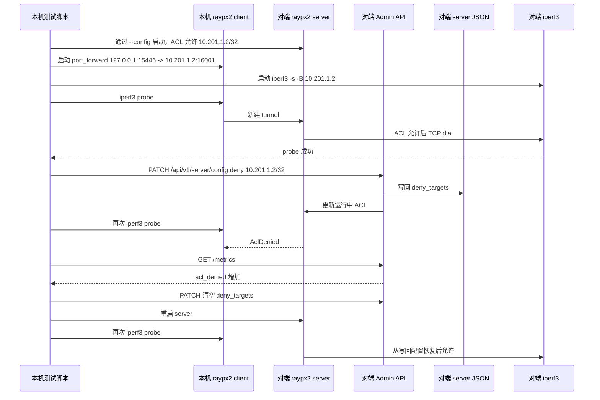

# DGX server ACL 热更新与重启恢复系统测试方案

日期：2026-07-05

## 1. 范围和目标

本文验证 `docs/server-admin-console.md` 中 server ACL 配置能力的系统级行为：通过 Admin API 修改 server `allow_targets` / `deny_targets` 后，新建 tunnel 立即按新 ACL 判定，成功修改会写回 server JSON 配置文件，并在 server 重启后继续生效。

本测试复用 `docs/test/dgx-multi-interface-quic-binding-test-design_cn.md` 的 2 台 DGX 环境：

| 项 | 值 |
|---|---|
| 本机工作区 | `/home/jack/src/tcpquic-proxy` |
| 对端控制面 | `jack@172.16.10.81` |
| 本机二进制 | `build/bin/Release/raypx2` |
| 对端临时二进制目录 | `/home/jack/tcpquic-dgx-bin` |
| path-a | `10.201.1.1 -> 10.201.1.2` |
| path-b | `10.201.2.1 -> 10.201.2.2` |
| QUIC 端口 | `4433` |
| server admin | 对端 `127.0.0.1:18081` |
| client admin | 本机 `127.0.0.1:18082` |

控制面和数据面约束：

- SSH 只走 `172.16.10.81` 管理网。
- Admin HTTP 只监听 loopback；调用对端 Admin API 时通过 SSH 在对端本机执行 `curl`。
- 本测试不配置 `tc netem`，不得修改数据网口 qdisc。
- server 配置文件必须是严格 JSON，并通过 `--config` 启动，以验证 Admin ACL 写回目标。

## 2. 功能和非功能目标

功能目标：

| 目标 | 验收标准 |
|---|---|
| 初始 ACL 允许目标 | 初始 `allow_targets` 包含 `10.201.1.2/32`，通过本地 port forward 访问对端 `iperf3` 成功 |
| ACL 热更新为拒绝 | PATCH `deny_targets:["10.201.1.2/32"]` 后，新建 tunnel 失败，server `acl_denied` 增加 |
| ACL 热更新恢复允许 | PATCH 清空 `deny_targets` 后，新建 tunnel 恢复成功 |
| 配置文件持久化 | 对端 server JSON 中 `server.allow_targets` / `server.deny_targets` 与最后一次成功 PATCH 一致 |
| 非法 CIDR 回滚 | PATCH 非法 CIDR 返回 400，运行中 ACL 和配置文件保持前一个成功版本 |
| 重启恢复 | 重启 server 后，GET `/server/config` 和新建 tunnel 行为与写回后的配置一致 |

非功能目标：

| 类别 | 暂定目标 |
|---|---|
| 热更新收敛 | PATCH 后 5 秒内新建 tunnel 表现出新 ACL 行为 |
| Admin 可用性 | 每个 GET/PATCH Admin 请求 5 秒内返回 |
| 数据面影响 | ACL 更新不要求保持已有 tunnel；只验证后续新建 tunnel |
| 安全边界 | 不把 Admin API 暴露到 `172.16.*` 或数据网地址 |
| 证据完整性 | 保存环境、配置、Admin JSON、iperf 结果、日志和最终摘要 |

## 3. 系统级端到端功能链路图



关键断言：

| 环节 | 断言 | 证据 |
|---|---|---|
| server 启动 | 使用远端临时 JSON 配置；`GET /server/config` 返回 `role=server` | `admin/initial-server-config.json` |
| 初始连通 | client 至少 1 条 QUIC connection connected；port forward probe `rc=0` | `admin/initial-client-connections.json`、`case/initial-iperf.rc` |
| 拒绝生效 | deny PATCH 返回 200；后续 probe 非 0；`acl_denied` 增加 | `admin/patch-deny-response.json`、`case/deny-iperf.rc`、`admin/metrics-after-deny.json` |
| 恢复生效 | allow PATCH 返回 200；后续 probe `rc=0` | `admin/patch-allow-response.json`、`case/recover-iperf.rc` |
| 非法回滚 | invalid PATCH 返回 400；GET config 和磁盘配置仍为恢复允许版本 | `admin/patch-invalid-response.json`、`proxy/remote-server-config-after-invalid.json` |
| 重启恢复 | 重启后 GET config 仍允许；probe `rc=0` | `admin/post-restart-server-config.json`、`case/post-restart-iperf.rc` |

## 4. 测试策略和覆盖矩阵

本轮只跑 path-a，目标是隔离 server ACL 行为，不把多网口调度作为变量。path-b 地址保留在 server listen 中，确保测试仍覆盖 DGX 双地址 server listen 的常见部署形态。

| 编号 | 场景 | 操作 | 期望 |
|---|---|---|---|
| ACL01 | 环境与路由检查 | 记录本机/对端 IP、路由、二进制 SHA256 | 路由命中 10.201 path-a/path-b；远端 SSH 可用 |
| ACL02 | 初始允许 | server 配置 `allow_targets:["10.201.1.2/32"]`，client port_forward 到 `10.201.1.2:16001` | iperf3 probe 成功 |
| ACL03 | 运行时拒绝 | PATCH `deny_targets:["10.201.1.2/32"]` | 新 probe 失败，`acl_denied` 增加 |
| ACL04 | 运行时恢复 | PATCH `deny_targets:[]` | 新 probe 成功 |
| ACL05 | 非法 CIDR | PATCH `allow_targets:["bad-cidr"]` | HTTP 400，配置不变 |
| ACL06 | 持久化检查 | 读取远端 server JSON | `server.allow_targets` 和 `server.deny_targets` 与恢复版本一致 |
| ACL07 | 重启恢复 | 停止并用同一 JSON 配置重启 server | GET config 与配置文件一致，新 probe 成功 |

## 5. k6 性能基线

本轮不执行 k6；原因是当前目标是验证 server ACL 的正确性、持久化和重启恢复，不是短连接容量。后续若要压测 ACL patch 和短 tunnel，可以基于本方案扩展：

| 场景 | 流量 | 门禁 |
|---|---|---|
| acl-patch-baseline | 1 VU，每 2 秒 PATCH 一次，持续 1 分钟 | PATCH p95 < 50 ms，错误率为 0 |
| acl-deny-short | 50 VU，通过 HTTP CONNECT 建短 tunnel，ACL 拒绝目标 | 预期拒绝率 100%，Admin 可用 |
| acl-allow-short | 50 VU，通过 HTTP CONNECT 建短 tunnel，ACL 允许目标 | 成功率 > 99.9%，p95 < 500 ms |

## 6. 容量和可扩展性验证

本轮不扩大容量档位，只验证单目标 ACL 决策链路。后续容量测试可增加：

- `allow_targets` 100、1000、10000 条 CIDR 时的 PATCH 延迟和新建 tunnel 延迟。
- 并发 PATCH 与并发短 tunnel 的一致性。
- domain target 解析出多候选地址时的 ACL 过滤一致性。

## 7. 异常条件和恢复

| 场景 | 注入故障 | 预期影响 | 检测信号 | 恢复和验收 |
|---|---|---|---|---|
| 非法 CIDR | PATCH `allow_targets:["bad-cidr"]` | 请求失败，旧 ACL 保持 | HTTP 400，GET config 不变 | 提交合法 ACL 后成功 |
| deny 覆盖 allow | 同时 allow 和 deny `10.201.1.2/32` | deny 优先生效，新 tunnel 被拒绝 | `acl_denied` 增加 | 清空 deny 后恢复 |
| server 重启 | 停止 server 后按同一 JSON 重启 | 旧 QUIC 连接断开，新连接按持久化 ACL 恢复 | post-restart probe 成功 | client 可重新 connected |
| Admin token 变化 | server 重启生成新 token | 旧 token 失效 | 重启后重新读取 token 文件 | 新 token 可 GET config |

## 8. 可观测性和测试证据

执行脚本：

```bash
rtk bash scripts/run-dgx-server-acl-hot-update.sh
```

默认结果目录：

```text
docs/test/dgx-server-acl-hot-update-<timestamp>/
  env/
  proxy/
  admin/
  case/
  net/
  summary/
```

必须保存：

- `env/git-head.txt`
- `env/git-status-short.txt`
- `env/local-raypx2.sha256`
- `env/remote-raypx2.sha256`
- `proxy/server-config.initial.json`
- `proxy/remote-server-config-after-deny.json`
- `proxy/remote-server-config-after-allow.json`
- `proxy/remote-server-config-after-invalid.json`
- `proxy/remote-server-config-post-restart.json`
- `admin/*server-config*.json`
- `admin/*metrics*.json`
- `case/*iperf.rc`
- `summary/summary.md`

## 9. 进入、退出和发布门禁

进入条件：

- 本机 `build/bin/Release/raypx2` 可执行。
- 对端 `jack@172.16.10.81` 可免交互 SSH。
- `jq`、`curl`、`iperf3`、`ssh`、`scp` 可用。
- 10.201 path-a/path-b 路由与既有 DGX 文档一致。

退出条件：

- ACL01-ACL07 均执行并保存证据。
- 本机 client、远端 server、远端 iperf3 被清理。
- 远端 server JSON 最终保留恢复允许版本：`allow_targets=["10.201.1.2/32"]`，`deny_targets=[]`。

阻断问题：

- PATCH 成功但新 tunnel 未按新 ACL 行为变化。
- PATCH 成功但配置文件未写回。
- 非法 CIDR 后运行中 ACL 或配置文件被污染。
- 重启后 ACL 未从写回配置恢复。
- Admin API 暴露到非 loopback 地址。

## 10. 风险、假设和开放问题

风险：

- 如果远端已有进程占用 `4433` 或本机已有进程占用 `15446` / `18082`，测试会失败；脚本只清理自身启动的进程。
- iperf3 probe 失败只作为 tunnel 失败信号，不用于吞吐结论。
- server 重启会断开旧 QUIC 连接；本方案只验证 client 后续能重连并新建 tunnel。

假设：

- `10.201.1.2` 既作为 server listen 地址，也作为 server 侧本机目标地址，server 对该地址发起 TCP dial 是有效目标。
- `server.allow_targets` 只需要允许目标 IP，不需要允许 client 源 IP。
- 压缩是否启用由 client 端控制，server 配置不包含压缩项。

开放问题：

- 是否需要把本测试纳入长期 CI 需要另行决策；当前依赖 2 台 DGX 和固定链路，不适合普通本地 CI。
